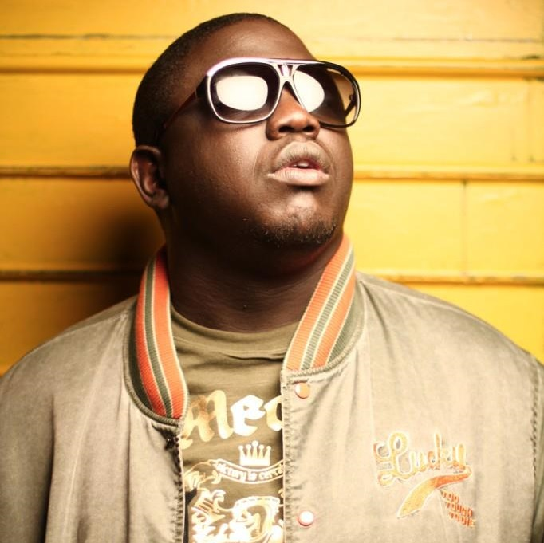
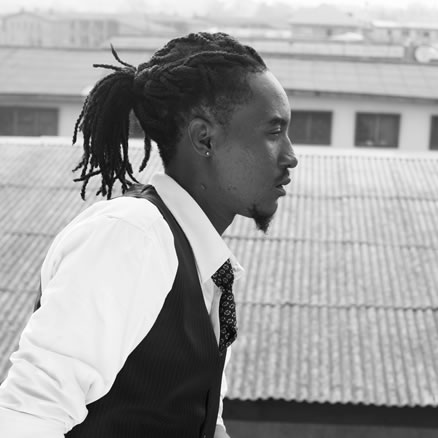
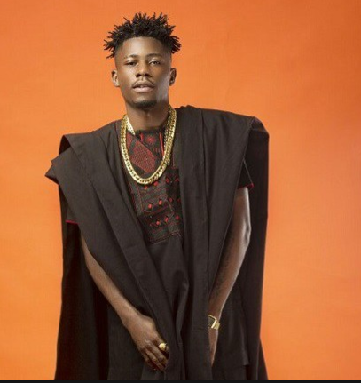
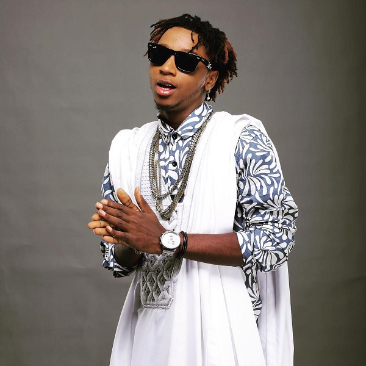
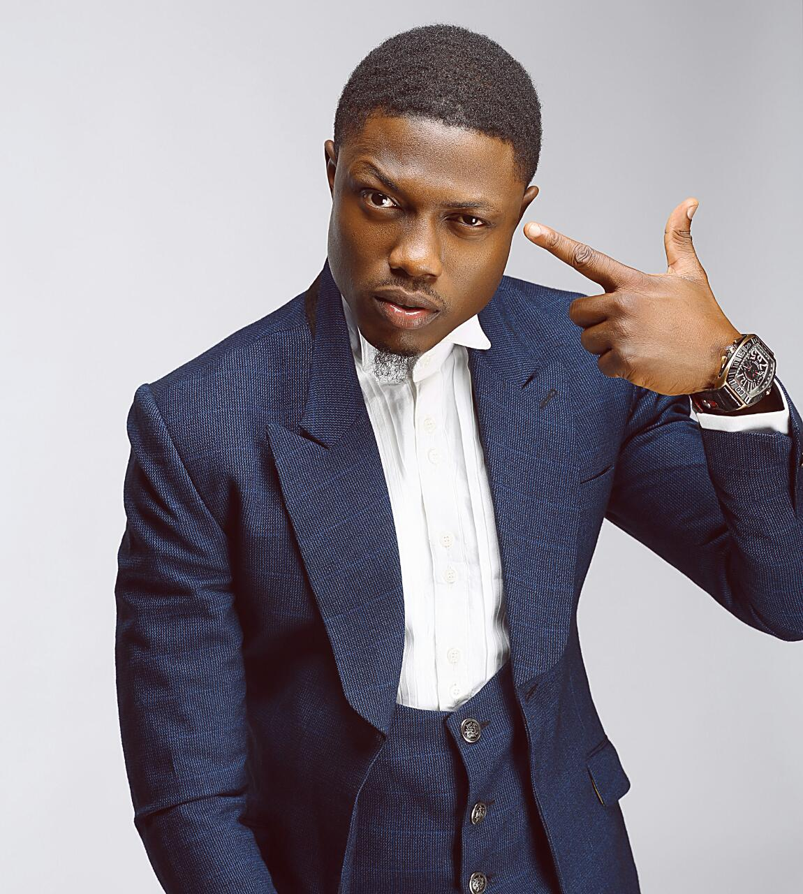
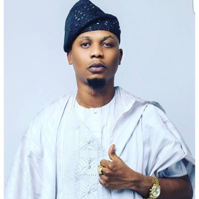
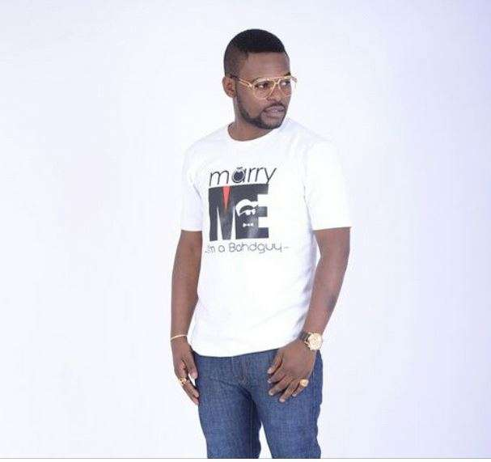
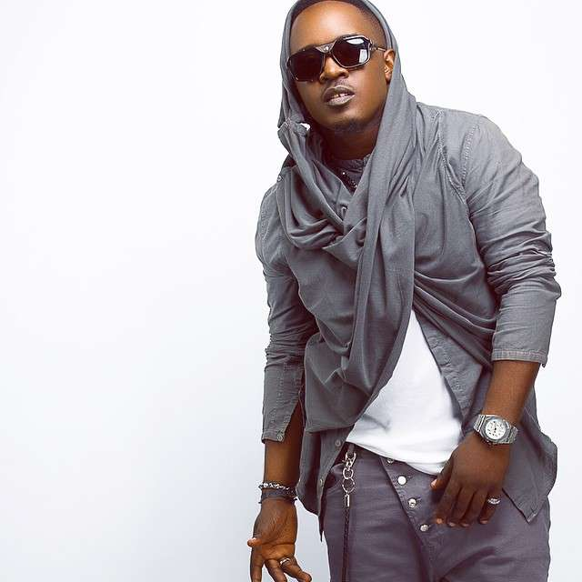
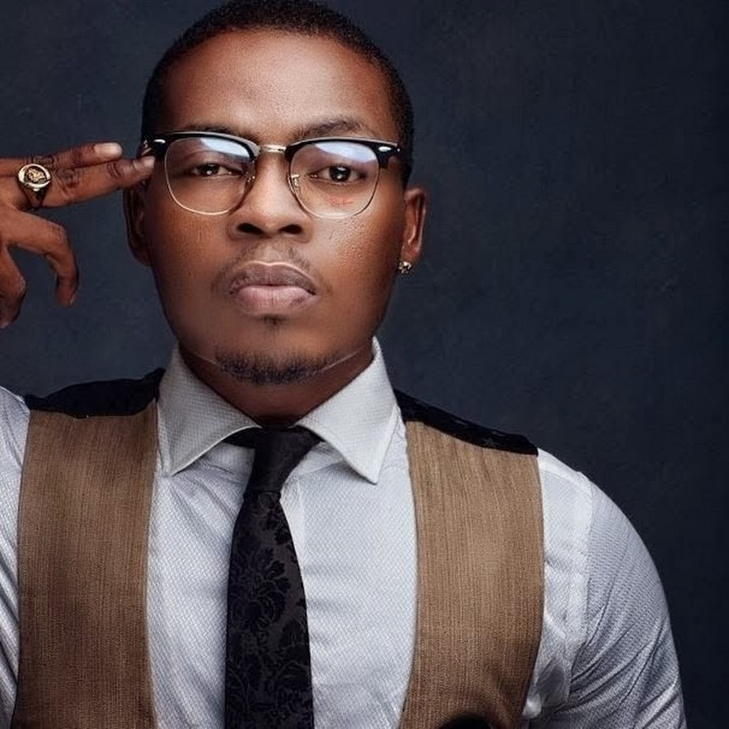
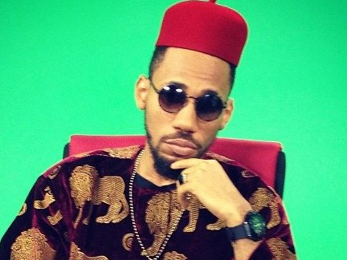

 Welcome to Top Ten Nigeria. This week we'll be counting down on top ten nigeria rappers. The list consist of both rappers that rap in English and their indigenous tongue. This talented and gifted artists are the one who made it to my top ten nigerian rappers.Enjoy;

#### 10- Ill Bliss
Illbliss is at this spot because he is no longer active like those good old days . Oga Boss is among the well known bosses in Nigeria Entertainment Industry and his flow is something we can’t forget in a hurry. Just recently, the rapper made it known that he is retiring from music maybe he wants to go into something else who knows.
ILLBLISS, is a Nigerian rapper/ hip-hop recording artist, stage performer, businessman and owner of the talent managing outfit known as 'The Goretti Company', company responsible for launching the careers of Chidinma and Phyno, among others. Also popularly known as Oga Boss, he has received many nominations and won awards, the most notable being the award for Best Hiphop Video (for the hit 'U Go Wound O!!') at  the 2008 maiden edition of the Soundcity Music Video Awards. 

#### 9- Jesse Jagz
Jesse Garba Abaga born on the 10th of August 1984, popularly known as Jesse Jagz, is a Nigerian hip hop recording artist. 
In April 2015, he re-signed with Chocolate City after leaving the label in May 2012 to establish his own imprint known as Jagz Nation.He's on the number nine spot in our countdown, he is M.I Abaga’s younger brother , you can easily denote that from their flows.He's a very good rapper.

#### 8- YCEE
Oludemilade Martin Alejo was born on January 29, 1993, popularly known by his stage name YCEE, is a Nigerian rapper and songwriter currently signed to Tinny Entertainment.
He rose to limelight after one of his singles titled 'Condo', which features vocals from Patoranking, earned him two nominations at the 2015 Nigeria Entertainment Awards.
He was also nominated in the 'Best Artist in African Pop' category at the 2015 All Africa Music Awards.
In October 2016, YCEE signed a record deal with Sony Music.

#### 7- Yung6ix
Onome Onokohwomo born on 8 July 1989, better known by his stage name Yung6ix, is a Nigerian hip hop recording artist.
Yung6ix is a warri born rapper who started his hustle  in 2010 when he remixed Ice Prince “Oleku” and his version got thumbs up by many. One of his hottest single is “Blessing” where he featured Oritse Femi.  

#### 6- Vector
At the number six spot we have a Nigerian rapper that sound more like American rapper, Jayz .
Olanrewaju Ogunmefun, better known by his stage name Vector tha Viper, is a Nigerian Hip hop artist. Vector has released two studio albums, his debut album State of Surprise (SOS) and The Second Coming. 
He is the voice behind the Sprite commercial that has aired on most radio stations across Nigeria since 2009.In anticipation of his second studio album, he released a mix tape titled 'Bar Racks'. He released his second studio album titled The Second Coming on 12 December 2012.Vector is that Nigerian rapper that flows in good englsih without getting tired .

#### 5- Reminisce
On this fifth spot we have another industrious rapper known as Reminisce.
Remilekun Abdulkalid Safaru, known by his stage names Reminisce and ALAGA IBILE, is a Nigerian singer, rapper, and songwriter from Ogun State.He performs in both English and his native language, Yoruba.
Reminisce is an hard working Nigerian rappers who makes sure he brings out something new all the time.

#### 4-  Falz
 Folarin Falana born october 27, 1990 in lagos state, known by his stage name falz is a nigerian rapper, actor, and songwriter.He began his career while in secondary school after forming a group called 'The School Boys' with his friend before his professional career as a music artiste began in 2009.
Falz shot into limelight after his song titled 'Marry Me' (featuring vocals from poe and yemi alade) won him a nomination in the 'Best Collaboration of The Year' category at the 2015 nigeria Entertainment Awards. 
      He was also nominated in the 'Best Rap Act of The Year' and 'Best New Act to Watch' categories at the same event.He currently owns an independent record label called Bahd Guys Records. Falz is a very talented person, he is not just a rapper but also a comedian and an actor.And he does excellently well im all of them.Weldone bro.

#### 3- M.I
Jude Abaga born 4 october 1981, known professionally as M.I or  M.I abaga, is a nigerian hip hop recording artist and record producer. He has been the chief executive officer of chocolate city since june 2015.
He won best hip hop and best new act at the 2009 mtv africa music awards, and was nominated in the best international act category at the bet awards 2010. He rose to prominence in 2006 when his song 'Crowd Mentality' became popular in his hometown of jos. 
M.I Abaga is one of the most educated rappers who knows how to play with words and always have something new to say in his songs . The self acclaimed Chairman is respected by many and he has worked with hosts of Nigerian singers and rappers.

#### 2- Olamide
Olamide Adedeji born 15 march 1989, known by his stage name Olamide but popularly called Olamide Baddo, is a nigerian hip hop recording artist from Bariga, Lagos state. He records mostly in yoruba, his native tongue. 
In 2011, he released his debut studio album rapsodi while signed to coded tunes. Ybnl, his follow-up album, was released under his label imprint Ybnl nation. On 7 November 2013, he released his third studio album Baddest Guy Ever Liveth.
    On 17 July 2013, Olamide became the first Nigerian to sign an endorsement deal with Cîroc. Olamide has been nominated and won several music awards, including multiple Nigeria Entertainment Awards and The Headies Awards.
He was crowned the “hottest rapper of 2015' by MTV Base . And he's obviously one of the hottest rapper of our time.

#### 1- Phyno
Chibuzor Nelson Azubuike born 9 october 1986, also known by his stage name phyno, is a nigerian rapper, singer, songwriter and record producer.
He also calls himself Phyno Phino. He started his musical career as a producer in 2003.
He is renowned for rapping in the igbo language. His debut studio album 'no guts no glory' was released in 2014.
Phyno is an industrious rapper,its no surprise he's on the number one spot on today's countdown. Rise on bro!!!

