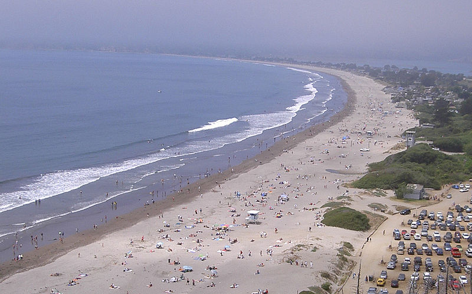
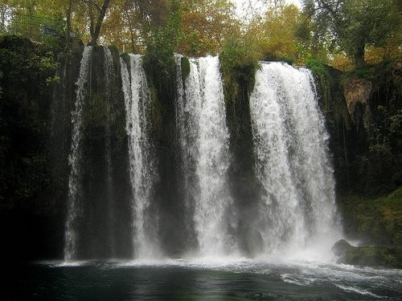
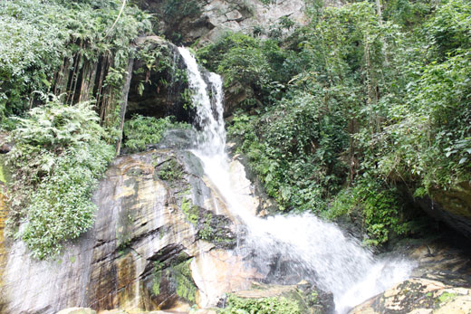
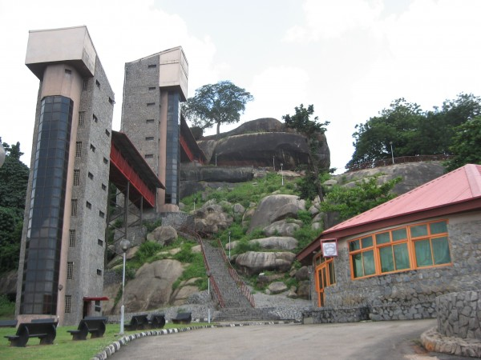
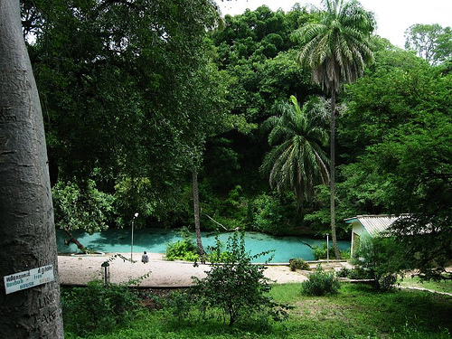
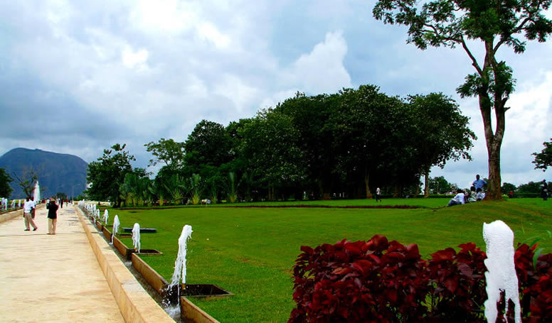
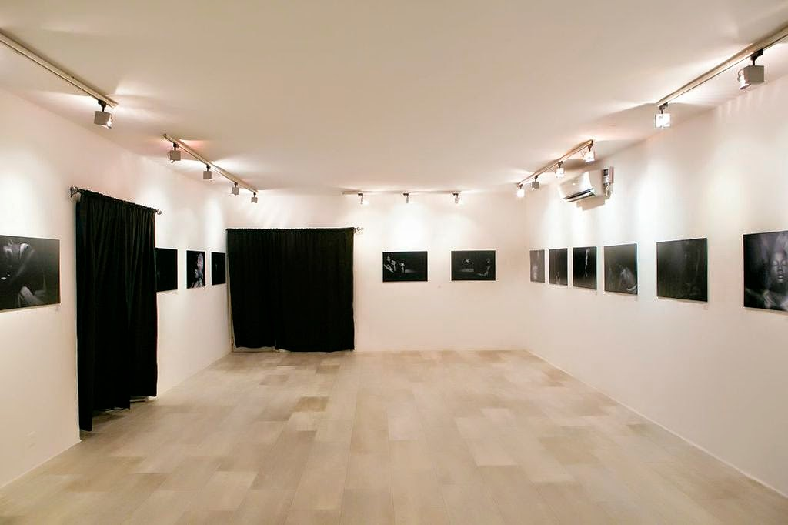
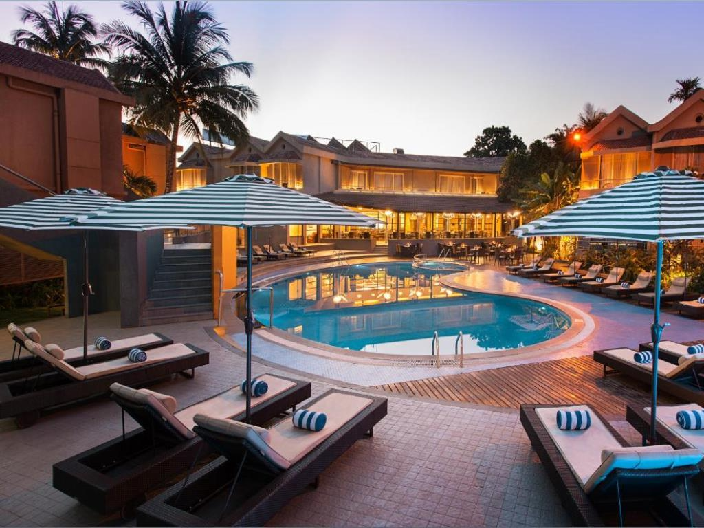
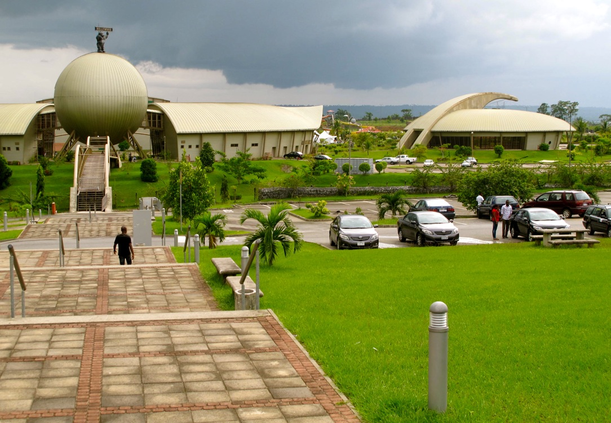

Top Ten Nigeria brings you the top ten beautiful places to visit in Nigeria.These places have breathtaking views and are also places of relaxation.When looking for places to go and have fun,relax or holiday getaway,these are good choices;

#### 10-  Ibeno Beach
The Ibeno Beach is one of the beaches on the Atlantic Ocean along the shorelines of Ibeno. It is the longest sand beach in West Africa.
The beach is located in Ibeno, a local government area of Akwa Ibom State southeastern, Nigeria. The title, 'Ibeno beach' was coined from its location, 'Ibeno'.The beach is one of the tourist attractions in Nigeria.

#### 9- Mambilla Plateau
The Mambilla Plateau is a plateau in the Taraba State of Nigeria. The plateau is Nigeria's northern continuation of the Bamenda Highlands of Cameroon. The Mambilla Plateau has an average elevation of about 1,600 metres (5,249 ft) above sea level, making it the highest plateau in Nigeria.Some of its villages are situated on hills that must be at least 1,828 metres (5,997 ft) high above sea level.
        It is the highest mountain in Nigeria and the highest mountain in West Africa if Cameroon's mountains, such as Mount Cameroon, are excluded. It is a sight to behold.

#### 8- Ikogosi Warm Springs
The Ikogosi Warm Springs is a tourist attraction located at Ikogosi, a town in Ekiti State, southwestern Nigeria.Flowing abreast the warm spring is another cold spring which meets the warm spring at a confluence, each maintaining its thermal properties.These attributes make the spring a tourist attraction in Nigeria.Research suggested that the warm spring has a temperature of about 700C at the source and 370C at the confluence.

#### 7- Olumo Rock
Olumo Rock is a popular tourist attraction in the city of Abeokuta, Nigeria. It was used as a fortress by the Egba people in the early 19th century.Olumo rock, one of the most popular tourist destinations in Nigeria, West Africa, sits in the ancient city center of Abeokuta – a name which means “Under the rock”.
      New renovations completed early 2006 upgraded the infrastructure of the site to include a new museum, restaurants, water fountain and The ancient Itoku market where local artisans and traders enjoy to haggle over price just as much as the customers like to find a bargain just outside the Olumo rock premises and is a must-see. The market is the center of the indigenous Abeokuta industry of tie-and-dye, locally known as adire. In places where the plaster has cracked off the walls, you may see traces of the mud bricks used in the original construction. The locals are very friendly and if asked, will often give tourists and visitors informal tours of the dyeing processes. Other popular items to watch out for include local beads, bracelets, sculptures and musical instruments like the sekere and talking drum.
     A trip to Olumo rock usually commences with a climb up the man-made stairs carved into the rock. The journey continues with climbs on irregularly sized rocks (or ladders which are now provided) through a narrow corridor that leads to the top of the rock. All along the way, catch sights of carvings in the rock, cowrie-studded statues and the ancient abode of the priestesses who live in huts on the rock.
On the way back down the rock, the sight of the Ogun river running like a silver chain amidst a forest of aged red corrugated roofs bordered by thick green forests which melt into the horizon is breathtaking.

#### 6-Yankari National Park
Yankari National Park is a large wildlife park located in the south-central part of Bauchi State, in northeastern Nigeria. It covers an area of about 2,244 square kilometres (866 sq mi) and is home to several natural warm water springs, as well as a wide variety of flora and fauna. Its location in the heartland of the West African savanna makes it a unique way for tourists and holidaymakers to watch wildlife in its natural habitat. Yankari was originally created as a game reserve in 1956, but later designated Nigeria’s biggest national park in 1991. It is the most popular destination for tourists in Nigeria and, as such, plays a crucial role in the development and promotion of tourism and ecotourism in Nigeria. It is also one of the most popular eco-destinations in West Africa.

#### 5- The Millennium Park
 The Millennium Park is the largest public park of Abuja, the capital of Nigeria and is located in the Maitama district of the city.
     The Millennium Park was inaugurated by Her Majesty Queen Elizabeth II of the United Kingdom on 4 December 2003. It’s located near the former Presidential Palace close to the nucleus of presidential and administrative buildings of the city.
     This Park, conceived and designed by the Italian architect Manfredi Nicoletti, has quickly become one of the main attractions of the city of Abuja bringing thousands of people together each day.
During the Millennium Park opening ceremony, each Commonwealth Head of State has planted symbolically a Ravenala madagascariensis palm giving birth to the Park. Among others present were the former (President of Nigeria Olusegun Obasanjo, UK prime Minister Tony Blair and Her Majesty Queen Elizabeth II.)

#### 4- Omenka Gallery
Omenka Gallery was founded in Lagos in 2003 by Nigerian artist,curator and art administrator Oliver Enwonwu.Enwonwu's father, Ben Enwonwu, (1917-1994) was one of Nigeria's leading, 20th-century, modernist artists.
      Omenka Gallery is a Nigerian contemporary art gallery, which represents Nigerian and international artists at its exhibition space in Lagos.                   

#### 3- Whispering Palms Beach Resort

#### 2- Obudu Mountain Resort
Obudu Mountain Resort (formerly known as the Obudu Cattle Ranch) is a ranch and resort on the Obudu Plateau in Cross River State, Nigeria. It was developed in 1951 by Mr. McCaughley, a Scot who first explored the mountain ranges in 1949. He camped on the mountaintop of the Oshie Ridge on the Sankwala Mountains for a month before returning with Mr. Hugh Jones a fellow rancher who, in 1951, together with Dr Crawfeild developed the Obudu Cattle Ranch. Although the ranch has been through troubles since, it has very recently been rehabilitated to its former glory. A recently added cable car from the base to the top of the plateau gives visitors a scenic view while bypassing the extremely winding road to the top.
       The ranch has in recent times seen an influx of both Nigerian and international tourists because of the development of tourist facilities by Cross-River State Government which has turned the ranch into one of the well known holiday and tourist resort centers in Nigeria.                
.jpg)

#### 1- Tinapa
Tinapa is a business and leisure resort just north of Calabar, Cross River State, Nigeria associated with the Calabar Free Trade Zone. It is being developed in four phases under a Private Public Partnership (PPP) promoted by the Government of Cross River State. The resort is located by the Calabar River, contiguous with the Calabar Free Trade Zone.This is one place i would love to visit.

