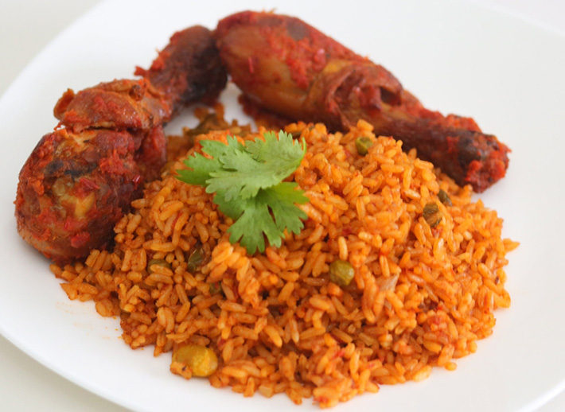

Top Ten Nigeria brings us the Top Ten Nigerian foods,these foods originated from different tribes and are now being eaten by everyone.These foods are very nutritious and delicious.Nigeria have a very rich culture and our food is a part of our culture,we believe our food is the best and the most delicious,those staying abroad crave these foods all the time.It wasn't easy picking the top ten from the long list of foods in Nigeria.This will motivate food lovers to try new foods.Fellow foodies get in here.....I love food too.Here we go;

#### 10- Nkwobi
Nkwobi is simply cooked cow foot mixed in spicy palm oil paste.
Nkwobi is a very popular delicacy originating from the South-Eastern region in Nigeria. Made with cowleg cooked and smothered in thick sauce, it is one of the many culinary delights to be derived from Igbo origins.
Nkwobi has become a favourite part of the menu when eating out in “traditional” restaurants both home and beyond.It is a popular traditional dessert in Eastern Nigeria.Eating Nkwobi and palm wine on a friday night is a major 'flexing'.

#### 9- Banga soup and Starch
Banga Soup or Ofe Akwu is native to the Niger Delta and the South Eastern parts of Nigeria. In the Niger Delta areas, Banga soup is commonly eaten with Starch, Pounded Yam, Semolina, Garri and Cassava Fufu. In the South Eastern parts of Nigeria, Banga Soup is referred to as 'Ofe Akwu' where Ofe means Soup / Stew and Akwu means palm fruit and is used mainly as stew for Boiled White Rice.
 It is called Banga by the Deltans/Benins, Obe eyin by the yorubas, Mbanga by the Cameroonians, amiedi by the urhobos and obey-ekpo by the itsekiris.
The main ingredient is palm fruit(which are boiled and pounded),other ingredients include curry leave,meat or chicken etc
Its a food we should all have a taste of......

#### 8- Abacha and Ugba
Abacha is also known as ‘African Salad’ and it can be eaten as a meal or snack. Many people eat it as a meal because it is fills up your stomach just like any other meal.African Salad is usually eaten as an in-between meal. This meal is well-known in the Eastern part of Nigeria, among the Igbo tribes and they love it.
     Abacha is prepared with cassava. The cassava tubers are cooked till done then sliced with a special grater. The sliced cassava is then soaked in cold water overnight, washed thoroughly and dried under the sun.
     Your African Salad will not be complete without Ugba. Ugba, also known as Ukpaka, is made from oil bean seeds. These seeds are cooked for several hours then sliced, washed and left to ferment a little bit.
Abacha and Ugba with 'gbomo' and tiny bits of meat,gets me licking my fingers.Its very delicious.

#### 7- Edikang Ikong Soup
 Edikang Ikong soup or simply Vegetable Soup is native to the Efiks, people from Akwa Ibom and Cross River states of Nigeria.Edikang Ikong soup is very nutritious. Prepared with a generous quantity of pumpkin leaves and water leaves, with dry fish and assorted meats this soup is nourishing in every sense of the word.
      Its very delicious too,I always look up to days when it will be cooked at home.

#### 6-Tuwo Shinkafa
Tuwo Shinkafa is one of the most delicious foods in the Northern part of Nigeria. Tuwo is made by soft rice and spicy sauce. The Hausa tribes love this food.
    It is usually served with Northern Nigerian soups: Miyan Kuka, Miyan Taushe etc. It also goes well with other Nigerian soups.
The rice used for Tuwo Shinkafa should be a soft rice variety that becomes sticky when cooked. This is so that the grains can be easily mashed to make a mass of tuwo.The main ingredient is short/medium grain soft rice and water(enough quantity to cook the rice till very soft and sticky).

#### 5- Ewa Agoyin
There's always a very long queue of people waiting to buy ewa agoyin in the afternoon in almost every buka in Nigeria.
Every Nigerian beans lover are crazy about Ewa Agoyin. Ewa Agoyin is made up of cooked beans and pepper sauce. It is a delicious beans dish, well-known for its softness and tasty sauce.
Eating Ewa Agoyin with 'Agege bread' is the best feeling in life.

#### 4- Afang soup
This is my favourite food,its very delicious and nutritious. Afang Soup originated in the Cross River State of South-Eastern Nigeria,it is now enjoyed all over Nigeria. The main ingredients are water leave and okazi leave,other ingredients are meat,periwinkle,snails,fresh and dried fish etc. The dish takes around an hour to cook in total and is often served with garri,fufu or semovita.
It is very nutritious as the soup consists mainly of vegetables.

#### 3- Ewedu and Amala
 Amala and Ewedu soup is a popular Nigerian food, eaten by most Nigerians especially the yoruba tribe.Its native to the yoruba people.
Amala which is made from fermented yam and usually eaten with ewedu soup is served as everyday lunch or during special occasions. Most local restaurants called Buka often have this combination on their menu.
This is one food I usually have cravings for,I love eating it with assorted meats.

#### 2- Egusi Soup
 Egusi Soup is a very popular and delicious Nigerian delicacy. It's ingredients are melon,pumpkin leave,palm oil,dry fish,fresh fish,assorted meats and seasonings. It is usually served with garri, pounded yam or fufu. Pounded yam is incomplete without Egusi soup(melon soup). Pounded yam is made by boiling yam and pounding it.
Ninety percent of Nigerians have either heard or eaten egusi soup to show how popular it is.Easy to cook and its not very expensive.

#### 1- Jollof Rice
Jollof rice is very delicious and usually the favourite food of most Nigerians.
A Nigerian party without Jollof Rice is no party! There is a theory that party jollof rice are unique.Most Nigerians look forward to ‘owanbe’ parties, simply because of the delicious foods including jollof rice. Jollof rice is very popular in Nigeria and much of West Africa. The dish is made up of rice,tomatoes, onions, vegetable oil, and a variety of spices. It is usually served with chicken,vegetables,fish or meat.Jollof rice is one variety of savoury rice dishes served all over the world.

