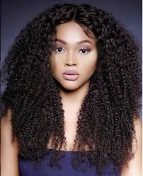
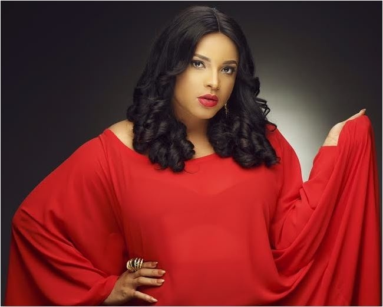
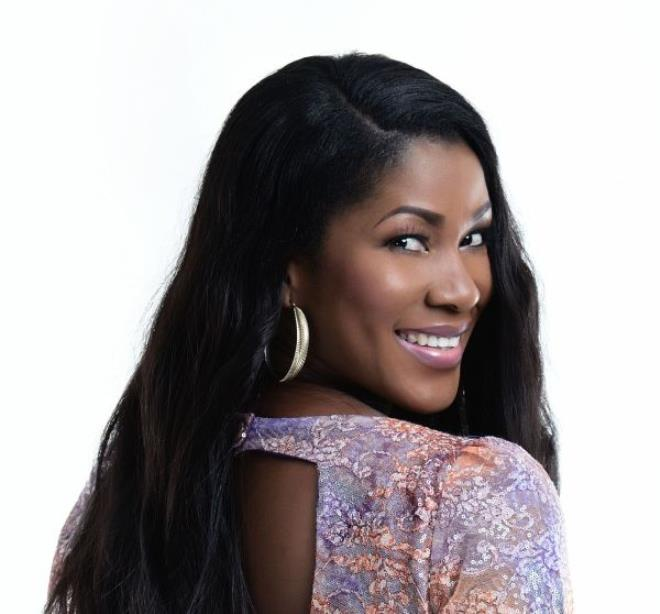
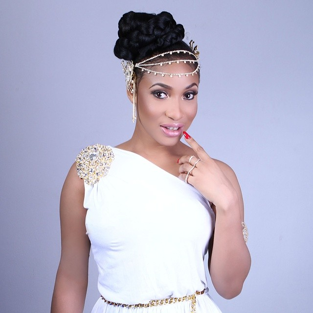
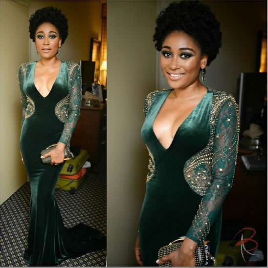
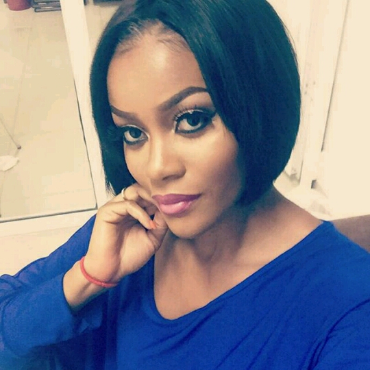
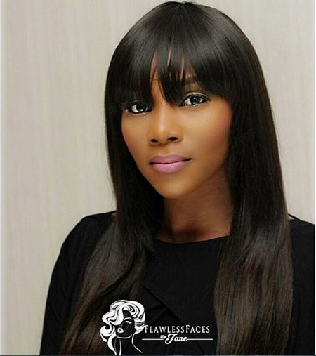
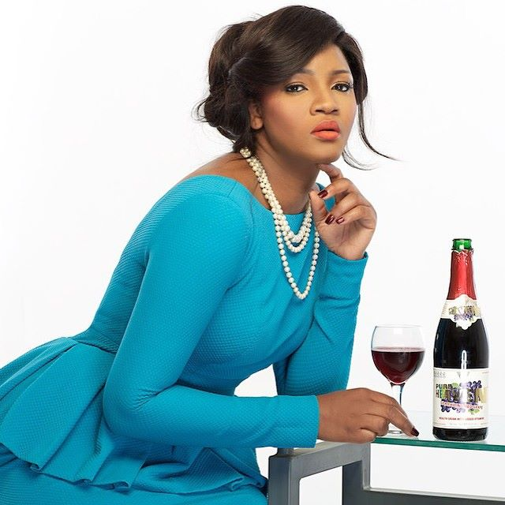
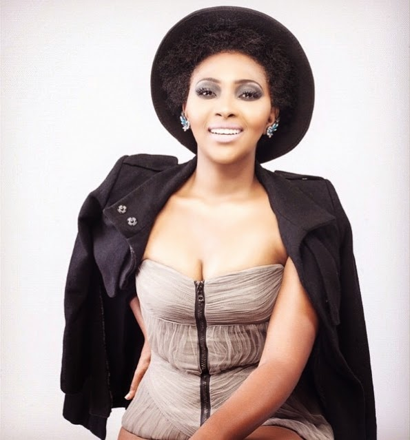

For quite some years now with the worldwide burst of Nollywood movies, our home screen(TV) has been adorned with a lot of beautiful faces that keep us glued to our television. Top Ten Nigeria brings you the top ten most beautiful Nigerian Actresses that entertain Nigerians. This was compiled after a series of research, here's the list

#### 10- Mercy Aigbe

Mercy Aigbe was born on January 1 1979 in Edo State (Nigeria),and she is the second child in a family of five. she attended the polytechnic in Ibadan where she received her OND in financial Studies. She then went to the university of lagos for a degree in theatre arts. She's a pretty one.

#### 9- Shirley Igwe

Shirley Igwe is an upcoming actress born on April 1.She's so pretty and she gets our number nine spot....

#### 8- Stephenie Okereke

Stephanie Okereke was born in Ngor Okpala,Imo State. She is the sixth child of Mary and Chima Okereke's eight children. She completed her primary & secondary education inDelta State.She studied at the University of Calabar, in Cross River State, where she graduated with a degree in English and Literary Studies. And she's number eight on our list.

#### 7- Ini Edo

Ini Edo born on April 19, 1982 is on our list as number six. Ini Edo is a Theatre Arts graduate of the University of Calabar.In 2008 she was married to American-based Nigerian businessman Philip Ehiagwina.In 2013, she was announced as judge for the Miss Black Africa Uk Pageant.Due to her philanthropic gestures, the United Nations appointed her as the United Nations Habitat Youth Envoy.

#### 6- Tonto Dikeh

Tonto Wigo Charity Dikeh-Churchill (tontolet) born June 9,1985 also known as Tonto Dike, is a Nigerian actress and singer from Rivers State and is of the Ikwerre tribe. Dikeh is from a family of seven. She's number six on our list.

#### 5- Mbong Amata

Fine girl no pimple Mbong Amata born in 1985 is on our list as the number five.The former miss awka ibom is doubtlessly a queen.....Mbong Amata is a Nigerian actress. She has acted in several films including Black November, Forgetting June, and Inale. She won the "Most Beautiful Girl" (Akwa Ibom) in 2003, and was the 2nd runner up in the 2004 Miss Nigeria.

#### 4- Damilola Adegbite

Damilola Adegbite born 18 May 1985 is a Nigerian actress, model, and television personality. She played Thelema Duke in the soap opera Tinsel, and Kemi Williams in the movie Flower Girl. She won Best Actress in a TV Series at the 2011 Nigeria Entertainment Awards.She's a beauty and she's our number four.

#### 3- Genevieve Nnaji

Gene was born on May 3 1979, from mbaise imo state.The screen goddess has continued to wow us with her ageless beauty.Nevertheless,im sorry to break your hearts she's not our number 1 on the countdown.

#### 2- Omotola Jalade Ekeinde

Omosexy never grows old born on 7 February 1978 .The mother of four gets more beautiful every day. Omotola, who is of Ondo descent, was born in Lagos State. While awaiting her results from university, she began modelling to earn a living.She had a brief stint at Obafemi Awolowo University and completed her studies at Yaba College of Technology (1996–2004), where she studied estate management.

#### 1- Lilian Esoro

Lilian Esoro Franklin is a Nigerian actress,an event planner, and also the CEO of Goldie Locks hair salon situated in the capital city of Abuja Nigeria. The Imo State-born beauty is the youngest in a family of seven.She started off her acting career in 2006 with "Extended Family" and since then she has starred in a couple of soap operas like CLINIC MATTERS a popular family sitcom where she plays the role of Nurse Abigail, a stage play titled 'Ayetu', 'I voted now', and 'Strive'.She studied Political Science at University of Abuja.

