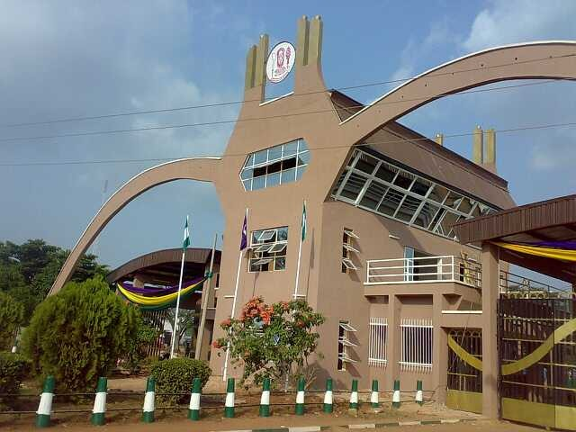
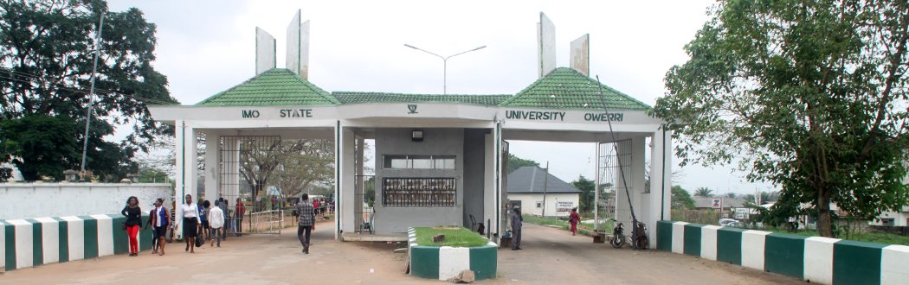
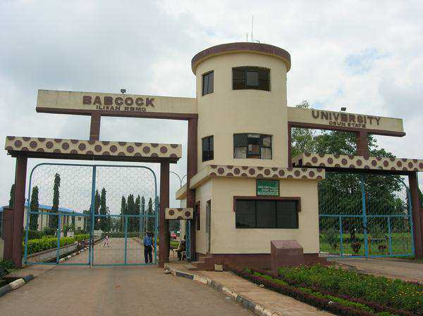

'Forming' is a slang used in Nigeria to mean 'pretending','Living a fake life','trying to be what you're not','feeling too big'.
It's a common thing in Nigeria for girls on campus to live a different life from the one they live at home.Girls form in a bid to feel 'among' or 'to be popular'. There are stories of girls denying their mother that trekked all the way from the village to see them,just because they are known in school as 'big girls'.
Top Ten Nigeria brings you a list of the top ten Nigerian universities with girls that form. Enjoy!!!

#### 10- Federal University of Technology Owerri(Futo)
The university was founded in 1980. It later merged with Alvan Ikoku College of Education Owerri, absorbing the latter's students. It is one of the premier technological universities in western Africa. Its student body comprises people from all over west Africa and beyond. It is the only federal university of technology in the south-east of Nigeria, and one of the oldest in West Africa. The University is known for its technologically strong graduates, evidenced by the large number its alumni currently in oil and gas companies in Nigeria. The largest percentage of engineers in most oil companies in Nigeria are FUTO alumni.The fact that more of the population of the school are boys makes the available girls to 'form'.

#### 9- Anambra State University(ANSU)
Chukwuemeka Odumegwu Ojukwu University formerly Anambra State University is a Nigerian tertiary institution located in Uli, a suburb in Anambra State.The University was established by law No. 13 of 2000 by the Anambra State Government and has a 2-Campus structure. The main campus of the University is located at Uli, in the former site of the Ekwenugo Okeke Polytechnic, formally called Anambra State Polytechnic. And it's our number nine university with girls that 'form'.

#### 8- University of Benin(Uniben)
The University of Benin was founded in 1970. It started as an Institute of Technology and was accorded the status of a full-fledged University by National Universities Commission (NUC) on 1 July 1971.
 I carried out a research and most of the people added uniben to their list.I just have to agree with them.

#### 7- Lagos State University(Lasu)
 The Lagos State University (LASU) is a public university located at Ojo, Lagos, Nigeria, and is the only state university in the former British colony. It was established in 1983 by the enabling Law of Lagos State of Nigeria, for the advancement of learning and establishment of academic excellence.
Well,its located in lagos,that's the only conviction I need.

#### 6-Imo State University(Imsu)
The Imo State University (IMSU) in Owerri, Imo State, Nigeria was established in 1981.
The fact that it is located in owerri(the center of hotels),and the school does not have any hostel explains it all.

#### 5- Nnamdi Azikiwe University(Unizik)
Nnamdi Azikiwe University, Awka is a Federal university in Nigeria. Its main campus is located in the southeastern part of Nigeria in Anambra State's capital, Awka, and a second campus is at Nnewi. It is one of twenty-five federal universities which are overseen and accredited by the National Universities Commission.
We can't list universities with girls that 'form' without adding unizik.
The time I went to see a friend there,my mouth was agape with the number of pot-bellied sugar daddy's.These girls are living 'large',with some of them having parents struggling in the village to cater for them.

#### 4- Covenant University
Covenant University is located in Ota, Ogun State in Nigeria. It is a Private Christian University.Covenant University was opened on October 21,2002.In January 2015, it was ranked as the best university in Nigeria according to Webometrics.
I don't really have much to say here,the fact that it's an expensive private university there's a very high possibility that they 'form' and from my research,covenant university was frequently mentioned.

#### 3- Babcock University
Babcock University is a private Christian co-educational Nigerian university owned and operated by the Seventh-day Adventist Church in Nigeria. The university is located equidistant between Ibadan and Lagos. Theuniversity was officially inaugurated on April 20, 1999.
It is known as one of the most expensive universities in Nigeria,One should expect Daddy girls and Sugar Daddy girls,flaunting their cars,phones(Apple),and expensive lifestyles.There's no doubt most of them are from wealthy homes,but still most of them 'form'.

#### 2-University of PortHarcourt(Uniport)
Founded in 1975, University of Port Harcourt (UNIPORT) is a second-generation Federal University located in the Niger-Delta region of Nigeria with over 50,000 students and a strong focus in Petroleum Engineering. Formerly known as University College, Port Harcourt, UNIPORT has been ranked amongst the top ten universities in Africa and as the first in Nigeria by Times Higher Education (THE); a UK-based source for higher education information.
There was actually a disagreement on whether to put unilag or uniport as the number one.However uniport is right behind unilag. A friend of mine told me that it's only in uniport you will see a seventeen years old girl in year one driving a 'spider' car.
With the overflow of whitemen and 'oil money' you wouldn't expect less.

#### 1- University Of Lagos(Unilag)
The University of Lagos (Unilag) is a federal government university in Lagos State, southwestern Nigeria that was established in 1962. ... It was overseen and accredited by the National Universities Commission, and is now acclaimed publicly as “the University of First Choice and the Nation's Pride.”
Due to it's location,we expect nothing less.It's common in unilag for girls to 'form'.U'll see a girl living in mushin claiming that she lives at 'Lekki'.With Sugar daddy's and G-boys readily available,one wouldn't expect less.
It's only by the grace of God that one will school in unilag and not be tempted to live like a 'big girl'.

