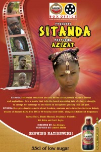

Lately,Nollywood movies have improved vastly and are almost brushing up to a steadily growing Hollywood.
Top Ten Nigeria brings you the all time best Nigerian movies,both recent and old movies that keep us glued to our chairs. Enjoy!!!

#### 10- The Figurine
The Figurine: Araromire is a 2009 Nigerian supernatural suspense thriller film written by Kemi Adesoye, produced and directed by Kunle Afolayan, who also stars in the film as one of the main protagonists. It also stars Ramsey Nouah and Omoni Oboli. The movie narrates the story of two friends who finds a mystical sculpture in an abandoned shrine in the forest while serving at a National Youth Service Corps camp, and one of them decides to take the artwork home. Unknown to them, the sculpture is from the goddess 'Araromire' which bestows seven years of good luck on anyone who encounters it, and after the seven years have expired, seven years of bad luck follow. The lives of the two friends begin to change for good, as they become successful and wealthy businessmen. However, after seven years, things start to change for the worse.

#### 9- Aki na Ukwa
The ribs cracking movie will never evade the hearts of Nigerians.Aki na Ukwa is a 2003 Nigerian comedy film directed by Amayo Uzo Phillips.Starring Osita Iheme,Chinedu Ikedieze,Oby Kechere,Amaechi Muonagor,Frances Nsokwu.
The film launched the acting careers of the two actors(Osita Iheme and Chinedu ikedieze).The movie entails the mischief of two children as they attempt to disrupt the love affair of their father and their teacher,and the disadvantages of single parenting.The two young troublesome brothers cause disruption in home life, terrorise the people in their village and wreak havoc at school.

#### 8- Sitanda
Sitanda is a Nigerian adventure / drama film directed by African Movie Academy Award winner Ali Nuhu, and written by Fidel Akpom. The film received 9 nominations and won 5 awards at the 3rd Africa Movie Academy Awards in 2007, including Best Picture, Best Nigerian Film, Best Director and Best Original Screenplay. Starring Ali Nuhu,Stephanie Okereke,Azizat Sadiq,Ireti Doyle,Justus Esiri,Bimbo Manuel.

#### 7- Osuofia in london
One of the movies that brought the limelight to Nollywood.
Osuofia in London is a 2003 Nigerian comedy film written and directed by Kingsley Ogoro and starring Nkem Owoh. The film is among the highest selling Nollywood films.
Osuofia in London is an hilarious movie that depicts the travels of a customary igbo man and how he struggles with the norms of his new environment. Osuofia (Nkem Owoh), a bamboozled villager from Nigeria, travels to London, England to receive his share of an inheritance left for him by a deceased relative.

#### 6- Last Flight to Abuja
Last Flight to Abuja is a 2012 Nigerian thriller disaster film written by Tunde Babalola, directed and produced by Obi Emelonye. Starring Omotola Jalade Ekeinde, Hakeem Kae-Kazim and Jim Iyke. The film which was shot in Lagos, received 5 nominations at the 2013 Africa Movie Academy Awards and won award for the category best film by an African based abroad.

#### 5- Phone Swap
 Phone Swap is a 2012 Nigerian romance comedy drama film written by Kemi Adesoye, directed and produced by Kunle Afolayan. It stars Nse Ikpe Etim, Wale Ojo, Joke Silva, Chika Okpala, Lydia Forson and Hafeez Oyetoro.
     It narrates the story of Mary, a warm-hearted fashion designer who works under a very stringent boss, and Akin, an arrogant, withdrawn and bossy business executive. They accidentally swap their mobile phones at a busy airport, which leads to an exchange in their destinations and the need to help carryout each other's assignments.Its settings situated in Owerri,Lagos and Abuja.

#### 4- The Meeting
An uptight middle-aged corporate executive flies to Abuja from Lagos for an all-important make or break meeting with a government minister and is to return same day. What he does not bargain for is meeting a brick wall in the form of the minister’s cantankerous secretary, having to add extra days to his planned trip and engaging in a dalliance with a beautiful but pushy youth corper.
     The Meeting is a 2012 Nigerian romantic comedy drama film produced by Rita Dominic & Mildred Okwo and directed by Mildred Okwo. It stars Femi Jacobs, Rita Dominic, Linda Ejiofor, Kehinde Bankole and Jide Kosoko with Special Appearances from Nse Ikpe Etim, Kate Henshaw and Chinedu Ikedieze.
     

#### 3- Stronger than pain
Nkem Owoh never ceases to amaze me.Stronger than Pain is a native/local movie that spawned response from viewers. Stronger Than Pain is a story of a husband beater and a wife-defender. Starring Nkem Owoh (Osuofia), Kate Henshaw, Ebube Nwagbo, Ifeanyi Ikechukwu, Daniella Chioma Okeke, Matah Njubuigbo. Ulanna's(Nkem Owoh) pride and dignity has been taken away as a result of the love he has for his wife Eringa(Kate Henshaw Nuttal), this has practically made him a weakling and an object of scorn in the village.Where there is Nkem Owoh,we expect great deal of comedy and probably romance.

#### 2- Living In Bondage
This will take our memory back to the beginning of Nollywood.
Living in bondage is a 1992 Nigerian drama thriller film directed by Chris Obi Rapu, written by Kenneth Nnebue & Okechukwu Ogunjiofor and produced by Okechukwu Ogunjiofor.Featuring the likes of Kenneth Okonkwo,Kanayo O. Kanayo,Bob Manuel,Francis Agu, Okechukwu Ogunjiofor and a host of others.
    The movie has everything needed in a movie;suspense,Love,Betrayal,and even supernatural powers.The movie also focuses on greed,cultism and forgiveness.

#### 1- Mr and Mrs
The clamour of people made me watch this movie and each scene kept me clued to the chair.A revealing story that focuses on the role and importance of women in the home.
      Mr. and Mrs. is a 2012 Nigerian romantic drama film written and produced by Chinwe Egwuagu and directed by Ikechukwu Onyeka, starring Nse Ikpe Etim, Joseph Benjamin, Barbara Soky, Thelma Okodua and Paul Apel.

