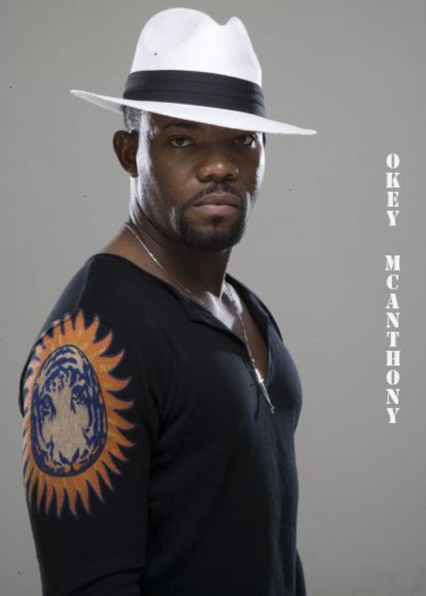
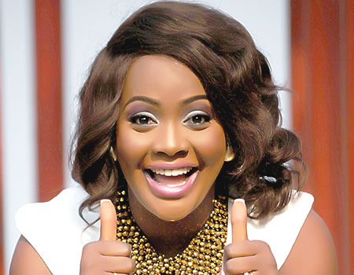
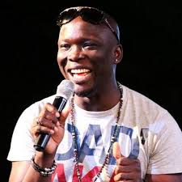
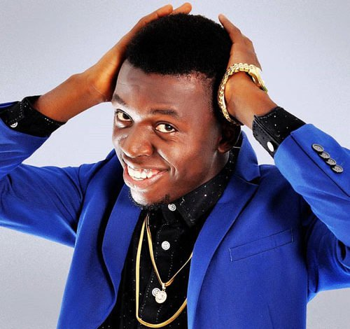
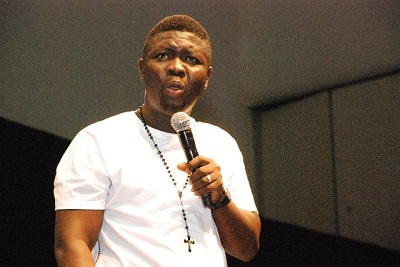
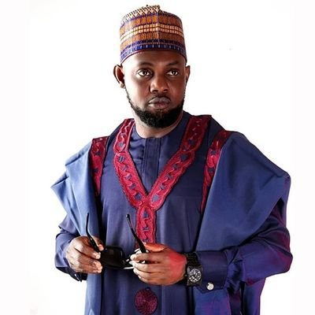
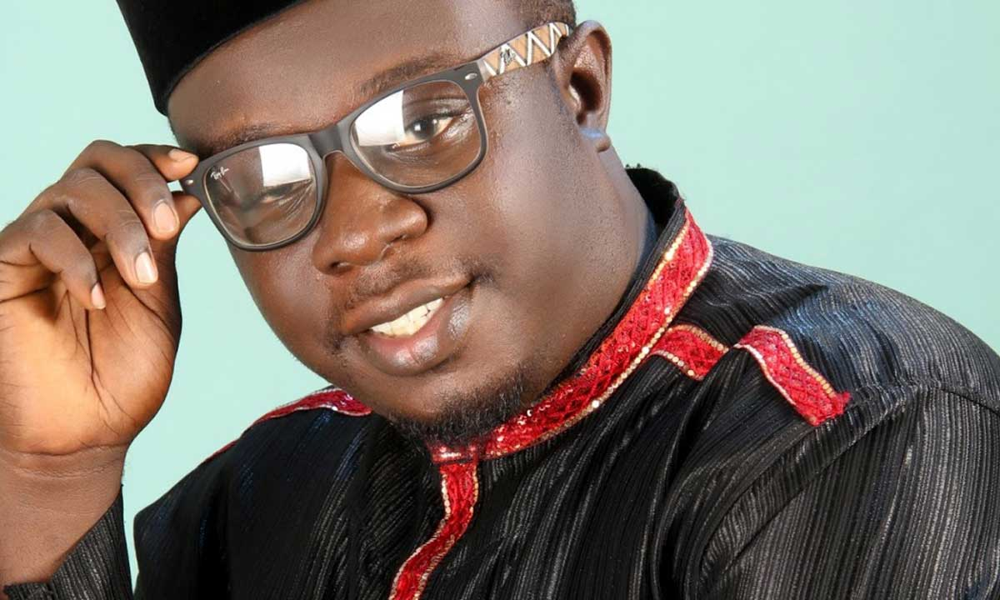
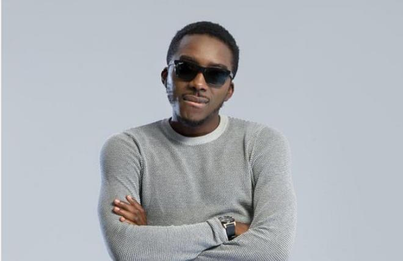
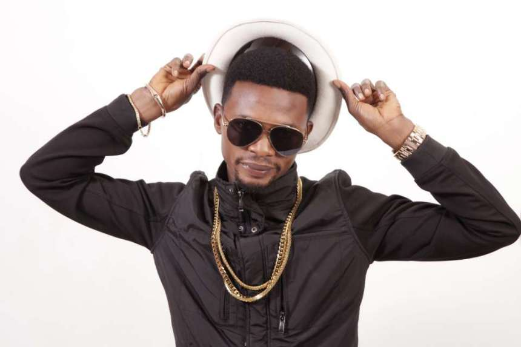
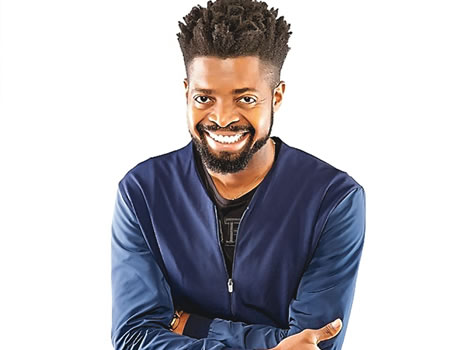

Top Ten Naija brings us the top ten 'hillarious' Nigerian comedians.This list was compiled after watching various comedy skits.We all have different sense of humour,what may be funny to me may not be to someone else so the list is open to disagreement.Here's the list;

#### 10- Okey Bakassi
Okechukwu Anthony Onyegbule (born October 23, 1969), popularly known as Okey Bakassi is a Nigerian stand-up comedian and actor. In 2014, he won the 'Best Actor in a Leading Role (Igbo)' category at the 2014 edition of the Best of Nollywood Awards for his role in the film Onye Ozi.
      Okey Bakassi always wanted to entertain. Even Though the college River state University of science & Technology where he schooled at didnt have a theatre arts department.
Okay bakassi and some other students with like minds and interests came together to form a group ‘Theatre Kolleagues’ for the purpose of acting and entertaining the university community. Okey after university came to Lagos and thereafter met with popular movie producer and director, Zeb Ejiro who in 1993 gave him his first opportunity to appear on a network television production – ‘Fortunes’ where he played Nick, one of the Johnson’s bodyguards.He's also a funny person and performs in comedy shows across Nigeria.

#### 9- Helen Paul
 Helen Paul is a comedienne, singer and actress from Nigeria.She is best known as a stand-up comedian and popularly known as Tatafo. Her style is quirky and spontaneous, and her petite stature and voice range make her sound like a child.
She is one of the funniest Nigerian comediennes.

#### 8- Gordons
 Godwin Komone popularly known as Gordons is a Nigerian Comedian and Musical Artist. He is an indigene of Delta State and an Urhobo by tribe. Gordons attended Ighogbadu Primary School,Delta State and then proceeded to Nana College, Delta State for his Secondary Education. He is a graduate of Integrated Science from Delta State University. Gordons is the first born of his parents. He got married on March 23, 2002 and his marriage is blessed with four children.
       Gordons with his many tales of poverty and his regular chanting of 'hallelulah' that we dont ever get tired of hearing.He made the list and he's number 8.

#### 7- Akpororo
Bowoto, popularly known and referred to as Akpororo, is a Nigerian stand-up comedian, vocalist and actor.
      He is a native of Ilaje, Ondo State, Nigeria but he was born and grew up in Warri, a suburb in Delta State, Nigeria where he had his early education.His career started off as a local gospel musician until in 2008 when he went into the National Comedy Challenge by Opa Williams and went on to win the Calabar zone of the competition. In 2009, Akpororo moved to Lagos and contested twice in the AY's Open Mic Challenge, coming second in his first try and winning the competition in his second try. He rose to popularity in 2013 following his performance at 'Basketmouth's Laff and Jam' show and went on to perform in several comedy shows including 'AY Live'.On 12 August 2014, he staged his first major comedy show 'Akpororo vs Akpororo' at the Shell Hall, MUSON Centre. The maiden event saw the attendance of notable musical acts and comedians.
     In 2014, Akpororo delved into acting, starring in the films Headgone and The Antique; with the former earning him three nominations at the 2015 Golden Icons Academy Movie Awards.Just his face alone is enough to make one laugh.

#### 6- Seyi Law
 Seyi Law is a nigerian Comedian, born Idileoye Oluwaseyitan Lawrence Aletile, stage named Seyi Law, has continued to soar in comic entertainment since hitting limelight following his success at the AY Open Comedy Mic in 2006.Since then, he's been known has a top comedian in the country as he is always at most events for performance. He's also got dozens of comedy skits on Youtube. He is also the founder of 'I must laugh' show.He is married with a son.Funny man with his yoruba accent.

#### 5- AY
Ayo Makun (Ayodeji Richard Makun, also known by his stage name A.Y) is a multi-award winning Nigerian actor, comedian, radio and T.V presenter, actor, writer, director and MC. He hails from Ifon, Ose local government in Ondo State but prefers to be known as a 'Warri boy'.Ayo Makun who is more known for his innovative and creative ideas rather than his humorous character is the host of the A.Y live shows and A.Y comedy skits. His first movie, 30 Days in Atlanta was produced by him and directed by Robert O. Peters. He was made a U.N Peace Ambassador in 2009 after winning six awards in 2008. He is the C.E.O of Corporate World Entertainment Nigeria.
 Ayo Makun attended Delta State University, Abraka. He graduated (after spending nine years) in 2003 as the most celebrated theatre arts student. A.Y also won other awards such as the most fashionable student on campus (1999 and 2000); best show-biz promoter (2001); the most celebrated student on campus (2001) and the Jaycee club socio-personality award (2003).Ay is a very creative person,he may not be too funny,but his creativity has it all going for him.With his movies '30 days in Atlanta' and 'A trip to Jamaica' grossing in millions for him.Thumbs up Ay.

#### 4- Elenu
 Akinlami Babatunde Julius popularly known as Elenu is a Nigerian Comedian. He has always had the dream of becoming a Medical Doctor, but along the line, he fell in love with Computers and hence went ahead to obtain an Ordinary National Diploma(OND) in Computer Science. He got married to Chinwe Anyanwu at Global Impact Church, Surulere, Lagos on June 15, 2013 and they are blessed with a son, Jayden.
       Elenu is an hilarious person,he doesnt need to force it.He has participated in various comedy shows where he brings laughter to the audience.

#### 3- Bovi                       
Bovi Ugboma born on September 25, 1979 is a Nigerian comedian.A director, producer, actor, and writer from Delta State, Nigeria. He has organized popular stand-up comedy concerts like 'Bovi Man On Fire' across the globe.
      Bovi Ugboma was born in Benin City,where he attended UNIBEN staff schools. He attended secondary school at Ughelli Northern in Delta State, and proceeded to Delta State University where he studied Theatre Arts.
      Bovi began his career in April 2007,starring in the sitcom Extended Family, which he produced, wrote, and packaged. The show was very popular, and by 2008 Bovi was leading comedy shows and events throughout Nigeria.He participated in Nite of a thousand Laughs organized by Opa Williams.Bovi is another funny and creative comedian I know,with his various comedy skits and movies,recent one being(its her day).

#### 2- I Go Dye
Francis Agoda (born 4 April 1979), popularly known as I Go Dye or I Go Die, is a Nigerian comedian. He has organized several international comedy shows, such as 'Igodye Standing.'Francis Agoda was born on 4 April 1979 in Abraka, Delta State, Nigeria.
    His elementary school days was at Ighogbadu Primary School and College of Commerce in Warri, Delta State,Nigeria..He had a creative disposition,been the zonal project manager of the Junior Engineering Technical Society (JET Club),while he also invented an helicopter, a hovercraft ship, a radio transmitter, and a battery table fan, which earned him a scholarship to study structural engineering at a university in New York.
    He followed his passion,developing his comedy artistry, at a time when the comedy business was not trending as a career.However, Agoda continued to pursue comedy, until he was invited to join the Press Literary Art Drama Debating Society (PLADDS). He soon became PLADD's Programme Director. He's one of the funniest comedians in Nigeria and creative in his jokes too.

#### 1- Basketmouth
Bright Okpocha born 14 September 1978 in Lagos, better known by his stage name Basketmouth is a Nigerian comedian and actor. He has organized popular stand-up comedy concerts like Basketmouth Uncensored across the globe.
      Bright completed his primary and secondary school education in Apapa (Lagos, Nigeria) and then moved on to pursue a degree at the University of Benin where he studied sociology and anthropology with his brother Godwin.
In 2005 and 2006 Basketmouth won the National Comedy Award and the awards for Best Stand-up Comedian of the Year.Basket mouth was born in Lagos but hails from Abia State, Nigeria.
     Basketmouth sure knows how to crack us up and he takes the number one spot on the countdown and is famous for his antagonistic hilarious view on nollywood movies.

