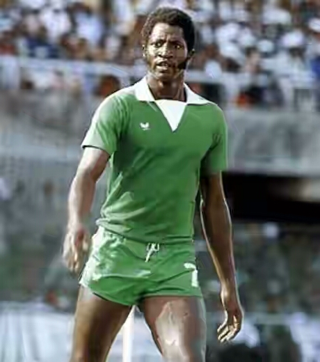
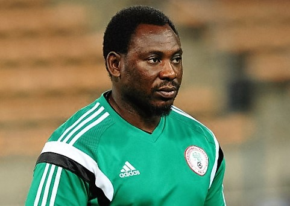
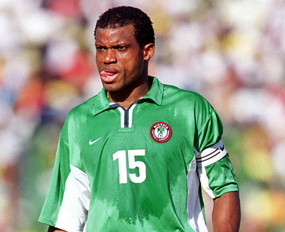
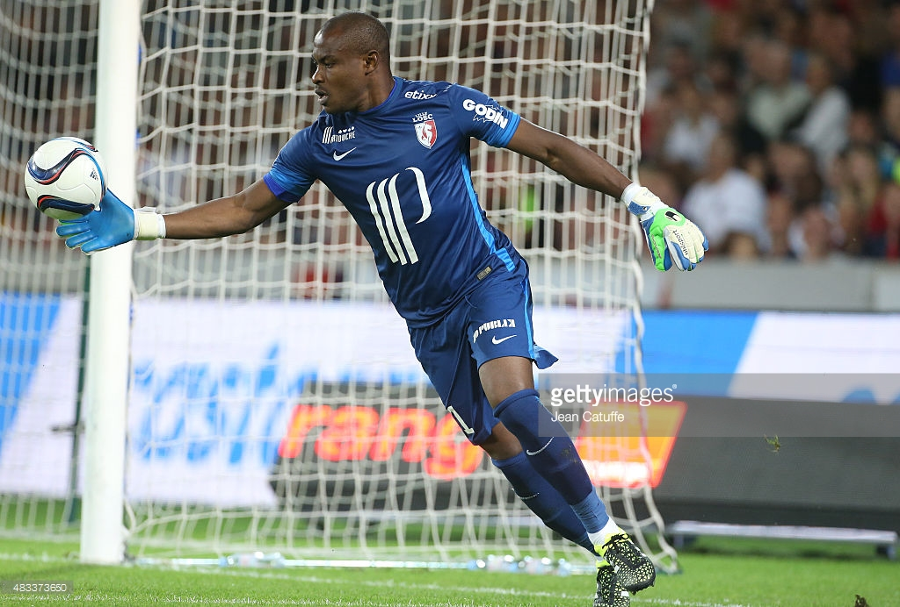
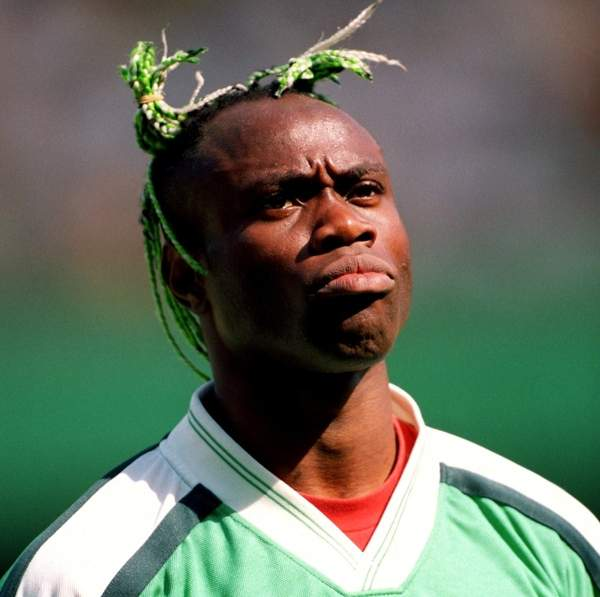
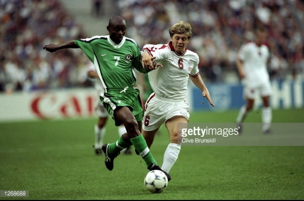
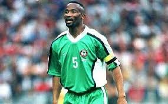
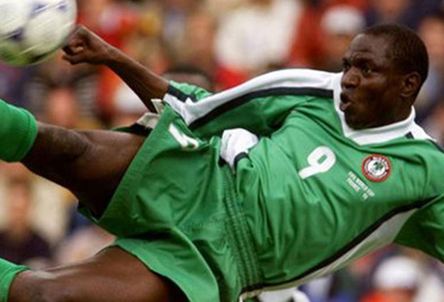
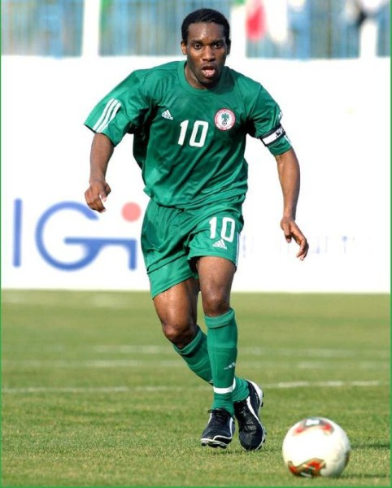
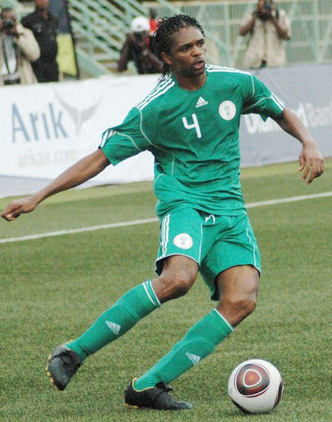

Top Ten Nigeria Brings us the Top Ten Nigerian Footballers of all time for our Football Lovers.We talk about the Footballers and a brief history of their career. Nigerians are very passionate about football,and I hope you all enjoy this countdown

#### 10- Patrick Olusegun Odegbami(Mathematical)
Patrick Olusegun Odegbami, often shortened to Segun Odegbami (born August 27, 1952, in Abeokuta) is a retired Nigerian footballer who played as a forward.He's nicknamed Mathematical for his precise style of play. He was famous for running down the touchline with the ball to prevent opponents from getting it. Odegbami is regarded as one of the greatest Nigerian players of all-time.
         Odegbami was brought up in the northern city of Jos, Plateau State.He won 46 caps and scored 23 goals for the National Team, and guided Nigeria to its first Africa Cup of Nations title at the 1980 tournament in his homeland. Nicknamed Mathematical, he was famous for his skill on the ball, speed and precision of his crosses from the right wing. He played for IICC Shooting Stars of Ibadan his entire career, from 1970 to 1984. His last game was the 1984 African Champions Cup final defeat to Zamalek of Egypt. The original source of the nickname 'Mathematical' was because Segun Odegbami attended and graduated from Nigeria's premier technical institution; The Polytechnic, Ibadan where he studied Engineering.
In September 2015, former Nigeria national football team captain Segun Odegbami stated his intention to run for FIFA presidency.

#### 9- Daniel Amokachi
Daniel Owefin Amokachi (born 30 December 1972) is a Nigerian former professional footballer of Idoma descent and former assistant manager of the Nigeria national football team.
       Amokachi nicknamed 'The Bull' was a striker from 1989 until 2005, starting his career with Ranchers Bees before earning notability by playing outside his native country with Premier League side Everton, as well as Club Brugge and Besiktas before initially finishing his career in the United States with Major League Soccer club Colorado Rapids. He returned to Nigeria in 2005 to briefly play for Nasarawa United, who he went on to manage before moving on to Enyimba.

#### 8- Sunday Oliseh
Sunday Ogorchukwu Oliseh who was born on 14 September 1974, Parents from Ebedei-Uno community in Ukwuani L.g.a of Delta State is a former Nigerian footballer who in his active playing career played as a midfielder. He was the coach of the Nigerian national football team from July 14, 2015, until he resigned on February 26, 2016, over a 'lack of support',unpaid wages and contract violations by the Nigerain Football Federation (Nff).
    A physical, technical defensive midfielder, Oliseh played for well world famous clubs such as AFC Ajax, Borussia Dortmund and Juventus F.C..
    Oliseh played 63 international matches and scored three goals for Nigeria, and played at the Football World Cups of 1994 and 1998. Oliseh also participated in the Olympic gold medal winning team of 1996. Sunday Oliseh was voted africa's 3rd best footballer in 1998 by CAF
   He is mostly remembered for scoring the winning goal in the group stage match against Spain in the 1998 World Cup, as Nigeria prevailed 3–2.
   In January 2006, at the age of 31, Oliseh retired from professional football after playing a half season for Belgian top club K.R.C. Genk.

#### 7- Vincent Enyeama
Vincent Enyeama who was born on the 29th of August 1982 is a Nigerian professional footballer who plays for Ligue 1 club Lille as a goalkeeper. He was also a member of the Nigerian national team from 2002 until October 2015, serving as its captain from 2013 until his retirement from international football. He is our nation's most capped player of all time, ending his international career with 101 caps.

#### 6- Taribo West
Taribo West (born 26 March 1974) is a Nigerian former professional footballer who played as a defender. He is best remembered for his various unusual and colourful hairstyles.
After winning several major trophies with Auxerre in French football, West went on to play for both Milanese clubs, Internazionale and Milan. He also appeared in the top level leagues of England and Germany.
Internationally, West made 42 caps for Nigeria between 1994 and 2005,being a member of the team in two World Cups and two African Championships. He also represented his country at the 1996 Summer Olympics, winning the gold medal.

#### 5- Finidi George
Finidi George (born 15 April 1971 in Port Harcourt) is a Nigerian retired footballer who played as a right winger.
After making a name for himself at Ajax in the Netherlands – being a leading figure in a team which won eight major titles, including the 1995 Champions League – he played several years in Spain with Real Betis, also having a brief spell in England before retiring. Finidi was an important member of the Nigerian team during the 1990s, appearing in two World Cups.

#### 4- Okechukwu Uche
 Uchechukwu 'Uche' Alozie Okechukwu (born 27 September 1967) is a Nigerian retired footballer who played as a central defender.
 'Uche' is a short form of the Igbo name 'Uchechukwu' (meaning 'God´s will').He was also honoured as the foreign player who played in Turkey for the longest period of time (13 years), going on to obtain Turkish citizenship under the name Deniz Uygar.
         The recipient of nearly 50 caps for Nigeria, Okechukwu represented the nation in two World Cups and as many Africa Cup of Nations, winning the latter tournament once.
Okechukwu made his debut for the Nigerian national team at the 1990 African Cup of Nations tournament, in a 1–5 loss against Algeria in their opening game. For the remainder of the competition the Super Eagles' defense did not concede another goal, until they were beaten 0–1 by the same opponent in the final.
Altogether, Okechukwu played 46 international matches, winning the CAN in 1994 (2–1 against Zambia) and the 1996 Summer Olympics. He also represented the nation in two FIFA World Cups, helping it progress to two consecutive round-of- 16 contests as he appeared in seven full matches combined, only missing out in the group stage 1–3 loss to Paraguay due to having collected two yellow cards.
         Okechukwu retired after the 1998 edition's 1–4 loss to Denmark, having captained the squad on several occasions from 1996 onwards.

#### 3-Rashidi Yekini
 Rashidi yekini (23 october 1963 – 4 may 2012) was a Nigerian footballer who played as a striker. His professional career, which spanned more than two decades, was mainly associated with vitória de setúbal in Portugal, but he also played in six other countries not including Nigeria.
         Yekini scored 37 goals as a Nigerian international, and represented the nation in five major tournaments, including two world cups where he scored the country's first-ever goal in the competition. he was also named the African footballer of the year in 1993.
Yekini was born in kaduna, of yoruba origin.after starting his professional career in the Nigerian league, he moved to côte d'ivoire to play for Africasports national, and from there he went to portugal and vitória de setúbal where he experienced his most memorable years, eventually becoming the primeira liga's top scorer in the 1993–94 season after scoring 21 goals; the previous campaign he had netted a career-best 34 in 32 games to help the sadinos promote from the second division, and those performances earned him the title of African footballer of the year once, the first ever for his country Nigeria

#### 2- Jay Jay Okocha
Augustine Azuka 'Jay-Jay' Okocha (born 14 August 1973) is a Nigerian former professional footballer who played as an attacking midfielder. A quick and skilful playmaker, who is widely regarded as the best Nigerian player of his generation and one of the greatest African players of all time,Okocha was known for his confidence, technique, creativity, and dribbling skills, as well as his use of feints, in particular the stepover.Due to his skill, he was described as being 'so good that they named him twice' (a line immortalised in a terrace chant while Okocha played for Bolton Wanderers). 
      Okocha was born in Enugu, Enugu State.His parents were from Ogwashi-Uku, Delta State, Nigeria.He began playing football on the streets just like many other football stars, usually with a makeshift ball.
      In an interview with BBC Sport he said, 'As far as I can remember, we used to play with anything, with any round thing we could find, and whenever we managed to get hold of a ball, that was a bonus! I mean it was amazing!' In 1990, he joined Enugu Rangers. In his time at the club he produced many spectacular displays including one where he rounded off and scored a goal, against experienced Nigerian goalkeeper William Okpara in a match against BCC.

#### 1- Kanu Nwankwo
 Nwankwo Kanu, OON (born 1 August 1976), or simply Kanu, is a retired Nigerian footballer who played as a forward. He was a member of and later captained the Nigerian national team for 16 years from 1994 until 2010.
     Kanu has won a UEFA Champions League medal, a UEFA Cup medal, three FA Cup Winners Medals and two African Player of the Year awards amongst others. He is also one of few players to have won the Premier League, FA Cup, Champions League, UEFA Cup and an Olympic Gold Medal.He made the third-most substitute appearances in Premier League history, appearing from the bench 118 times. He is also a UNICEF Goodwill Ambassador.
     Kanu was a member of the Nigerian national team from 1994 to 2010, making his debut in friendly against Sweden. Earlier on at the start of his career, Kanu was instrumental in Nigeria's overall success at the 1993 FIFA U-17 tournament in Japan and their subsequent 2–1 victory over Ghana in the final. With five goals, he was second joint-scorer in the tournament with Peter Anosike and Manuel Neira, behind compatriot and Captain Wilson Oruma.
As well as winning the Olympic gold in the football event at 1996 Olympics in Atlanta, where he scored the winning goal in the 4-3 semi-final win over Brazil,Kanu participated in the 1998 and 2002 FIFA World Cups. On 24 June 2010, Kanu ended his international career following Nigeria's exit from the 2010 World Cup in South Africa. Nigeria lost their group matches against Argentina and Greece, before a 2–2 draw with South Korea ended their stay in the tournament.He won 86 caps and scored 13 goals for his country.

