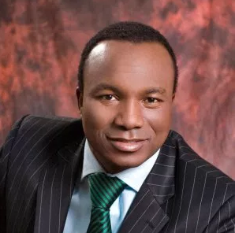
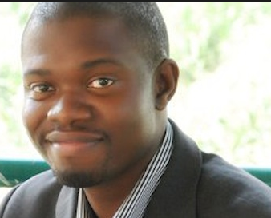
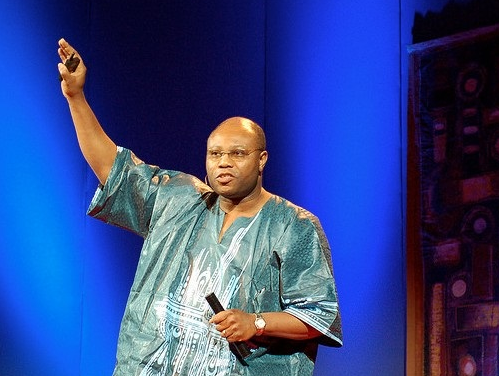
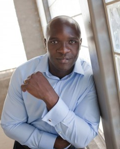
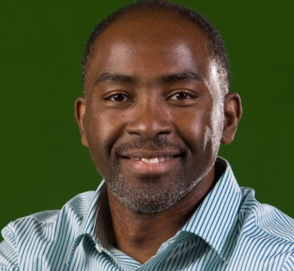
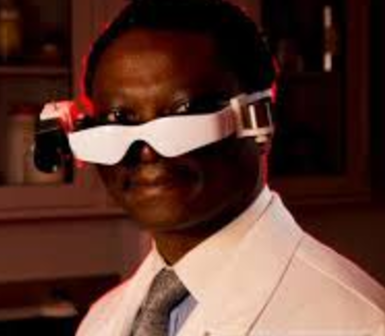
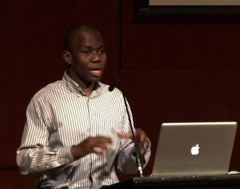
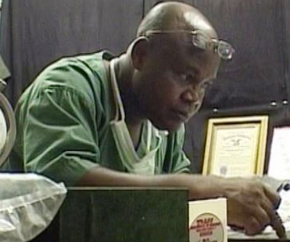
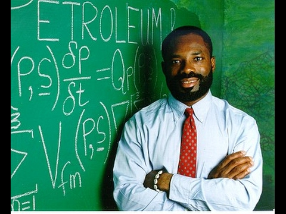

Top Ten Nigeria brings to us a countdown of Nigerian Inventors.You'll be surprised at the number of inventions that are being invented by Nigerians everyday.Nigerian is indeed a blessed country.I had to research thoroughly before I could choose these ones.
All inventions here are very useful and important.Bringing about the improvement of human lives.

#### 10- Sebastine Chinonye Omeh
He is best known for his research into the use of wind-propelled turbines to generate electricity.

####9- Saheed Adepoju
Saheed Adepoju is the inventor of the INYE-1&2,tablet computers designed for the African market.
The tablet was invented in 2010. His tablet is a 7-inch resistive touch tablet which has Wi-Fi and an inbuilt SIM.
The Inye tablet was designed to run on the android operating system.

#### 8- Seyi Oyesola
Seyi Oyesola is a Nigerian doctor, who co-invented 'hospital in a box',a solar-powered life-saving operating room which can be transported to remote areas of Africa and set up within minutes.

#### 7- Yemi Adesokan
Yemi Adesokan came up with a method by which drug-resistant infections can be treated.
His invention has already been put to use, especially in Africa were numerous infections and diseases are poorly managed. 
It is believed that Adesokan’s invention is capable of putting an end to the problem of drug-resistant infections in the world if properly employed.
He was honored by the MIT in 2011 because of his innovative work.

#### 6- Kunle Olukotun
Oyekunle Ayinde (Kunle) Olukotun is a pioneer of multi-core processors. 
A Nigerian was able to create the first microchip processors which support thread-level speculation. His invention was acquired by Sun Microsystem and is actively being used today in Sun Microsystem’s throughput computing technology.

#### 5- Samuel Achilefu
Samuel Achilefu is a Nigerian-born Professor of Radiography and Biomedical engineering.
In 2014, Samuel received the prestigious St. Louis Award for creating and developing a set of high-tech cancer-visualizing goggles with the aim of helping surgeons see cancer cells in real-time while operating on patients.

#### 4- Brino Gilbert
This invention is another unique and novel one. The Counter Collision Gadget is a device that has the capability of preventing a collision in locomotive vehicles, either on land, air or at sea. Developing a device that has been designed to prevent air, land, rail and sea accidents brought great accolades for the inventor, a Nigerian physicist from Edo state named Brino Gilbert.
So if see a car that can stop on its own accord to prevent an accident -that could be the work of a Nigerian.

#### 3- Ndubuisi Ekekwe
In this invention, the microchip was designed and embedded in robots which were used in performing minimally invasive surgeries. 
The microchip had the ability to store information and it is also able to control the surgical robot.

#### 2- Dr.Oviemo ovadje
Oviemo is a Nigerian medical Doctor who is credited with the invention of the Emergency Auto Transfusion System (EAT-SET), which is an effective, low-cost and affordable blood auto-transfusion mechanism that saves patients in developing countries.
He has patented the invention in nine (9) countries.
Think about this great invention and how many lives that have and could still be saved using this inventive system.

#### 1- Philip Emeagwali
Inventor Of World Fastest Computer.Philip Emeagwali is a Nigerian computer scientist.
He won the 1989 Gordon Bell Prize ($1,000) for price-performance in high-performance computing applications, in an oil reservoir modeling calculation using a novel mathematical formulation and implementation.

