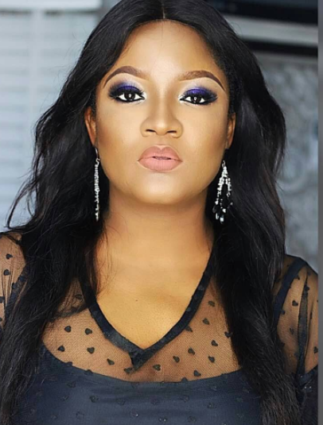
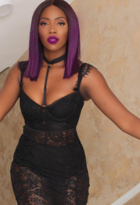
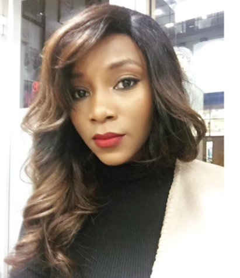
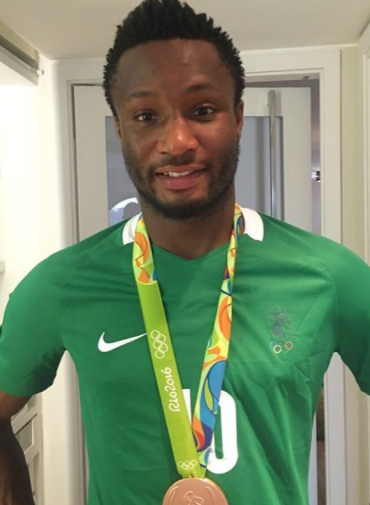
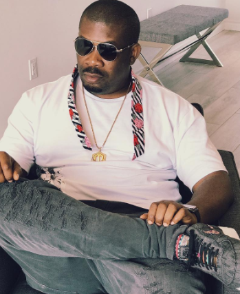
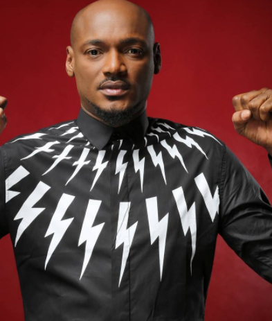
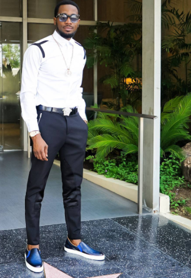
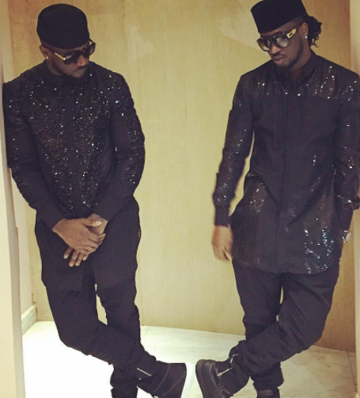
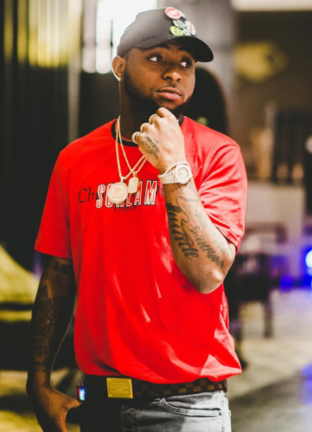
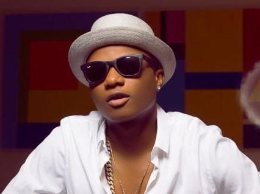

Top Ten Nigeria brings to us a countdown of popular Nigerian celebrities. This list consists of  musicians,actresses,television and radio hosts,media personalities,footballers and a host of others who have made their way to fame.
This rating is based on a number of things including social media followings.Their popularity is not only in Nigeria,they are known in other countries as well. Enjoy;

#### 10- Omotola Jalade Ekeinde
Omotola Jalade Ekeinde is a Nigerian actress, singer, philanthropist and former model. She is the first African celebrity to receive over 1 million likes on her Facebook page.  In 2014, she was honoured by the Nigerian government as a Member of the Order of the Federal Republic, MFR for her contributions to Nigerian cinema.She is known both locally and internationally,she has 1.6million followers on her instagram page.

#### 9- Tiwa Savage        
Tiwatope Savage-Balogun(born 5 February 1980), better known by her stage name Tiwa Savage, is a Nigerian singer, songwriter, performer and actress. She currently has a songwriting deal with Sony/ATV Music Publishing. Savage signed a recording contract with Mavin Records in 2012. Savage also signed a management and publishing deal with Roc Nation in June 2016, which she later confirmed via Instagram.She co-wrote the track 'Collard Greens & Cornbread' off Fantasia Barrino's Grammy-nominated album, Back to Me. Savage was featured on Solar Plexus, a compilation album released by Mavin Records.
Her debut studio album, Once Upon a Time, was released on 3 July 2013. It was supported by the singles 'Kele Kele Love', 'Love Me (3x)', 'Without My Heart', 'Ife Wa Gbona', 'Folarin', 'Olorun Mi' and 'Eminado'. Savage's second studio album, R.E.D, was released on 19 December 2015. It produced the singles 'My Darlin'', 'African Waist' and 'If I Start To Talk'. 
Savage sings in English and Yoruba. As a singer, her achievements include one MTV Africa Music Award, two The Headies Awards, one Channel O Music Video Award, one Nigeria Music Video Award, and two City People Entertainment Awards, among others.She is one of the most celebrated and popular female musicians in Nigeria.Its no surprise she made the list.

#### 8- Genevieve Nnaji  
Genevieve Nnaji (born 3 May 1979) is a Nigerian actress and singer.She won the Africa Movie Academy Award for Best Actress in a Leading Role in 2005, making her the first actress to win the award.
In 2011, she was honoured as a Member of the Order of the Federal Republic by the Nigerian government for her contribution to Nollywood.She's has continued to thrive after many years and she is one of the most popular nolywood actresses.

#### 7- John Mikel Obi
John Michael Nchekwube Obinna (born 22 April 1987), variously known as John Obi Mikel, John Mikel Obi or Mikel John Obi, is a Nigerian professional footballer who plays as a midfielder for Chinese club Tianjin TEDA in the Chinese Super League and the Nigeria national team.
He formerly played as a midfielder in the popular club 'Chelsea' which gained him fame both locally and internationally.

#### 6- Don Jazzy
Michael Collins Ajereh, better known as Don Jazzy, is a Nigerian record producer, singer, songwriter, and entrepreneur. He co-founded the now defunct record label Mo' Hits Records in 2004. Following the closure of the aforementioned record label, Don Jazzy set up Mavin Records on May 8, 2012.He's the most popular record producer in Nigeria.

#### 5- 2face Idibia
Innocent Ujah Idibia (born in Jos, Plateau State, Nigeria), better known by his stage name 2face Idibia, or 2Baba, is a Nigerian singer-songwriter, record producer and entrepreneur. He officially discontinued the use of the name Tuface and selected 2baba or Tu-baba as his stage name.
He is one of the most decorated and successful Afro pop artists in Africa. He is also one of the most bankable artists in Africa. 2Face has received one MTV Europe Music Award, one World Music Award, five Headies Awards (Hip-hop award), four Channel O Music Video Awards and one BET award for his musical work, four MTV Africa Music Awards, one MOBO award, one KORA award, and numerous additional nominations.
2face is a living legend in Nigeria.If you listen to hip-hop songs in Nigeria and you dont know 2face, are you a Nigerian?

#### 4- D'banj
Oladapo Daniel Oyebanjo (born 9 June 1980), known by his stage name D'banj, is a Nigerian singer-songwriter, musician, entrepreneur and TV host. He has won several music awards, including the awards for Best African Act at the MTV Europe Music Awards 2007, Artist of the Year at the MTV Africa Music Awards 2009,Best International Act: Africa at the 2011 BET Awards, and Best-selling African Artist at the 2014 World Music Awards, Evolution award at the 2015 MTV Africa Music awards.
He adopted the stage name D'banj, a combination of his first name, Dapo, and his surname, Oyebanjo. D'banj is currently best known internationally for his 2012 summer hit 'Oliver Twist', that topped the African charts 2011 and was a top 10 hit in the UK singles chart in 2012 reaching No. 2 on the UK R&B chart. 
As of 2016, D'banj is ranked to be the richest solo musician in Nigeria according to T.I.N Magazine.D'banj is very popular both locally and internationally.

#### 3- P-Square
P-Square are a Nigerian R&B duo of identical twin brothers Peter Okoye and Paul Okoye. They produce and release their albums through Square Records. 
In December 2011, they signed a record deal with Akon's Konvict Muzik label. In May 2012, they signed a record distribution deal with Universal Music South Africa.They are the most popular twins in Nigeria.They have being around for long and they keep coming out with hits after hits.Kudos to them.

#### 2- Davido
David Adedeji Adeleke (born November 21, 1992),better known by his stage name Davido, is an American-born Nigerian recording artist, performer and record producer. His 2011 single 'Dami Duro' was well-received throughout Nigeria. Along with his elder brother Adewale Adeleke, Davido is the co-owner of HKN Music (a record label home to Sina Rambo, B. Red and DeeKay).  
In January 2016, Davido announced via Twitter that he signed a record deal with Sony Music. Davido started his own label, Davido Music Worldwide (DMW), few months after signing with Sony.
In July 2016, Davido signed a record deal with Sony's RCA Records.The singer is one of the most popular Nigerian musicians,he sang in one of his recent songs that the popular real-madrid footballer Cristiano Ronaldo followed him on instagram.lol

#### 1- Wizkid
 Ayodeji Ibrahim Balogun (born 16 July 1990),better known by his stage name Wizkid , is a Nigerian singer and songwriter. 
In 2016, Wizkid achieved international recognition following his collaboration with Drake on the global hit, 'One Dance', which reached number one in 15 countries, including the United States, United Kingdom, Canada and Australia.
On 1 March 2017, Billboard magazine reported that Wizkid signed a multi-album deal with RCA Records.
He was ranked 5th on Forbes and Channel O's 2013 list of the Top 10 Richest/Bankable African Artists. In February 2014, Wizkid became the first ever Nigerian musician to have over 1 million followers on Twitter. On April 5, 2016, Wizkid became Nigeria's first artist to emerge on Billboard’s Twitter Last 24 hours chart following his guest feature on Drake's afrobeat-infused 'One Dance' single, which charted at number 21 and in May 12, 2016, the song reached number-one on the Billboard Hot 100 chart, a position it kept for 10 non-consecutive weeks. The single went on to become an international smash hit, topping the charts in 15 different countries, including the United Kingdom, Canada, Australia, France and Germany. 
The single thereby became Wizkid's first number-one single as a featured artist in these territories. Wizkid is therefore our most popular Nigerian celebrity. Weldone Sir.  

