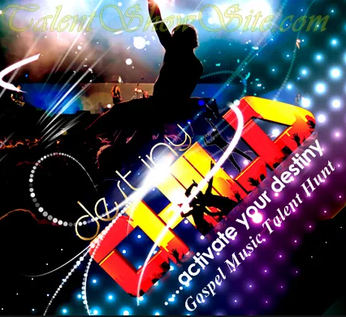
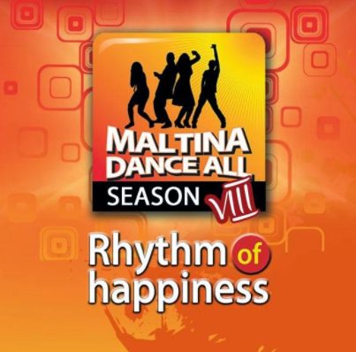
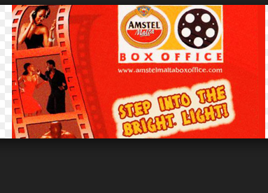
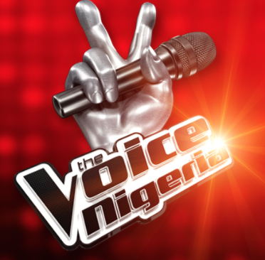
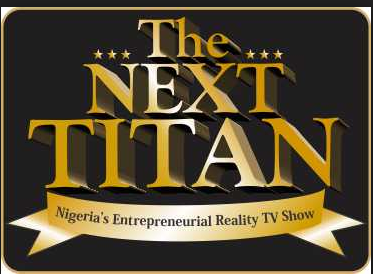
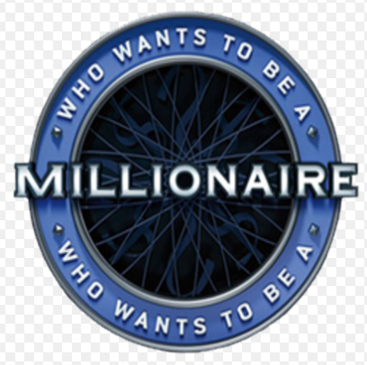
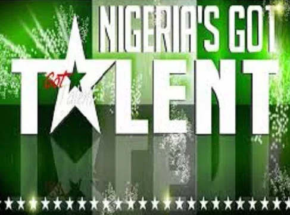
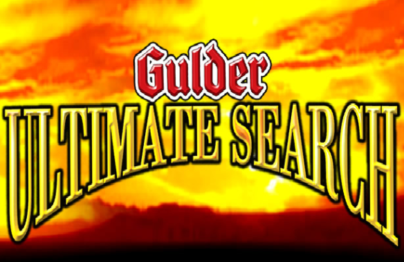
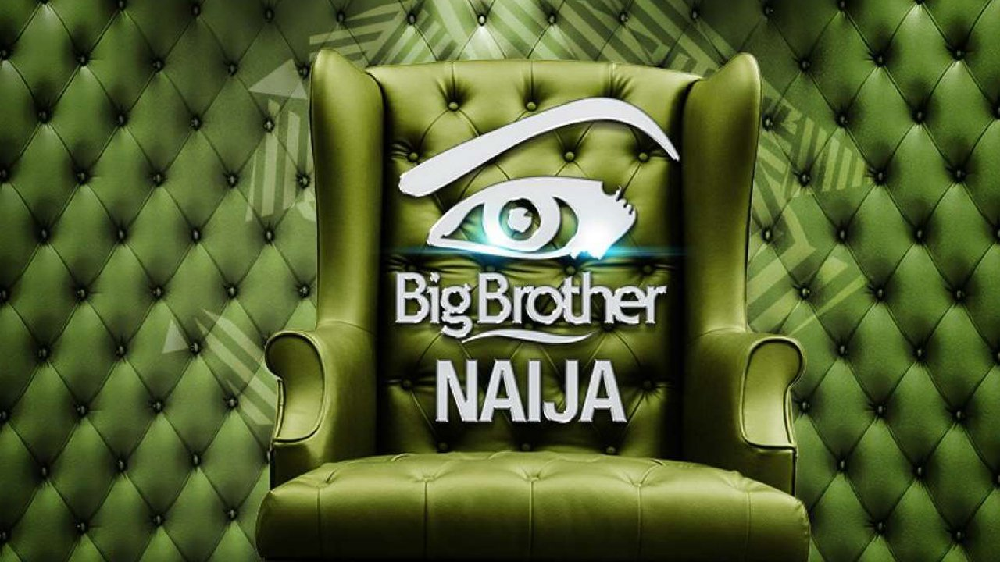

Top Ten Nigerian brings the top ten tv reality shows in Nigeria. These shows are entertaining,intriguing,educative,challenging,captivating,mind blowing etc.
One essential feature of these reality shows is that the winner wins whopping cash prices, exotic cars, trips to their favourite tourist sites and  music contracts with reputable music companies.Reality tv shows have made the contestants famous. Contestants also use them as platforms to start their careers and make them famous. Here's the countdown;e.

#### 10- Destiny Child Gospel Music talent hunt
This is one of the few talent shows in Nigeria that gear towards fishing out talented gospel singers and help them to develop their music skills in order to build a booming music niche. The talent hunt offers a wide range of opportunities to young talented gospel music ministers. 

#### 9- Maltina Dance Show
 Maltina Dance Show is sponsored by the makers of Maltina which is a popular drink in Nigeria. It is a talent show for people who can dance. It is held on yearly basis. 
It gives talented dancing families the opportunity to showcase their dance steps to the audience all over Nigeria.

#### 8- Amstel Malta Box Office
Amstel Malta Box Office also known as AMBO is a Nigerian television reality show launched in 2005.The TV reality show is sponsored by Nigerian Breweries, the largest brewing company in Nigeria.
This reality TV show aims are helping young Nigeria that are talented in acting to develop their acting skills in order to become super star actors.

#### 7- The Voice 
The Voice Nigeria is the Nigerian version of the TV series The Voice. It premiered on Africa Magic television channels Showcase and Urban on DStv in Nigeria on 10 April 2016 and was sponsored by Airtel and Coca-Cola. The winner would earn a recording contract with Universal Music Group, an SUV car worth N7 million and a trip to Abu Dhabi.

#### 6- The Next Titan
Next Titan talent show is sponsored by MTN. The show is organized for Nigerian young entrepreneurs. In the show, 20 talented young entrepreneur compete in a business driven tasks. The grand prize is N 5, 000,000 and a brand new car for the support of their business.

#### 5- Who wants to be a millionaire?
Who wants to be a millionaire? is a Nigerian game show based on the original British format of Who Wants to Be a Millionaire?. It first aired on 8 October 2004 and stopped temporarily on the 25th of June, 2017 with hope of coming back soon better and stronger.
The grand price is 10million naira. Presented by Frank Edoh.

#### 4- Nigeria's Got Talent
Nigeria's Got Talent is a Nigerian reality talent show which is part of the Got Talent franchise. It was launched in 2012 on television stations AIT and NTA, and sponsored by telecommunication company Airtel.
Hosted by Andre Blaze, a former presenter on Nigeria's Got Talent's fore-runner The Peak Talent Show,the judges are actress Kate Henshaw, comedian Yibo Koko, and radio presenter Dan Foster, who had previously held a similar position on Idols West Africa.

#### 3- Gulder Ultimate Search
Gulder Ultimate Search (also called GUS) is a Nigerian reality television series, created and sponsored by Nigerian Breweries Plc to promote the Gulder Lager Beer. The first season premiered in 2004. The GUS series is also the very first 100% local content reality television programme in Nigeria and it is a survival type reality programme that highlights the struggle of Contestants (10–30 persons, depending on the reference edition), their struggles against themselves and the wild i.e. nature and their search for a hidden treasure that brings to the last person standing instant fame and fortune.

#### 2- Project Fame
Project Fame, also known as Project Fame West Africa or MTN Project Fame West Africa (for sponsorship purposes), is a music talent TV reality show filmed in Lagos and aired in the West African subcontinent. It is a regional version of Star Academy reality series that was developed and is licensed worldwide by Endemol. The show used to feature contestants from Ghana, Liberia, Nigeria and Sierra Leone, but Liberia and Sierra Leone have been dropped since the 2014 Ebola Outbreak. The show is broadcast by networks in these four countries and across the African continent.
The MTN Project Fame is a yearly talent show that provides young people opportunity to show their talents and get a chance of winning huge prizes.

#### 1- Big Brother Naija
Big Brother Naija, formerly known as Big Brother Nigeria, is a reality TV show based on the Big Brother TV series in which 12 contestants live in an isolated house and compete for a large cash prize worth $100000 at the end of the show by avoiding being evicted by viewers. The first season of the show first aired on DStv Channel 37 from March 5 to June 4, 2006. The voting results are verified by the auditing company of Alexander-Forbes.

