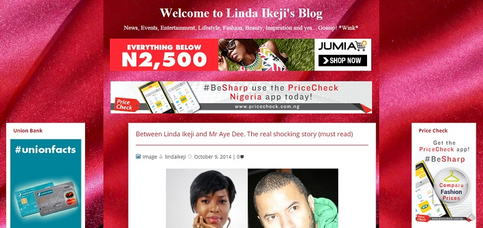

There probably are no people left who do not know that blogging can be a real goldmine. 
Blogging in Nigeria have become a serious business taking a completely different dimension in recent years from what it used to be. Blogging gives people platforms to air their views in any matter of their interest as well as creating solid business for smart entrepreneurs. While some Nigerian blogs and bloggers are still struggling to hit the golden jackpots, others are currently making the real big money and enjoying the dot com lifestyle as well as the the glamours that come with it.

#### 10- Afrifoodnetwork
One of the blog where you get all the tips for making good Nigeria meals for everyone that loves good meals.
recipes and health tips.

#### 9- Techpoint
This is another popular Nigerian blog specializing in technologies. One can read the latest articles on the newest gadgets which were recently launched as well as check out the ideas on startups or their realization. They post latest updates on technology news from all over the world.

#### 8- Tooxclusive
Tooxclusive.com is Nigerian Music site which provides you with Nigerian & Ghanaian Songs & Videos of your favorite Artists.

#### 7- Laila's blog
Lailas blog is one of the best when it comes to giving out latest and accurate information about the entertainment industry,business news,politics and also things, The blog started in January 2013. 7- The Voice 
The Voice Nigeria is the Nigerian version of the TV series The Voice. It premiered on Africa Magic television channels Showcase and Urban on DStv in Nigeria on 10 April 2016 and was sponsored by Airtel and Coca-Cola. The winner would earn a recording contract with Universal Music Group, an SUV car worth N7 million and a trip to Abu Dhabi.

#### 6- Naijaloaded
Naijaloaded is the No. 1 Hotspot for Nigerian Music, Video, News and Entertainment News. Naijaloaded launched in 2009, and it has grown to become one of the top websites in Nigeria.
Makinde Azeez is the founder of Naijaloaded.

#### 5- Hotnigerianjobs
The is the biggest blog in the Nigerian Jobs niche. This blog truly deserves it’s place on the top position.
For job seekers in Nigeria,this is the blog to watch.It contains the biggest collection of job opportunities and keeps updating the list.Not only can visitors search for jobs,they can also post jobs if they are in need of professionals for their companies.These services are both free of charge. The blogs interface also makes it easy to use.

#### 4- 360nobs
360Nobs.com is a Nigerian & African based entertainment & lifestyle website with all the latest news, music, literature, fashion tips & more.

#### 3- Naijasinglegirl
Naijasinglegirl is a satirist, lifestyle blogger, brand storyteller and content creator based in Nigeria.
She is on a quest to find a good man, a good job, good food, good money and all other good things life has to offer.
This website is mostly Naijasinglegirl’s documented experience during this chase.
Rather than weep over her single status, she chooses to laugh about it here, I hope you do, too. She also published her debut novel in 2016 called 29, Single & Nigerian.

#### 2- Bellanaijablog
Bellanaija is one of the biggest Nigerian blogs
An online blog that focuses on news, entertainment, fashion, lifestyle and other media contents aimed at wide range of audiences.audiences. It was founded by Uche Eze in 2006.

#### 1- Lindaikeji'sblog
Lindaikeji'sblog is the biggest blog in Nigeria.
It focuses on news,events,entertainment,lifestyle,fashion,beauty,inspiration and gossip.

