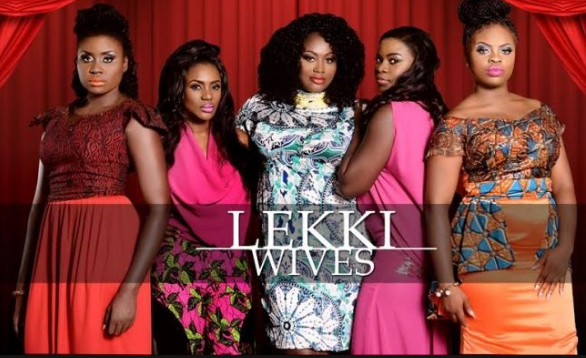

Top Ten Nigeria brings us the top ten t.v series in Nigeria. This is a list of the most popular Nigerian tv series. Some on this list have ended while some are still airing.These t.v series are dramatic,funny,entertaining and suspense filled. You can find most of them on irokotv and youtube.

#### 10- Lekki Wives
On this backdrop, I believe Blessing Egbe’s new flick, Lekki Wives, is a splendid and blunt portrayal of the wealth madness at all cost syndrome which has become endemic and contagious in us as a nation. In the film or drama series as one might choose to classify it, we see married ladies all out to do anything to move into the Lekki highbrow, maintain the suave and nouveau riche lifestyle, mingle and associate with the timbers and calibers of the society at the detriment of their family.

#### 9- Gidi Up
Gidi Up shadows the life of four young men and women (Obi, Tokunbo, Eki and Yvonne) who are pursuing success and independence in the city of Lagos, revealing the challenges they are faced in the quest to achieve their dreams.

#### 8- This is it
'This is It'  follows the first year journey of the young clueless newlyweds Dede and Tomide, how they adjust living together, dealing with friends and a little drama.

#### 7- Before 30
The plot springs from the lives of four young and urbane career women based in Lagos who have chosen the upwardly mobile life while having to deal with the demands of settling down before they all turn 30 years old.

#### 6- MTV Shuga
The underlying theme of this show is enlightenment on the HIV/AIDS menace in Africa in the bid to disseminate knowledge. The first season was commissioned by MTV Africa and the Partnership for an HIV-Free Generation and the Government of Kenya amongst others. Lupita Nyongo was part of the first and second season after which Shuga moved from Nairobi to Lagos. Tiwa Savage, Ikechukwu and other celebrities have also featured in Shuga, making it  an amazing platform to educate young people on safe sex, family planning amongst others. With 3 seasons done and dusted, the 4th season is going to be amazing.

#### 5- Husbands of Lagos
Husbands of Lagos is a Nigerian television series produced by ROK Studios. The series, which debuted on December 1, 2015, tells the story of seven men living in Lagos and the women in their lives.

#### 4- Jenifa Diary
Jenifa's Diary is a Nigerian television comedy series, created by Funke Akindele. The series is part of the Jenifa franchise, based on a naive and funny character of the same name. This series tells a story of a native village girl who desperately wants to get out of her ratchet way of life. In her desperation she leaves her village and goes to the city of lagos in order to process her visa to travel to the United States. Although unsuccessful with her visa application she decides to stay in Lagos and live a better life. She then finds herself in University of Lagos, with the help of a lady she met, Toyo baby (Olayade Juliana) and Kiki (Lota Chukwu) who help and accommodate her.

#### 3- Tinsel
Tinsel is a Nigerian soap opera that began airing in August 2008. On May 23, 2013, the show's 1000th episode aired. It has been called 'the most successful television drama on Nigerian television in recent times'. Tinsel's plot revolves around two rival film companies: Reel Studios, founded by Fred Ade-Williams (Victor Olaotan), and Odyssey Pictures, headed by Brenda 'Nana' Mensah (Funmilola Aofiyebi-Raimi).

#### 2- The Johnsons
The Johnsons is a Nigerian series which airs on Africa Magic. It focuses on an average Nigerian family in Lagos, Nigeria and the challenges they face

#### 1- Skinny Girl in Transit
Skinny Girl In Transit is a Nigerian Comedy webseries that began airing in July 2015, produced by Ndani TV, and as the name implies, it is a comedy about a young Nigerian woman and her efforts to lose weight.

