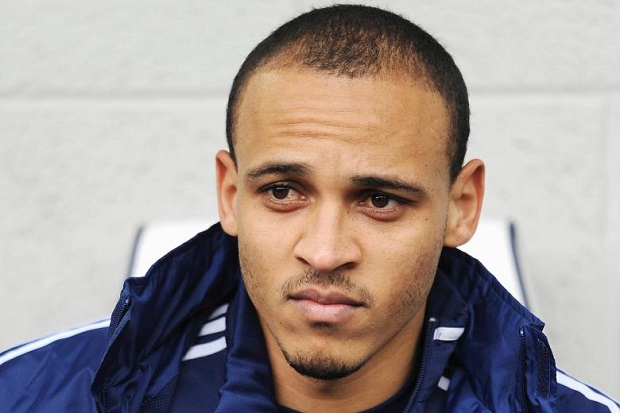
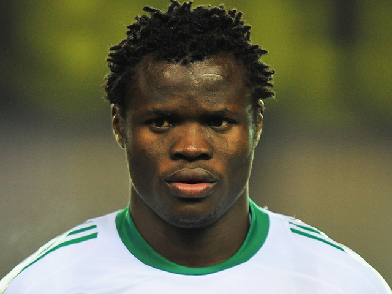
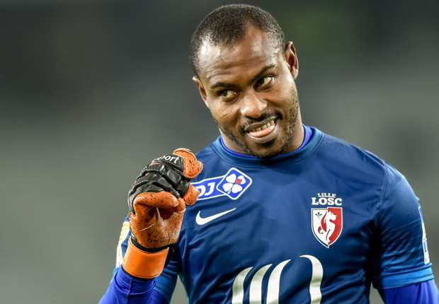
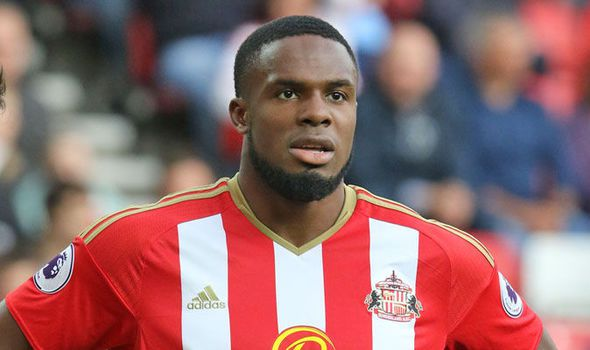
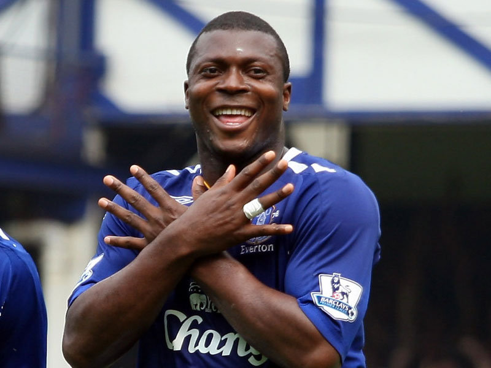
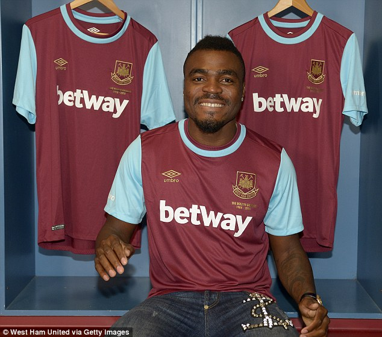
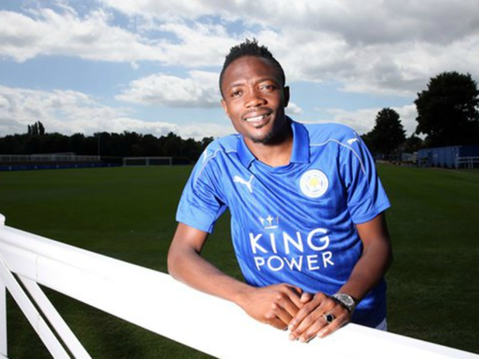
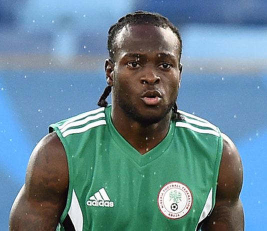
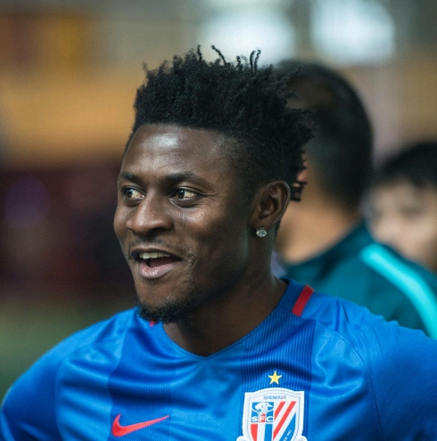
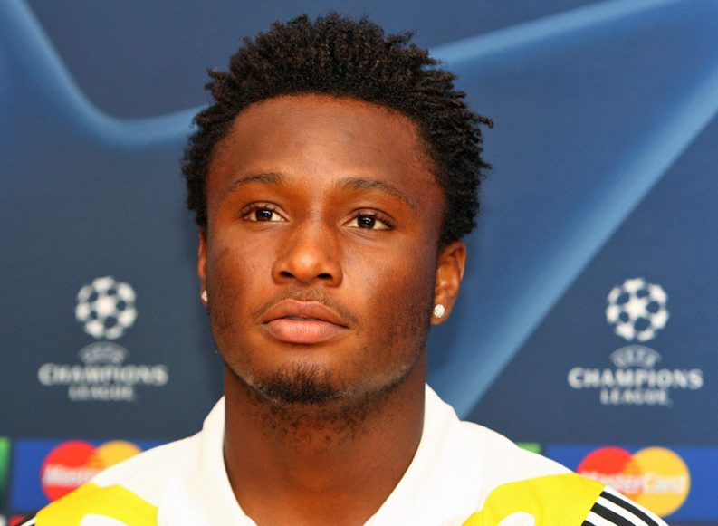

Top Ten Nigeria brings the Top Ten Richest Footballers in Nigeria 2018. As a notable point, these athletes might not be the highest-paid Nigerian footballers but based on endorsements, salaries and the other fortunes they have garnered so far in their careers, they are the richest Nigerian footballers at the moment.

#### 10- Peter Osaze Odemwingie
Peter Osaze Odemwingie born 15 July 1981 is a Nigerian professional footballer who plays as a forward and winger.
At the moment, he is declared with the net worth of $5.5 million.

#### 9- Taye Ismaila Taiwo
Taye Ismaila Taiwo born 16 April 1985 is a Nigerian professional footballer who plays as a defender for RoPS.
Taye Taiwo –a left-footed footballer –is considered one of the richest Nigerian footballers and at the moment, he is declared with the net worth of $6.6 million.

#### 8- Vincent Enyeama
Vincent Enyeama born 29 August 1982 is a Nigerian professional footballer who currently plays for Ligue 1 club Lille as a goalkeeper. He was also a member of the Nigerian national team from 2002 until October 2015, serving as its captain from 2013 until his retirement from international football. With 101 caps, he is Nigeria's joint most capped player of all time.
 Annually, the Nigerian star earns the total of £1.8 million and his current net worth is estimated at $7 million

#### 7- Victor Chinedu Anichebe
Victor Chinedu Anichebe born 23 April 1988 is a Nigerian professional footballer who is a free agent and most recently played for Beijing Enterprises as a striker. He has a net worth of $11 million.

#### 6- Yakubu Aiyegbeni
Yakubu Aiyegbeni born 22 November 1982, known as Yakubu, is a Nigerian former professional footballer who last played as a striker for Coventry City. The professional footballer has taken the advantage of his long football spell in Europe to amass sumptuous wealth which now gives him the net worth of $14.5 million.

#### 5- Emmanuel Emenike
Emmanuel Chinenye Emenike born 10 May 1987 is a Nigerian international footballer who plays as a striker for Las Palmas on loan from Olympiacos. His current net worth is valued at $18 million.

#### 4- Ahmed Musa
Ahmed Musa born 14 October 1992 is a Nigerian professional footballer who plays as a forward for CSKA Moscow (a Russian football club), and the Nigeria national team. The positions he plays are striker and left winger. He has a net worth of $18 million.

#### 3- Victor Moses
Victor Moses born 12 December 1990 is a Nigerian professional footballer who plays as a winger or wing-back on either flank for Premier League club Chelsea and the Nigeria national team. Currently, Victor Moses’ net worth is estimated around $20.1 million.

#### 2- Obafemi Akinwunmi Martins
Obafemi Akinwunmi Martins born 28 October 1984 is a Nigerian footballer who plays as a forward for Shanghai Greenland Shenhua. He is known for his speed on the ball.Date of birth 28 October 1984 (age 33).
At Shanghai Shenhua, he is reported to be earning the whopping sum of £8.4 million on a yearly basis. During his spell at the MLS side [Seattle Sounder], Martins was reported with the estimated net worth of $35 million. With this enormous sum, Obafemi Martins perfectly fits into this list as the second richest Nigerian footballer. In addition to his Italy-based assets, Martins owns a number of assets in other places.

#### 1- John Mikel Obi
John Michael Nchekwube Obinna born 22 April 1987 is a Nigerian professional footballer who plays as a midfielder for Chinese club Tianjin TEDA in the Chinese Super League and the Nigeria national team. He has a net worth of $50 million.

