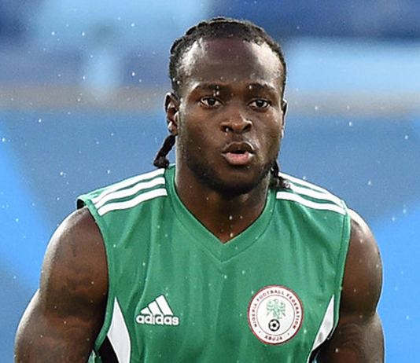
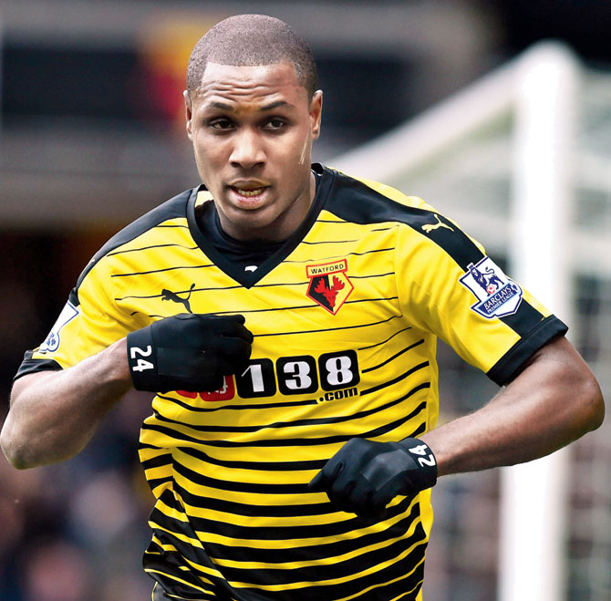
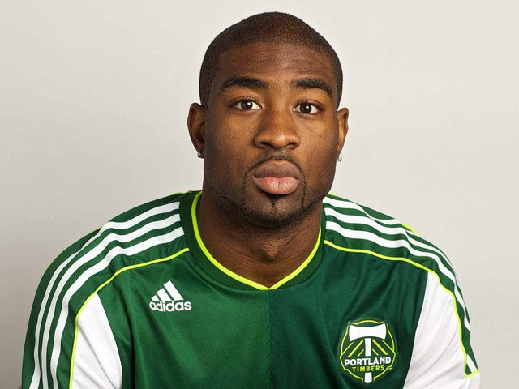
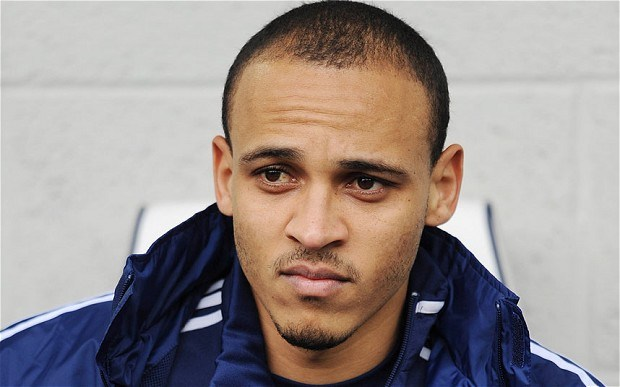
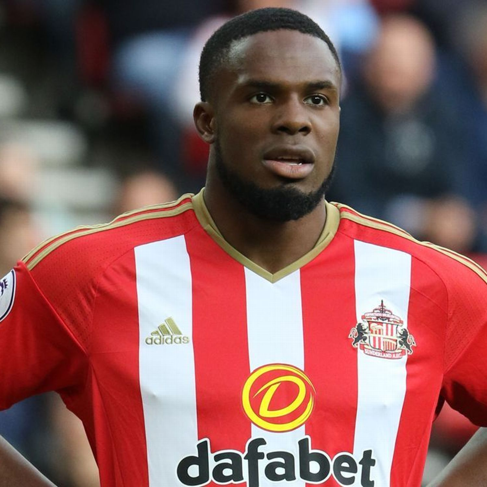
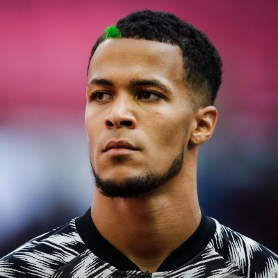
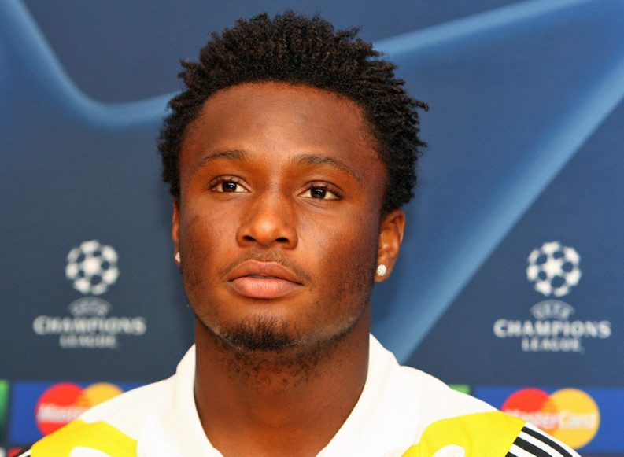
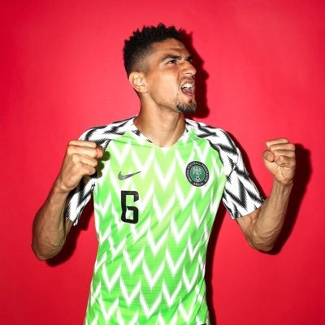
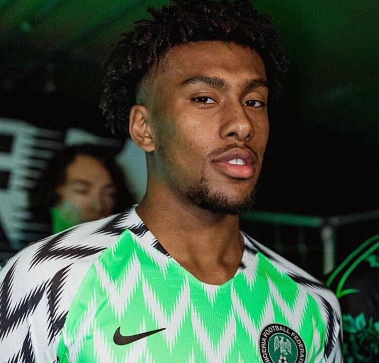

At some point, I was forced to watch football and I discovered that there are some really FINE players. Like, I have been missing big time. Here are the top ten handsome Nigerian footballers that knock ladies off their feet.

#### 10 - Victor Moses
Victor Moses (born 12 December 1990) is a Nigerian professional footballer who plays as a winger or wing-back on either flank for Premier League club Chelsea and the Nigeria national team. He is tall, dark and handsome- the dream man of every Nigerian lady.

#### 9- Odion Ighalo
Odion Jude Ighalo (born 16 June 1989) is a Nigerian professional footballer who plays as a striker for Chinese club Changchun Yatai and the Nigerian national team. Ighalo made his debut for Nigeria in 2015. He represented the nation at the 2018 World Cup. He's a fine Nigerian man and I like his hair cut in particular.

#### 8- Bright Dike
Chinedu Bright Dike was born on February 2, 1987,he  is a Nigerian international footballer who plays as a forward. He is the cousin of Super Eagles striker Emmanuel Emenike. He looks like a black American fine boy but nah He's Nigerian.

#### 7- Carl Ikeme
His heroics in the goal-line for the Super Eagles alone passes a message across to the ladies that they can have a sense of security when the 30-year-old is their number one. He has that bad boy kinda beauty that ladies love.

#### 6- Osaze Odemwinge
Nigeria’s ‘fine boy’ on the field (too bad he’s married). Peter Osaze Odemwingie is a Nigerian professional footballer. He grew up in Russia and Nigeria and began his career with Bendel Insurance in the Nigeria Premier League.

#### 5- Victor Anichebe
Victor Chinedu Anichebe (born 23 April 1988) is a Nigerian professional footballer who is a free agent and most recently played for Beijing Enterprises as a striker. He is tall,dark,handsome and he is well built(body goals for most men) which got girls drooling over him.

#### 4- William Froost Ekong
Born in the Netherlands into a mixed Dutch and Nigerian family little wonder where he got his good looks from.

#### 3- Mikel Obi
Mikel Obi is a fine Igbo man (no doubt),no wonder that Russia woman hijacked him from us. His physical appearances alone is worth making the girls have butterflies. 

#### 2- Leon Balogun
Leon-Aderemi Balogun (born 28 June 1988) is a German-born Nigerian professional footballer who plays as a defender for Premier League club Brighton & Hove Albion. The first time I saw him on the pitch I couldn't believe he was a Nigerian. He's a fine somebody and he's on the number two spot in today's countdown.

#### 1- Alex Iwobi
Alexander Chuka Iwobi  born 3 May 1996 is a Nigerian professional footballer who plays as a forward for Premier League club Arsenal and the Nigeria national team. He's tall,dark and handsome. Which other person to take the number one spot apart from Iwobi, He's so fineee and you can only imagine the number of girls drooling over him. 

