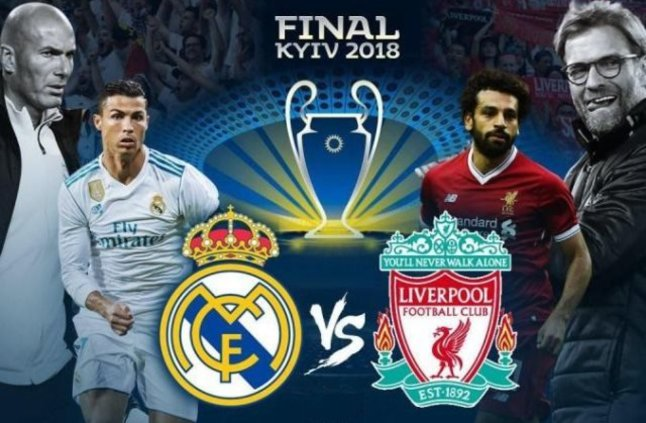
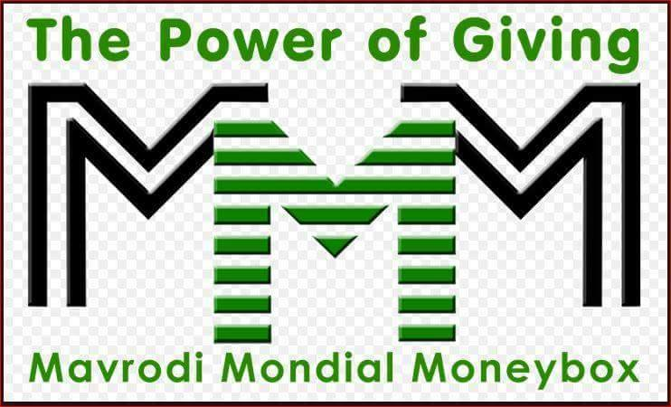

This week's topic is a little bit controversial . I'll be getting on the tail of some people.Lol. This week we're talking about the top ten biggest scams that readily comes to mind;

#### 10- LIPTON
After I saw that advertisement of lighten your world and how lipton makes a person smart, calm and thoughtful, I drank the content of a packet and my world is still dark, I think I'm even still dumb.

#### 9- ROMEO AND JUILET
When it was time for me to read this book, I bought 86 tissue papers so that I will clean my eyes as I believed that all the waters in my body would be cried out but after I finished reading it, I asked my teachers if the book had a sequel because I saw no love, just innocent foolishness which the sequel would tell how God and devil fought for who would flog those two fools first. And the tissue, we still dey use am for toilet tins.

#### 8- JUSTIN BEIBER'S SONG BOYFRIEND
My big sis stayed awake all night, waiting to download the song and finally when she did a long hiss followed, a hiss that made my dad run to her room with a machete as he thought a snake had made the sound. The dude later redeemed himself with other nice tunes shaa.

#### 7- BLACK PANTHER
The movie thrust the world into chaos and left many bereft of thought. The trailer alone made millions of people to seek for the existence of WAKANDA despite being told that the place is fictional. Every alarm was set for the release date and when it finally came, I forgot my baby sister on the cinema stand as I hustled to buy tickets. After the movie, I cried for a month as my parents sent me out to search for their child, my pain was never because of the baby (she is very annoying) my pain was that the movie was not even worth it. The movie that the world waited for its release, after the introduction of its main character in captain America civil war was a...dud. It had a poor story line, with highly sceptical (rubbish...who big English epp) unbelievable actions and the use of almost impossible technologies did not help matter and seriously...marvel, SAMBISA!!!Where was Black Panther when Chibok girls were missing now those yeye Marvels now want to lie, see the ease they used in destroying our Boko Haram. Mtcheew.

#### 6- 2012
That was the year the world ought to be destroyed and everyone would end up dead but 6 years later, we are still waiting for our doom. To think that some people gave all they had to churches before the set date of the destruction and started begging for a return when nothing happened just gives us a big and very important moral lesson which, I don't know.

#### 5- REAL MADRID VS LIVERPOOL
The die was cast, it was the match of the day, of the week, of the month, of the year, of the decade, of the century, of the millennium, of the...well you know what i mean. We all hoped to see a civil war between the two best counter attacking sides but an early injury to Liverpool's main man, Mohammed Salah and blatant mistakes from the goal keeper ended things on a boring note as Liverpool had to play defence throughout the second half. What a shame.

#### 4- DETERGENTS IN NIGERIA
This people lie no get part two. You will just be watching one nice movie, the next thing you will see is one yeye advertisement where one woman will put a very dirty cloth inside water mixed with Arial and wipe it once, immediately the dirty clothe will transform to the kind of cloth Jesus will wear when he comes again. I tried this thing when I was small. I dirtied my new white shirt my mumsi just bought and did as instructed in the advertisement; I did not know my mum was watching me. The slap I received after my failed experiment made me to believe that Black Is Beautiful.

#### 3-SUPERMAN VS BATMAN.
DO YOU BLEED? that question was the highlight of the trailer people were crying , singing, shouting, dancing giving glory to Sango that DC had finally produced a beautiful movie. STV now even carry the matter on their head and were now showing the trailer every 2 minutes. Movie come show, what we saw was an almost fat batman that was wearing koi koi shoe.

#### 2- MMM	
My uncle said with MMM he will be richer than Dangote. Many people referred to this as Money Making Machine but you wey dey read with your big eyes and you wan use 20k chop 2million, na Sango go purge you. On the fateful day which MMM crashed, it was like a burial, like the Passover night. In every family one mumu had donated money to the scheme and wailed like a cow. Oh and that my uncle, he now sleeps in church where he prays for God's thunder to fire the nose tip of the person who started MMM.

#### 1- BUHARI
Scam of the Century. CHANGE was the mantra. On the eve of his inception as president of Nigeria many people began to trek to Aso rock for reasons I could not understand and the worst part was that these mediocre media group were giving attention to these attention seekers. On our papers we were given large akara of corrupt officials who returned their loots for fear of our GOD FEARING OGA. The baba even promised to equate one naira to one dollar but 3 years later the trending slogan is CHANGE THE CHANGE THAT IS CHANGING US. When he pumped our brains with these lies, we all thought he was our Moses, little did we know that oga is Amadioha's favourite comedian.

