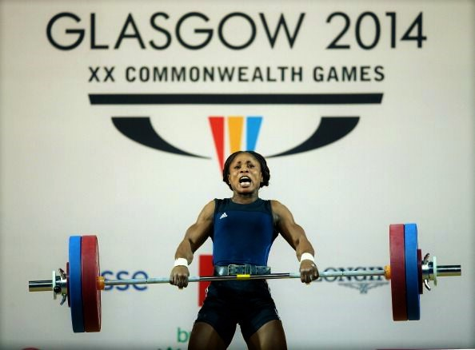
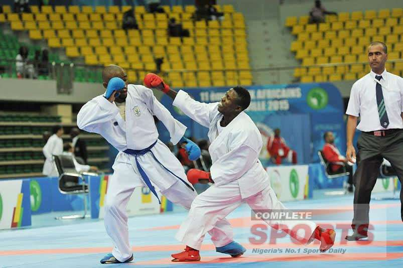
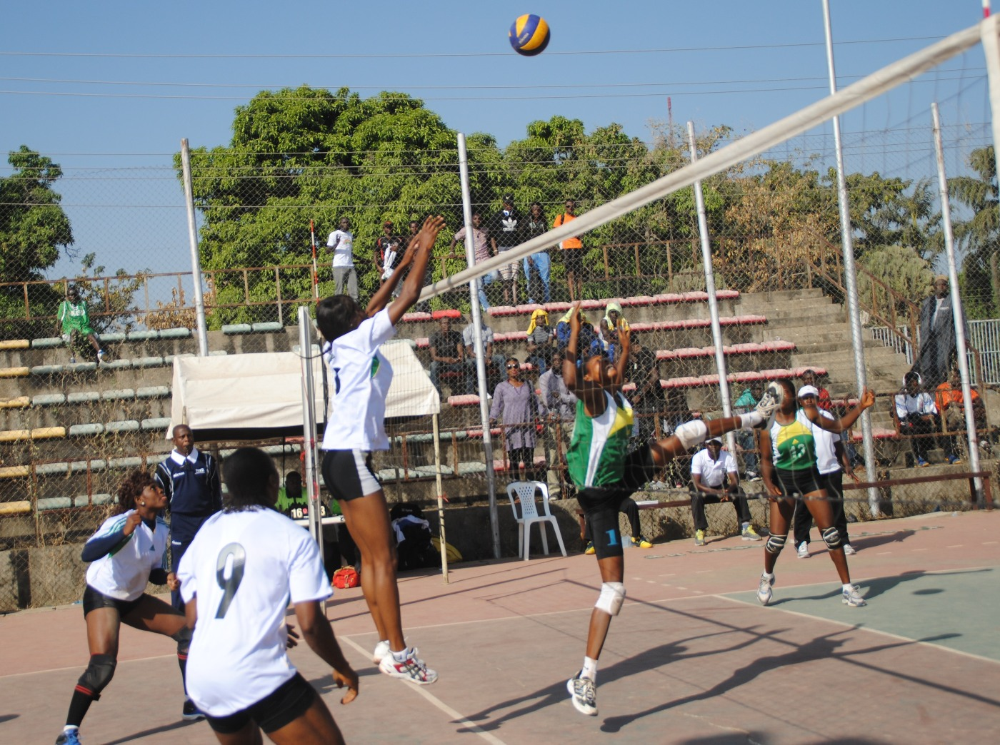
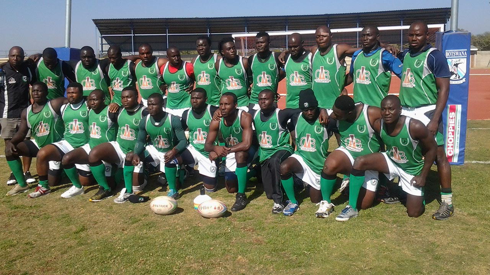
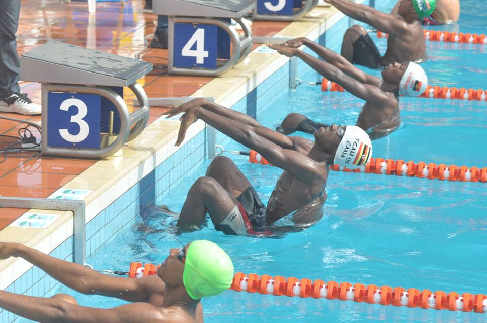
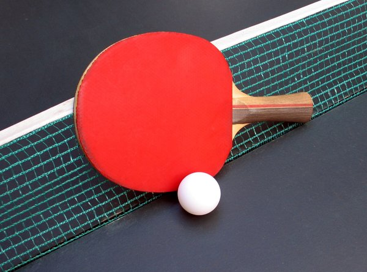
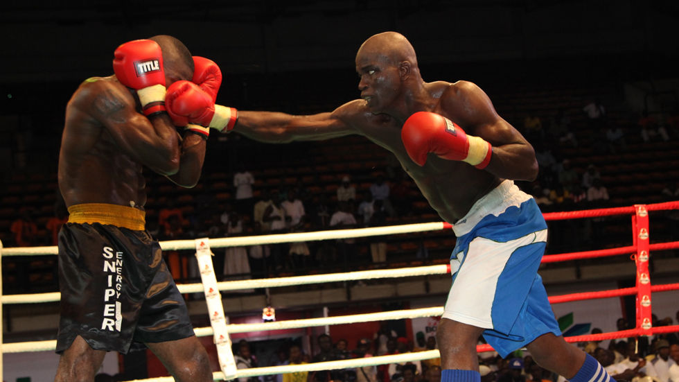
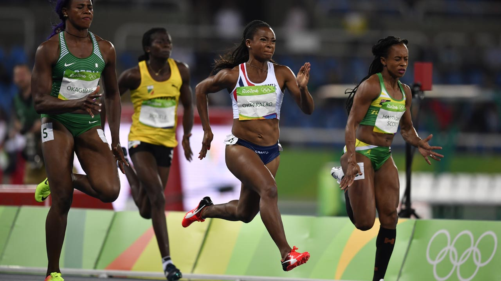
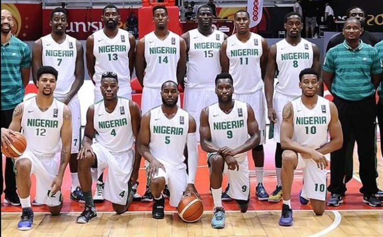
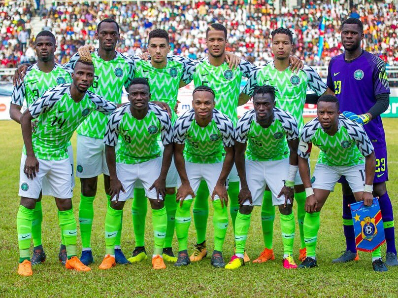

Nigerians engage in lots of sporting activities,they also organise local sport competitions and are involved in international competitions. Nigeria has made its mark in global sports competition. Here are the top ten sports in Nigeria;

#### 10- Weightlifting.
This is a sport that almost everyone engage in for fitness and to build the body muscles.
Weightlifting is the sport or activity of lifting barbells or other heavy weights. The Nigeria Weightlifting Federation, otherwise known as NWF, formed in 1963,  is the national governing body that oversees the sport of weightlifting in Nigeria.

#### 9- Karate
Karate is a Japanese martial art whose physical aspects seek the development of defensive and counterattacking body movements. It is an oriental system of unarmed combat using the hands and feet to deliver and block blows, widely practised as a sport.Many Nigerians are now engaging in karate as a sport.
Karate Federation of Nigeria it is the largest association for karate in Nigeria and a member as well as the official representative for this sport in the Nigeria Olympic Committee.

#### 8- Volleyball
This is a game for two teams, usually of six players, in which a large ball is hit by hand over a high net, the aim being to score points by making the ball reach the ground on the opponent's side of the court. The volleyball is fast becoming a popular sport in nigeria.
Nigeria Volleyball  Federation (NVBF)  is the national governing body that oversees the sport of volleyball in Nigeria.

#### 7- Rugby
Rugby is a team game played with an oval ball that may be kicked, carried, and passed from hand to hand. Points are scored by grounding the ball behind the opponents' goal line (thereby scoring a try) or by kicking it between the two posts and over the crossbar of the opponents' goal.
The governing body is the Nigerian Rugby Football Federation.

#### 6- Swimming
Traditional Swimming has been in existence in riverine communities all over Nigeria even before Nigeria became the country that it is today. People living in various fishing communities learnt how to swim for survival purposes to prevent them from drowning whenever they went out in their boats to fish.  Swimming activities were also often part of various traditional festivals in many parts of the country.
Swimming is one of the sports that nigerians actively engage in and various swimming competitions are being held both locally and internationally.
Over the years, Nigerian swimmers have participated in numerous International Competitions including the following  :
* Africa Zone 2Junior Swimming Championships
* Africa Zone 2 Senior Swimming Championships
* African Junior Swimming Championship
* African Senior Swimming Championships
* FINA World Aquatics Championships
* FINA World Swimming Championships (25m)
* African Youth Games
* African Games
* Commonwealth Games
* Olympic Games

#### 5- Tennis
Tennis is a racket sport that can be played individually against a single opponent (singles) or between two teams of two players each (doubles). Each player uses a tennis racket that is strung with cord to strike a hollow rubber ball covered with felt over or around a net and into the opponent's court. The object of the game is to maneuver the ball in such a way that the opponent is not able to play a valid return. The player who is unable to return the ball will not gain a point, while the opposite player will.
Tennis is an Olympic sport and is played at all levels of society and at all ages. And it is also a popular sport in Nigeria.

#### 4- Boxing
Boxing is a combat sport in which two people, usually wearing protective gloves, throw punches at each other for a predetermined set of time in a boxing ring. We are africans and were strong ,its only natural that we engage in the sport of boxing.

#### 3- Track and Field (Athletics)
Track and field is a sport which includes athletic contests established on the skills of running, jumping, and throwing.The name is derived from the sport's typical venue: a stadium with an oval running track enclosing a grass field where the throwing and some of the jumping events take place. Track and field is categorized under the umbrella sport of athletics, which also includes road running, cross country running, and race walking. It is the core sporting activity that Nigerians engage in ,there is no sport event happening that running,jumping or throwing will not be among the listed sport activity.
The Athletics Federation of Nigeria is the governing body for the sport of athletics in Nigeria. It is a member of the Confederation of African Athletics and the International Association of Athletics Federations.

#### 2- Basketball
The Nigerian national basketball team is overseen by the Nigeria Basketball Federation (NBBF). It is generally considered to be one of the best national basketball teams in the FIBA Africa zone, along with Angola and Senegal. Nigeria will be ranked 16th in the FIBA World Rankings after the 2016 Olympic Men's Basketball Tournament in Rio, making them the top climber in FIBA rankings from last year.
Nigeria is the only African nation to ever qualify for the Summer Olympics through the FIBA World Olympic Qualifying Tournament. This was accomplished at the 2012 Event when Nigeria beat the world elite teams of Lithuania and Greece. In 2015, Nigeria won its first crown as basketball champion of Africa.

#### 1- Football
Football is the most popular sport in Nigeria. Nigerians love football,every corner of the street has been turned to a football pitch ,just to depict the extend of love for this sport. The Nigeria national football team competes regularly for international titles. Nigeria has one of the finest national teams in Africa.
The Nigeria national football team, nicknamed the Super Eagles, is the national team of Nigeria and is controlled by the Nigeria Football Association. The under-17 team is known as the Golden Eaglets and Under-20 team is known as the "Flying Eagles".
The women's national team (the Super Falcons) has been a dominant force on the African continent since its inception. They have qualified for every FIFA Women's World Cup and won the first seven CAF Women's Championships before having their run end in 2008 against Equatorial Guinea.

