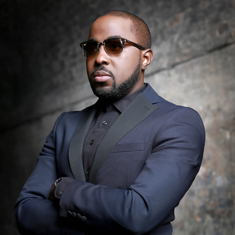
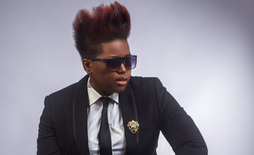
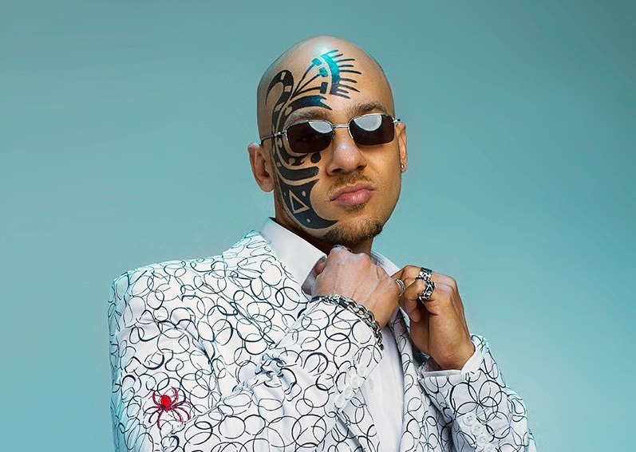
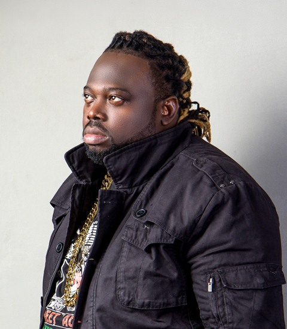
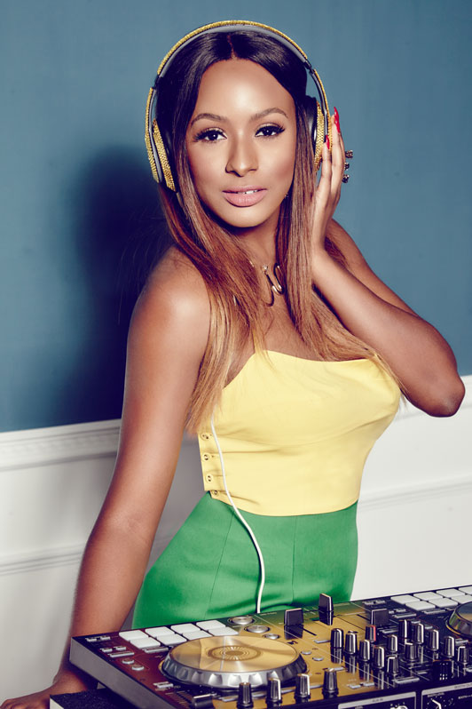
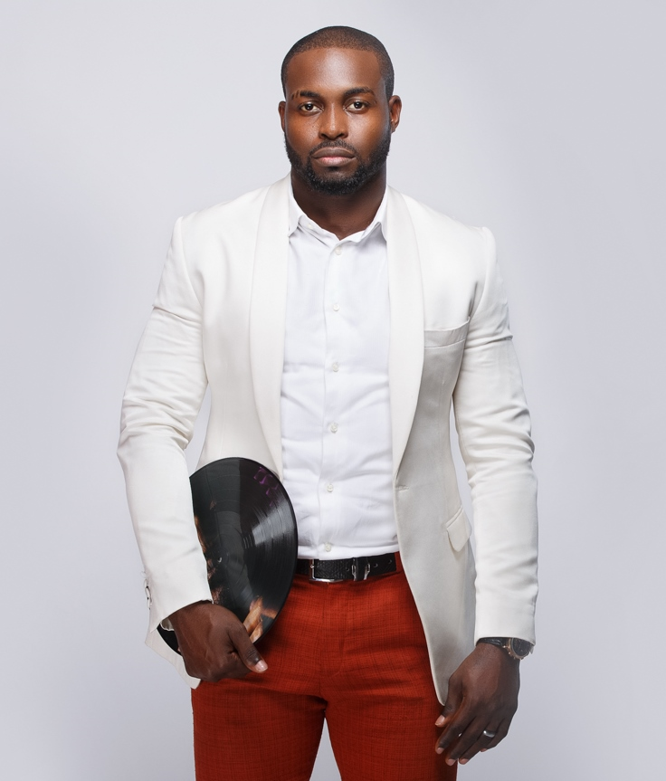
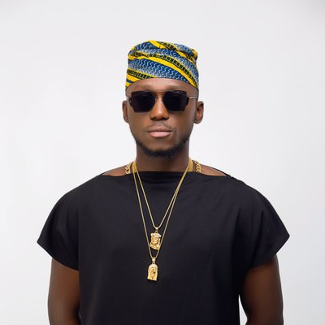
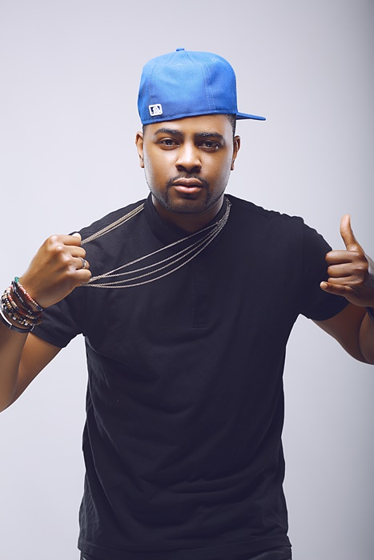
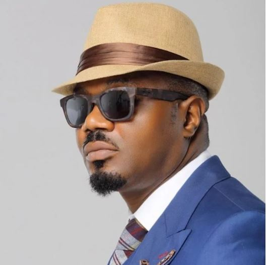

A disc jockey, often abbreviated as DJ, is a person who plays existing recorded music for a live audience.
Here's the list of top ten DJ's in Nigeria. This DJ's we have on the list are the most influential DJ's in Nigeria. Before you can standout as a DJ you must posses:
Skill
Style
Fame.

#### 10 - DJ Baddo
His real name is Godfrey Egbe. He has recorded a lot of singles, where he featured a lot of great artist like Terry G, Jaywon, Durella, 9ice, Small Doctor etc. In 2015 and 2016, he won the best Mixtape DJ of the year. In 2014, he won the Best DJ of The Year by The Headies. In 2016, he won Nation Career Fair Awards as the Most relevant DJ ambassador.

#### 9 - DJ Caise
Derin Phillips, better known as DJ Caise (pronounced as "Case"), is a Nigerian disc jockey.
He started out as a DJ at Beat 99.9 FM,and has performed at Big Brother Africa ,MTV,BET and other headline Festivals etc. He has garnered a lot of awards for himself around Africa. DJ Caise got signed to Chocolate City in 2011.DJ Caise is best known for hosting 'DJ Caise In The Mix', which is held every friday night from 9 pm to 7 am on The Beat 99.9 FM.

#### 8- DJ lambo
Olawunmi Okerayi, known by her stage name DJ Lambo, is a Nigerian disc jockey. Her song "Drank" was produced by Reinhard and received positive critical reviews and extensive airplay. She was signed to Loopy Music in 2013 before its merge with Chocolate City in 2015. She won DJ of the Year (Female) at the 2016 City People Entertainment Awards. Nigerian Entertainment Today (NET) listed her as one of top five Nigerian DJ's to watch out for in 2015.
In 2017, DJ Lambo was among the few DJs selected to play at Big Brother Nigeria's season 2 Saturday party of the Big Brother Naija reality game show.

#### 7- DJ Sose
Dj sose is one of the most handsome Nigerian DJ who is easily recognised due to the signatory tattoo on his face.
His name is Thomas Amar-Aigbe, he is known to perform at different events like Jimmy's Jump off,weddings etc. Channel O rated him among the top 10 African Djs.

#### 6- DJ Humility
His real name is Benedict Afagwu.
DJ Humility entered the spotlight in Nigeria when he clinched the first position at the Benson & Hedges DJ Championship in the early 2000s. About the same time, he was voted as Nigeria’s best radio DJ at the Gbedu Awards; in 2003, he won an award at the Fanta Fame Awards .
He has also performed at some of the biggest concerts in Africa. DJ Humility is currently a radio Dj.

#### 5- DJ Cuppy
Florence Ifeoluwa Otedola (born November 11, 1992), professionally known as DJ Cuppy, is a Nigerian disc jockey and producer. She is the daughter of Nigerian businessman Femi Otedola.
In 2014, she became the resident DJ at the esteemed Mtv Africa Music Award which took place at Durban. She released her very first compilation, which she mixed and called it House of Cuppy. In 2016, she became an intern at Jay-Z’s Roc Nation. In 2014, she was made an ambassador for Nigeria’s campaign, ‘ Fascinating Nigeria’, by the Minister of Tourism, Culture and National Orientation (Edem Duke). Also, in 2015, she won the best Female Dj in NEA Awards. She is respected and famed despite being a female Dj.
She is currently the most popular female Dj in Nigeria who is giving the male counterparts a run for their money.

#### 4- DJ Neptune
Imohiosen Patrick is a multiple award winning DJ from Nigeria. He is popularly known as Dj Neptune. He started out as a professional DJ in 2001 and got hired by Ray power where he worked for 6years(2004-2010)before becoming a freelance DJ and performing at international and national concerts.
DJ Neptune has been been nominated for several awards which includes Best World DJ at the 2008 ‘NEA’ Nigeria Entertainment Awards in New York, U.S.A. He won Best World DJ at the 2009 ‘NEA’ Nigeria Entertainment Awards in D.C, U.S.A. Tush Award Best DJ in Nigeria, 2010; International Best DJ at the first “AEA” Africa Entertainment Awards in Malaysia.

#### 3- DJ Spinall
Sodamola Oluseye Desmond is a multiple award-winning DJ from Nigeria. He is popularly known as DJ SPINALL a.k.a. TheCAP (The Crazy Azz Party). He is the first Nigerian DJ to be endorsed by any brand in Africa and the first African DJ to tour in the United States. He grew up in Lagos State and DJ SPINALL is also the first African DJ to perform at the SXSW Festival in the United States.

#### 2- DJ Xclusive
Rotimi Alakija  popularly known as DJ Xclusive, is a Nigerian disc jockey, record producer and recording artist.
He won the World Best Dj at an award organized by Nigeria Entertainment Awards. In his years as a DJ , he had performed with great artists like Brick and Lace,Ne-Yo,Mario Winans,Fat Joe, and Nas.

#### 1- DJ Jimmy Jatt
Oluwaforijimi "Jimmy" Adewale Amu (born October 15, 1966), professionally referred to by his stage name DJ Jimmy Jatt, is a Nigerian disc jockey who is revered as one of the pioneering hiphop DJs in Nigeria. He started out his music career as a rapper under the sobriquet Master J but delved into DJing after his failure in getting signed by a record label despite releasing a handful of songs including a demo recording. He is best known for his Jimmy's Jump Off concert, an event he started in 2008 to become one of the most attended entertainment events in Nigeria. In 2006, he won the Hip Hop World Hall of Fame award at the maiden edition of The Headies for his contribution to hip-hop in Nigeria.

