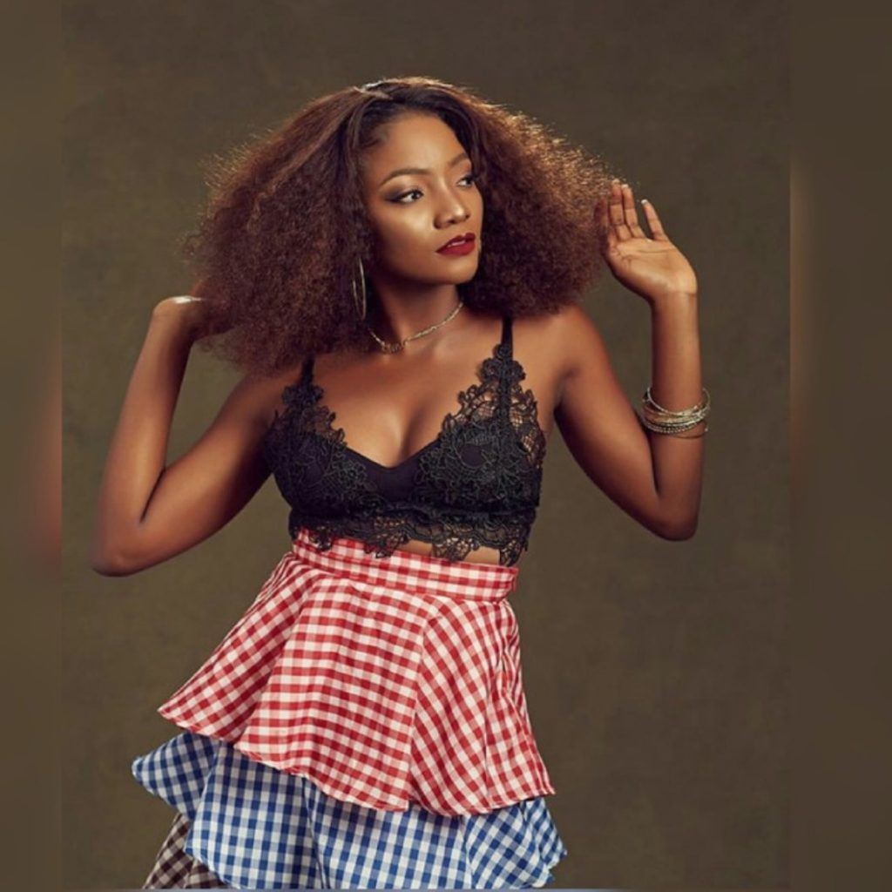

Nigeria is known to produce the top acts in Africa when it comes to the music entertainment industry. The Nigerian music industry has drastically evolved in the past decade and is currently a major factor in the global music scene. Female acts in the industry have managed to break through the music scene in the nation. When it comes to music in Nigeria the ladies are not smiling. From topping charts to shutting down concerts.On today's countdown we're going to take into cognisance those that repeatedly pepper the media with hot banging songs,music videos and more.Our ranking is based on their current relevance in the music industry.

#### 10- Eva
Elohor Eva Alordiah born better known as Eva Alordiah or simply Eva, is a Nigerian rapper, entertainer, make-up artist, fashion designer and entrepreneur. She is considered one of the best female rappers in Nigeria. Since her breakthrough into the Nigerian music industry, Eva has garnered several awards including one Nigeria Entertainment Award from 4 nominations, one Eloy Award, and one YEM award from 2 nominations. Her debut EP, titled The GIGO E.P, was released for free digital download on 20 November 2011. Eva is the owner of makeupByOrsela, a company that specialises in Makeup services. In November 2014, Eva released her self-titled second EP. Her debut studio album, 1960: The Album, was released in September 2016. Without doubt she is naija's number one female rapper,that alone is enough to earn her a comfortable seat on the list.

#### 9- Cynthia Morgan
Cynthia Ikponmwenosa Morgan born 23 September 1991,popularly known by her previous stage name Cynthia Morgan, now Madrina, is a Nigerian born songwriter and singer. Her music is a fusion of pop, hip hop, dancehall and rap. She shot into limelight following the release of two singles titled "Don't Break My Heart" and "Lead Me On", which received massive airplay and positive reviews from critics. Cynthia started singing professionally in 2007, but she became known when she was featured in Jhybo song in 2010. And in 2013, she released her track tagged “Don’t Break My Heart” under Northside Entertainment. This her hit track made so much wave in the music industry topping the musical chart for weeks. She released another hit track “German Juice” which hit the music chart with so much energy. She has won some award like The Headies,  Artist of the year and South South Artist of the year and has been nominated for many.

#### 8- Waje
Aituaje Iruobe, popularly known as Waje (an acronym for "Words aren’t just enough") is a Nigerian singer whose vocal range covers three octaves. She was first seen in P-Square’s video “Omoge Mi” and in 2007 in the hit track “Busy Body” and also featured as the female voice in the duo’s 2008 hit track “Do Me”. She participated in a reality show powered by MTV Base South Africa and Zain which boosted her music career in the industry and has since then released many hit songs.

#### 7- Chidinma
Chidinma Ekile (born 2 May 1991), popularly known by her stage name Chidinma, is a Nigerian singer and songwriter. In 2010, she rose to stardom after winning the third season of Project Fame West Africa.Following the release of the music video for her "Emi Ni Baller" single, she became the first female musician to peak at number 1 on the MTV Base Official Naija Top 10 chart. In 2011, she released her first solo single "Jankoliko" featuring Sound Sultan. Chidinma, her self-titled debut studio album, was released through the music platform Spinlet. 
Chidinma won Best Female West African Act at the 2012 Kora Awards and performed "Kedike" at the ceremony. She is currently a brand ambassador for MTN. 

#### 6- Seyi Shey
Deborah Oluwaseyi Joshua professionally known by her stage name Seyi Shay was born on December 21,1985, she is a Nigerian-based singer and songwriter. Seyi relocated to Nigeria from the UK in 2013 which also marks the start of her career. Seyi has done pretty well for herself in her career as Exquisite Magazine named her one of the Exquisite Ladies of the year 2016 along Nigerian popular musicians- Tiwa Savage and Yemi Alade. In addition to this great honor, Seyi managed to secure several nominations for the Headies award that same year. 

#### 5- Omawunmi
Omawumi Megbele  known by her stage name Omawumi was born on 13 April 1982, she is a Nigerian singer-songwriter and actress of Itsekiri ethnicity. She is a brand ambassador for Globacom, Konga.com, and Malta Guinness. She's also part of the campaign called "Rise with the Energy of Africa". She gained attention as the 2007 runner-up on West African Idols, a reality TV show part of the Idols franchise. Her second album, The Lasso of Truth, was reported to be a commercial success in Nigeria. She released her first hit single “In the music” which made wave in the industry and brought her to fame. After then she as been releasing some hit tracks overwhelmingly welcomed and accepted by fans.

#### 4- Niniola
Niniola Apata better known by her stage name Niniola, is a Nigerian singer and songwriter. She rose to recognition in 2013 after finishing third runner-up on the sixth season of Project Fame West Africa. Upon the release of her breakthrough debut single "Ibadi", Niniola was nominated in the "Most Promising Act to Watch" category at the 2015 Nigeria Entertainment Awards. She currently has a record deal with Drumroll Records.
Niniola Apata is a rising Nigerian female vocalist and songwriter with a rather eccentric style of music which incorporates afro and house beats. Niniola has an outstanding vocal ability, and her great performing skills deem her enticing. Despite being new in the Nigerian music industry, she has managed to create a name for herself and is undoubtedly an artist to watch out for in the Nigerian female musicians list for this year. Her debut single received so much positive feedback, and she landed her first nomination. She has since received several nominations including ‘Best Female Artist West Africa.’

#### 3- Yemi Alade
Yemi Eberechi Alade simply known as Yemi Alade, is a Nigerian Afropop singer and songwriter. She gained prominence after winning the Peak Talent Show in 2009, and is best known for her hit single "Johnny". Yemi Alade became a force to reckon within the Nigerian music industry after the release of her major hit “Johnny.” The award-winning singer has gained so much popularity through the years and is currently considered the queen of afro-beat among Nigerian female musicians, so it's no surprise she made to the list. 
Yemi Alade’s rise to fame was quick as she labored hard to gain recognition as the top female artist in Nigeria and possibly Africa. Yemi Alade has also worked with several Nigerian best musicians creating some of the best work which certainly did not go unnoticed as she has received several awards for most of them. 

#### 2- Simi
Simisola Bolatito Ogunleye professionally known and referred to as Simi, is a Nigerian singer and songwriter. Simi started her career as a gospel singer, releasing her debut studio album in 2008 titled Ogaju. Her career came into spotlight in 2014 after she released "Tiff", a song which was nominated in two categories at The Headies 2015 and further brought her to mainstream recognition. Simi is currently signed to X3M Music under which she released her second studio album Simisola. Simi is on fire this season and this has earned her the number two spot on the countdown.

#### 1- Tiwa Savage
There is no better female act to kick-start this countdown other than the famed Tiwa Savage. Tiwa is undeniably one of the top female artists in Nigeria having worked with the several top acts both in Nigeria and globally. Tiwatope Savage-Balogun better known by her stage name Tiwa Savage, is a Nigerian singer, songwriter, performer and actress. She currently has a songwriting deal with Sony/ATV Music Publishing. Savage signed a recording contract with Mavin Records in 2012. Savage also signed a management and publishing deal with Roc Nation in June 2016, which she later confirmed via Instagram. As a singer, her achievements include an MTV Africa Music Award, two The Headies Awards, one Channel O Music Video Award, one Nigeria Music Video Award, and two City People Entertainment Awards.

