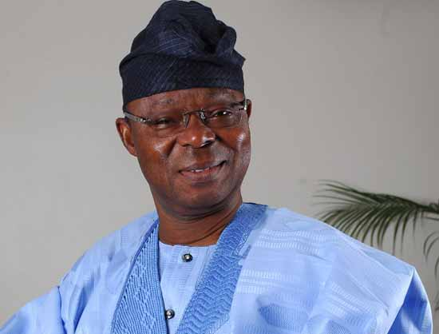
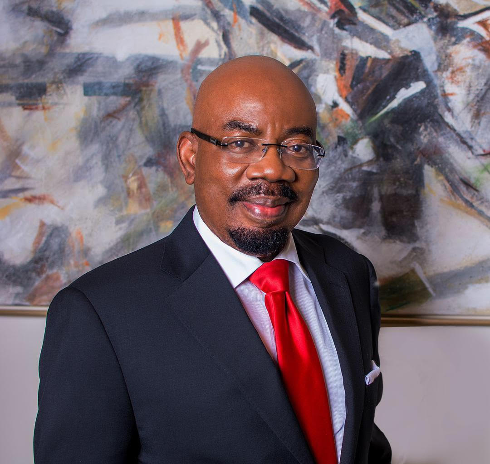
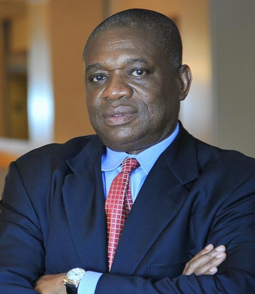
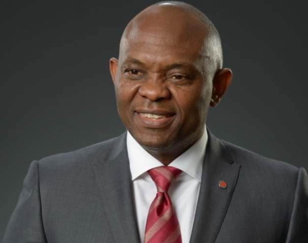
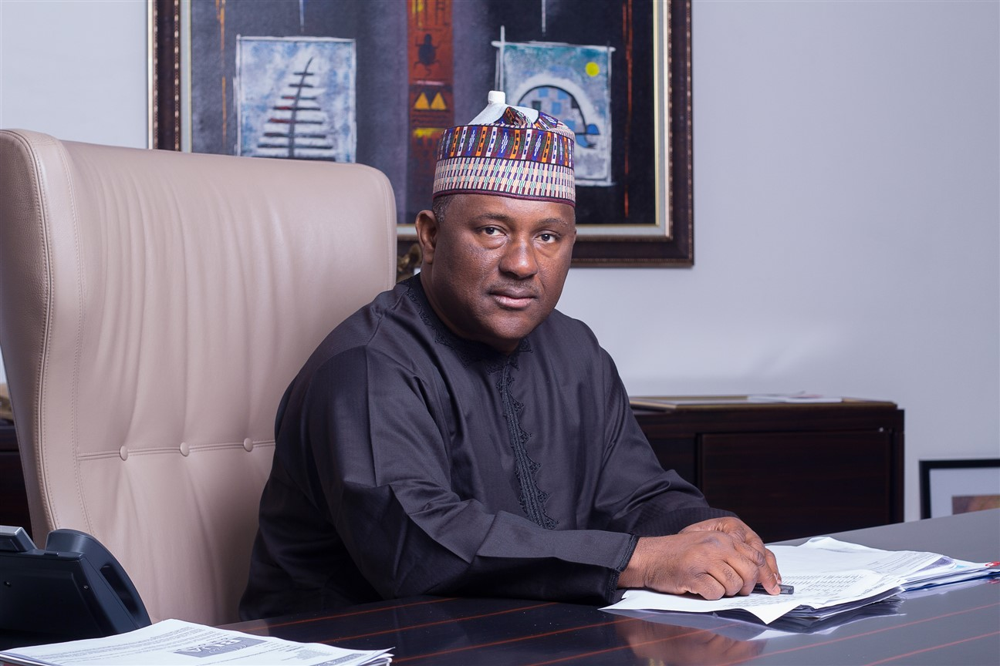
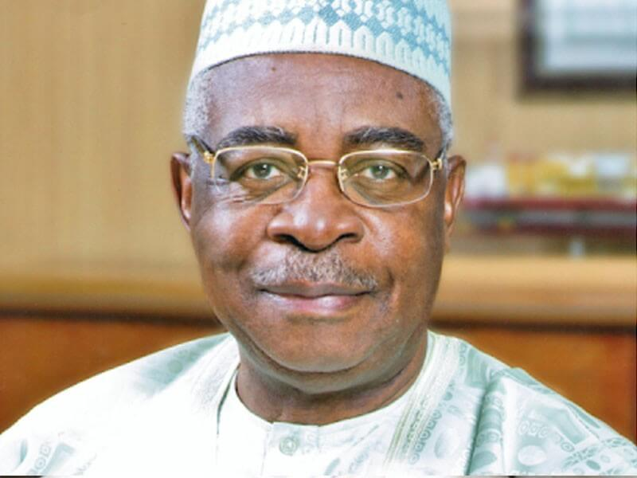
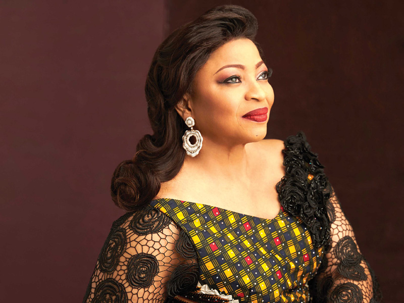
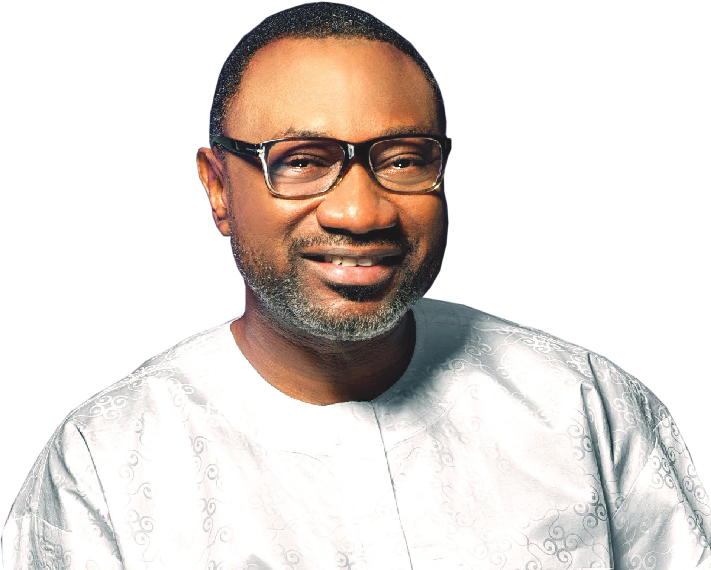
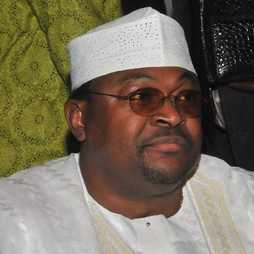
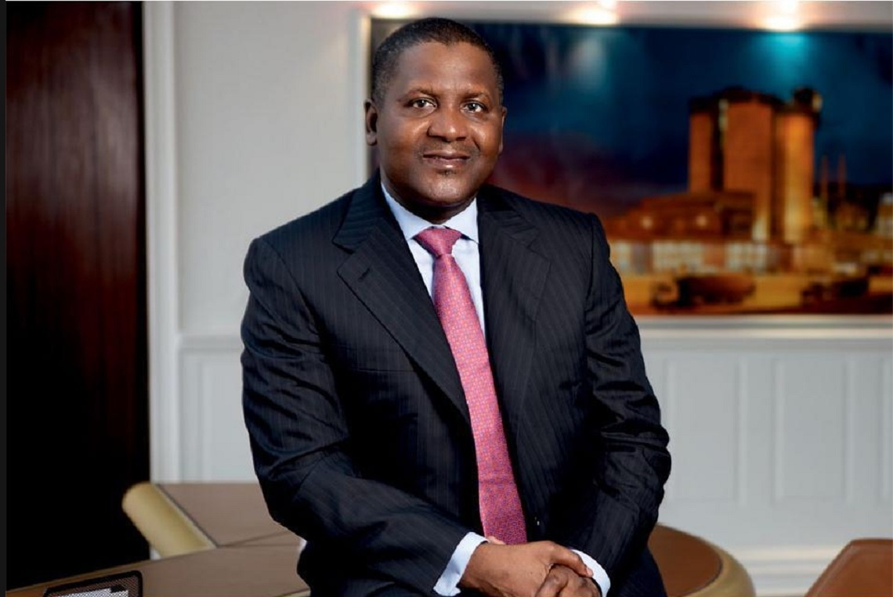

With a highly entrepreneurial spirit, Nigerians are one of the most industrious people on earth.Despite the seemingly insurmountable hurdles and harsh environment, the country is a proud mother to many billionaires and most importantly, the richest men in all of Africa. Here's the top ten richest persons in Nigerian;

#### 10- Oba Otudeko
Oba Otudeko, CFR is a Nigerian entrepreneur. He is the founder and chairman of Honeywell Group, and is also the chairman of FBN Holdings Plc. The conglomerate's operations stretch across oil and gas, flour milling, real estate and marine transportation. Another piece of his fortune is in the oceanfront Radisson Blu in Lagos, Nigeria. He is also the founder of Oba Otudeko Foundation. 
He is the tenth richest Nigerian with net worth of $650 million.

#### 9- Jim Ovia
Jim Ovia is a Nigerian businessman. He founded Zenith Bank in 1990.
Ovia is the founder of Visafone Communications Limited and the chairman of both the Nigerian Software Development Initiative (NSDI) and the National Information Technology Advisory Council (NITAC). He is a member of the Honorary International Investor Council as well as the Digital Bridge Institute (DBI). He is the Chairman of Cyberspace Network Limited. He is the ninth richest person in Nigeria with a net worth of $1 Billion.

#### 8- Orji Uzor Kalu
Orji Uzor Kalu is the chairman of SLOK Holding and the Daily Sun and New Telegraph newspapers in Nigeria, who served as the governor of Abia State, Nigeria from May 29, 1999, to May 29, 2007. Prior to his election, he served as the chairman of the Borno Water Board and the chairman of the Cooperative and Commerce Bank Limited. He is the eight richest person in Nigeria with a net worth of $1.1 Billion.

#### 7- Tony O. Elumelu
Tony Onyemaechi Elumelu is a Nigerian economist, entrepreneur, and philanthropist. He is the Chairman of Heirs Holdings, the United Bank for Africa, Transcorp and founder of The Tony Elumelu Foundation. He was recognised as one of "Africa's 20 Most Powerful People in 2012" by Forbes magazine. He has a net worth of $1.4 billion.

#### 6- Abdul Samad Isyaku Rabiu 
Founder of BUA group is the sixth richest Nigerian with a net worth of $1.5 billion. He is also the chairman of the Nigeria Bank of Industry.

#### 5- Theophilus Danjuma
General Theophilus Yakubu Danjuma GCON FSS psc (Rtd) (born 9 December 1938) is a Nigerian soldier, politician, multi-millionaire businessman and philanthropist. He was Nigerian Army Chief of Army Staff from July 1975 to October 1979. He was also Minister of Defence under President Olusegun Obasanjo's administration. Danjuma is chairman of South Atlantic Petroleum (SAPETRO). He has a net worth of $2 billion.

#### 4- Folorunso Alakija
Folorunso Alakija is a Nigerian billionaire businesswoman, one of the richest African women, and one of the richest black women in the world. In 2014, she temporarily unseated Oprah Winfrey as the richest woman of African descent in the world. She is involved in the fashion, oil and printing industries. She is the group managing director of The Rose of  Sharon Group which consists of  The Rose of Sharon Prints & Promotions Limited and Digital Reality Prints Limited, she is also the executive vice-chairman of Famfa Oil Limited. Alakija is ranked by Forbes as the richest woman in Nigeria with an estimated net worth of $2.1 billion. As of 2015, she is listed as the second most powerful woman in Africa after Ngozi Okonjo-Iweala and the 87th most powerful woman in the world by Forbes.

#### 3- Femi Otedola
Femi Otedola is a Nigerian businessman, entrepreneur, philanthropist, and chairman of Forte Oil PLC, an importer of fuel products. He is also the founder of Zenon Petroleum and Gas Ltd, and the owner of a number of other businesses across shipping, real estate and finance. He has recently invested in power generation as part of the liberalisation of the sector in Nigeria. He is the third richest man in Nigeria with a net worth of $2.3 billion. 

#### 2- Mike Adenuga
Chief Michael Adeniyi Agbolade Ishola Adenuga Jr, GCON is a Nigerian billionaire businessman, and the second-richest person in Nigeria. His company Globacom is Nigeria's second-largest telecom operator, and has a presence in Ghana and Benin. He owns stakes in the Equitorial Trust Bank and the oil exploration firm Conoil (formerly Consolidated Oil Company). Forbes has estimated his net worth at $5.8 billion as of 2017, which makes him the second-wealthiest Nigerian behind Aliko Dangote.

#### 1- Aliko Dangote
Aliko Dangote GCON is a Nigerian business magnate, investor, and owner of the Dangote Group, which has interests in commodities in Nigeria and other African countries. As of March 2018, he had an estimated net worth of US$14.1 billion. He is the Richest man in Nigeria and in Africa.
Dangote is ranked by Forbes magazine as the 100th-richest person in the world and the richest in Africa, and peaked on the list as the 23rd-richest person in the world in 2014.

