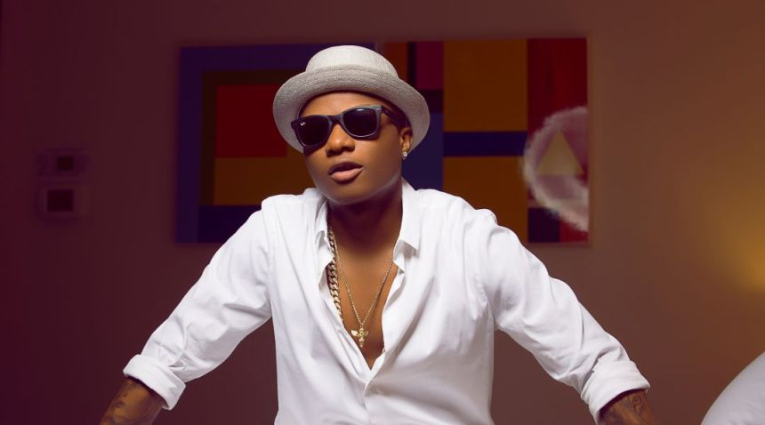
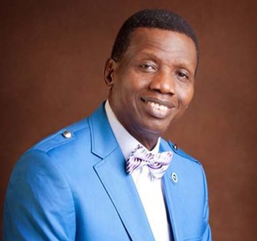
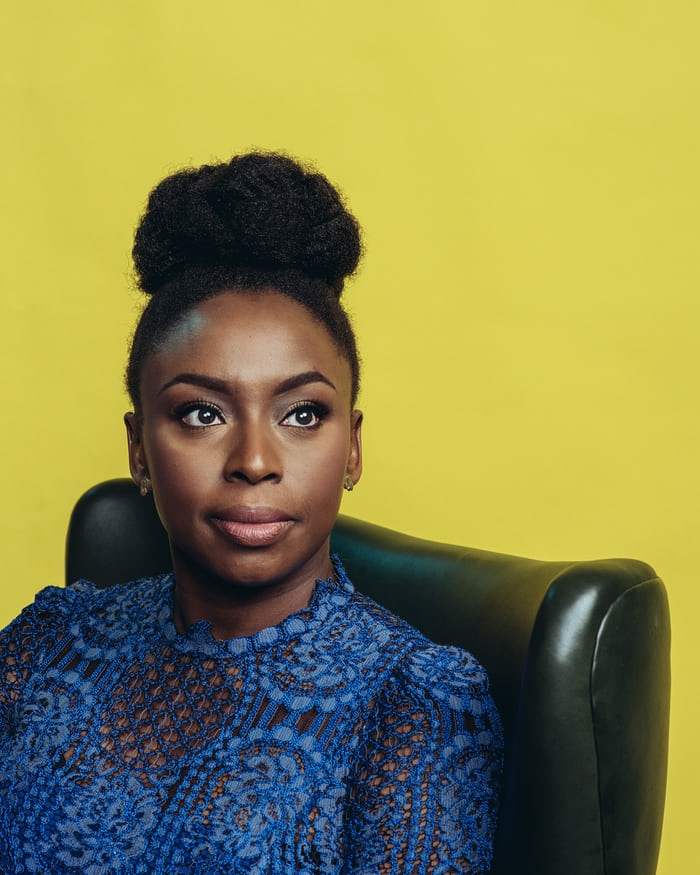
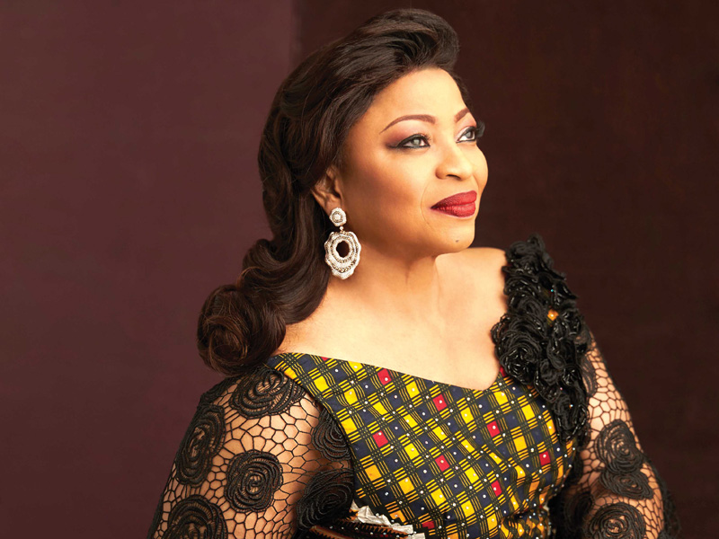
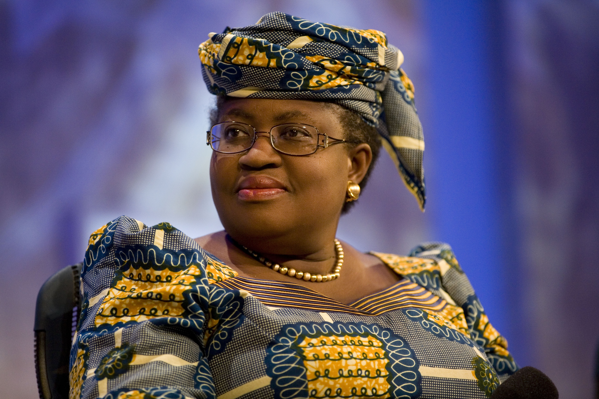
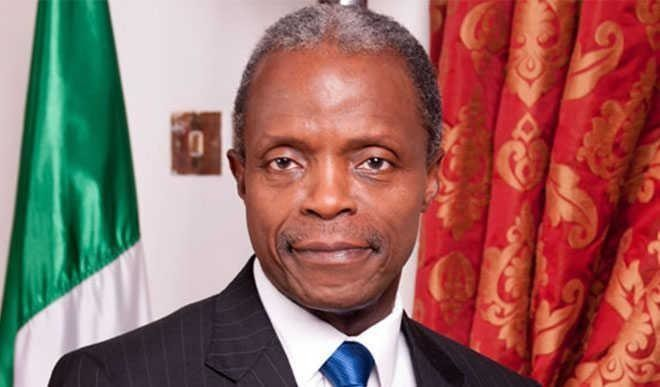
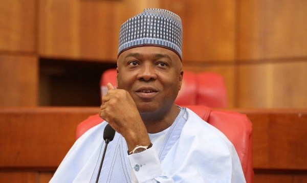
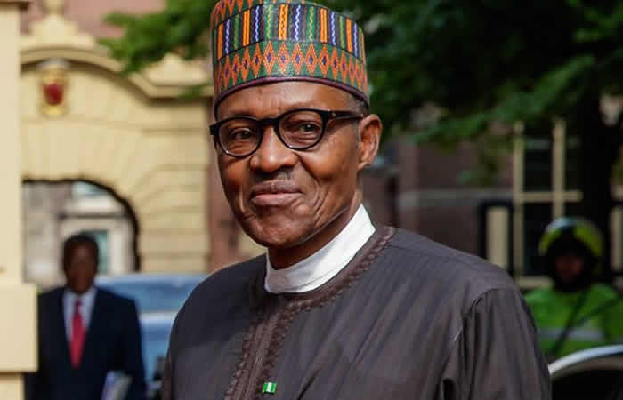
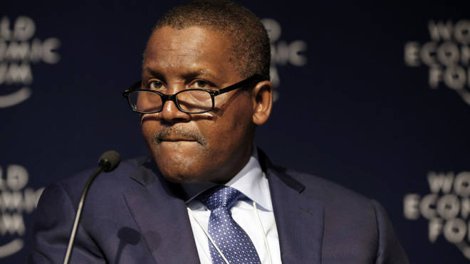

Top Ten Nigeria brings the top ten powerful people in Nigeria. We have selected them from different strata of society. Each one has contributed immensely to influencing Nigerians in various ways. The list is spread across categories: politics and governance; business and entrepreneurship; professionals, civil society and activism; media; arts and culture; religious and traditional leaders.

#### 10 - Linda Ikeji
Linda Ikeji is a Nigerian news carrier blogger, writer, entrepreneur and former model. She is best known for her blog. She is the highest paid blogger in Nigeria. In August 2012, Forbes Africa dedicated itself to celebrating African women that month's issue. In that issue, Forbes profiled Africa's 20 Most Prominent Women and the issue featured profiles on two young Nigerian women: Linda Ikeji, as well as Chibundu Onuzo.
Linda Ikeji was the biggest Google Search trend in Nigeria for 2014. The name Linda Ikeji was the most searched item by users of Google in Nigeria. Ikeji was interviewed by BBC on their Focus on Africa programme. The interview aired on 25 September 2012.

#### 9- Wizkid
Ayodeji Ibrahim Balogun (born 16 July 1990),[4] known professionally as Wizkid, is a Nigerian singer and songwriter. 
In 2016, Wizkid achieved international recognition following his collaboration with Drake on the global hit, "One Dance", which reached number one in 15 countries, including the United States, United Kingdom, Canada and Australia.
Following the release of his second studio album and expiration of his 5-year recording contract, Wizkid left E.M.E. On 1 March 2017, Billboard magazine reported that Wizkid signed a multi-album deal with RCA Records.
He was ranked 5th on Forbes and Channel O's 2013 list of the Top 10 Richest/Bankable African Artists. In February 2014, Wizkid became the first ever Nigerian musician to have over 1 million followers on Twitter. Moreover, he became the first Afrobeats artist to appear in the 2018 Guinness World Records for his contribution to Drake's hit song "One Dance".

#### 8- Pastor E.A Adebayo
Enoch Adejare Adeboye is a Nigerian pastor.
Leader of the largest Pentecostal church in Nigeria (Redeemed Christian Church of God) and former mathematics lecturer, Adeboye is on this list because as innocuous as he might appear, the soft-spoken preacher has under his influence millions of Nigerians who either attend his church or depend on his position on important matters as guides to make crucial decisions. Available statistics show that Pastor Adeboye has about 12 million members in the around 14, 000 RCCG branches scattered across the length and breadth of Nigeria. Further statistics gathered from Newsweek magazine shows that about 5million of these population are adults who are well over voting age, not youths. This implies that Adeboye has a hold over 8.4% of about 60 million Nigerians who are registered to vote and vote. In 2007, when the total voter population was around 72million, Adeboye, all things being equal, had influence over about 7.1% of the votes cast. He has always been relevant. 

If you have any doubts about Adeboye’s right to be on this list and at this spot, please be reminded that he is the senior pastor to vice president, Yemi Osinbajo and that he sanctioned the law professor’s decision to race with Buhari. What if he had said ‘no’?

####  7- Chimamanda Ngozi Adichie
Chimamanda Ngozi Adichie is a Nigerian novelist, writer of short stories, and nonfiction. 
In 2008, Adichie was awarded a MacArthur Genius Grant. She was described in The Times Literary Supplement as "the most prominent" of a "procession of critically acclaimed young anglophone authors [who] is succeeding in attracting a new generation of readers to African literature". Her most recent book, Dear Ijeawele, or a Feminist Manifesto in Fifteen Suggestions, was published in March 2017. 

#### 6- Folorunsho Alakija
Folorunso Alakija is a Nigerian billionaire businesswoman, one of the richest African women, and one of the richest black women in the world. In 2014, she temporarily unseated Oprah Winfrey as the richest woman of African descent in the world. She is involved in the fashion, oil and printing industries. She is the group managing director of The Rose of Sharon Group which consists of The Rose of Sharon Prints & Promotions Limited and Digital Reality Prints Limited and the executive vice-chairman of Famfa Oil Limited. Alakija is ranked by Forbes as the richest woman in Nigeria with an estimated net worth of $2.1 billion. As of 2015, she is listed as the second most powerful woman in Africa after Ngozi Okonjo-Iweala and the 87th most powerful woman in the world by Forbes.

#### 5- Ngozi Okonjo Iweala
Ngozi Okonjo-Iweala is a Nigerian economist and the first female Minister of Finance of Nigeria.
She served two terms as Finance Minister of Nigeria (2003-2006, 2011-2015) under the leadership of president Olusegun Obasanjo and president Umaru Musa Yaradu'a respectively. She was the Managing Director of the World Bank (2007-2011) and chairs the Board of the Global Alliance for Vaccines and Immunization (GAVI) and the African Risk Capacity (ARC).
In July 2017, Ngozi Okonjo-Iweala, was named an independent non-executive director at Standard Chartered Plc in the United Kingdom. In July 2018, Ngozi Okonjo-Iweala, was named on the board of Twitter Inc. She is also a Senior Adviser at Lazard. She is the most powerful woman in Africa.

#### 4- Yemi Osibanjo
Oluyemi Oluleke "Yemi" Osinbajo  is a Nigerian politician and lawyer who is the current Vice President of Nigeria, in office since 29 May 2015. He is also a Senior Advocate of Nigeria, Professor of Law and until his inauguration as Vice President, a Senior Partner with SimmonsCooper Partners, a commercial law practice. He recently ordered the overhaul of the Special Anti-robbery Squad unit of the police force and also sacked the Director-General of the Department of State Service, Lawal Daura. 

#### 3- Bukola Saraki
Abubakar Bukola Saraki is a Nigerian politician who has been President of the Nigeria's Senate since 2015. Previously he was Governor of Kwara State from 2003 to 2011. He was first elected to the Senate in April 2011 under the All Progressives Congress, representing the Kwara Central senatorial district, and re-elected in the March 2015 election, currently decamped to people democratic party on 31st of July 2018.

#### 2- Muhammadu Buhari
Muhammadu Buhari GCFR is the President of Nigeria, in office since 2015. He is a retired major general in the Nigerian Army and previously served as the nation's head of state from 31 December 1983 to 27 August 1985, after taking power in a military coup d'état. The term Buharism is ascribed to the Buhari military government.
He unsuccessfully ran for the office of president of Nigeria in the 2003, 2007, and 2011 general elections. In December 2014, he emerged as the presidential candidate of the All Progressives Congress for the March 2015 general elections. Buhari won the election, defeating the incumbent President Goodluck Jonathan. This marked the first time in the history of Nigeria that an incumbent president lost to an opposition candidate in a general election. He was sworn in on 29 May 2015. It's no mystery that he's on the number 2 spot on our countdown.

#### 1- Aliko Dangote
Aliko Dangote GCON is a Nigerian business magnate, investor, and owner of the Dangote Group, which has interests in commodities in Nigeria and other African countries. As of March 2018, he had an estimated net worth of US$14.1 billion.
Dangote is ranked by Forbes magazine as the 100th-richest person in the world and the richest in Africa, and peaked on the list as the 23rd-richest person in the world in 2014. Apart from his money, Dangote is a very powerful man whose control extends well beyond the borders of Nigeria. Africa’s richest man, Aliko Dangote has been named by Forbes as one of the most influential and powerful persons in the world. Dangote, the only Nigerian on the exclusive list, was 66th position on the list. and he's the number one powerful person in Nigeria on our list.

