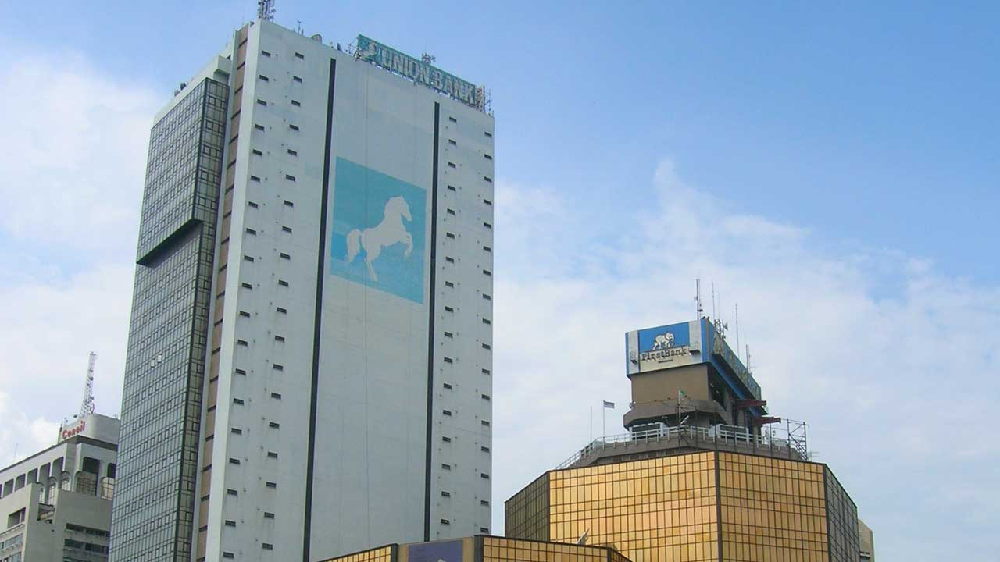
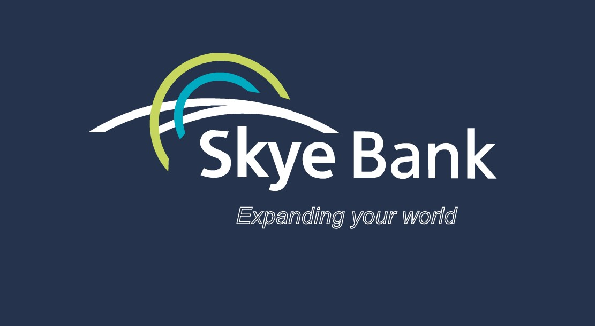
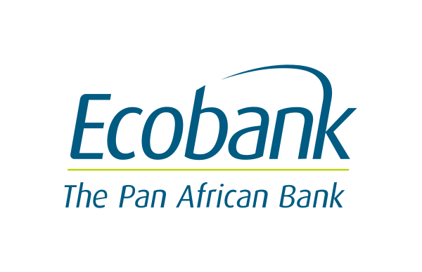
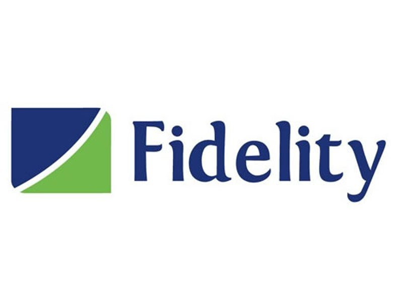
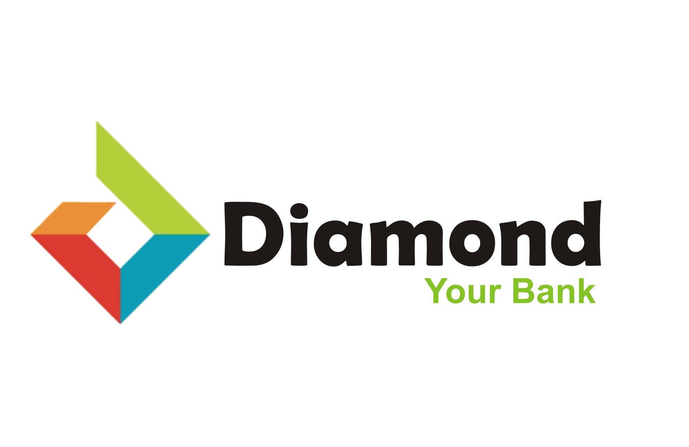
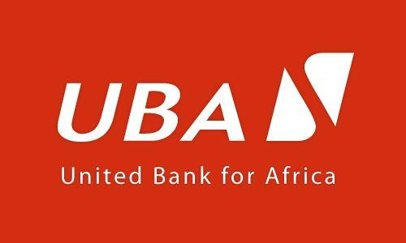
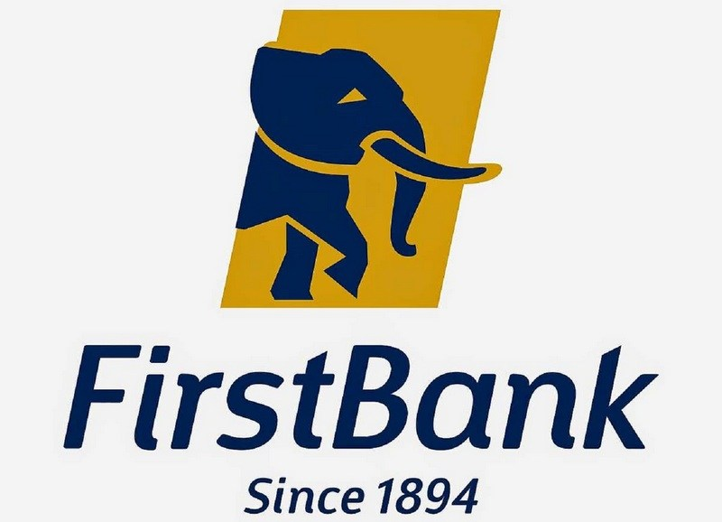
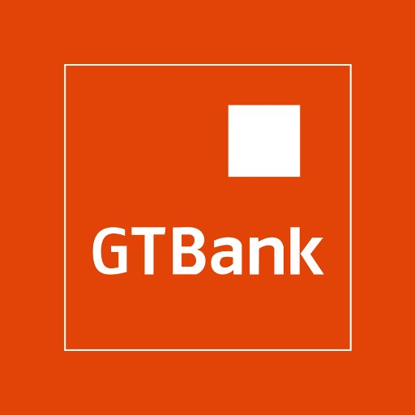
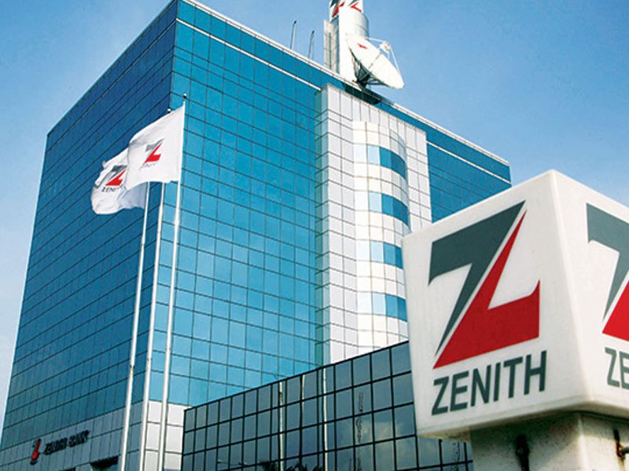

Indicators of the strength of a bank are its international reckoning, profitability, shareholders funds,total assets, earnings and customer deposits. Going by these parameters, the following are the top ten banks in Nigeria;

#### 10- Union Bank
Union Bank of Nigeria Plc., commonly known as Union Bank of Nigeria, is a commercial bank in Nigeria.
Union Bank is a large commercial bank, serving individuals, small and medium-sized companies, as well as large corporations and organizations. In July 2009, it was rated the 556th largest bank in the world and the 14th largest bank in Africa. As of Mar 31, 2018, the bank's asset base was estimated at NGN 1, 381 billion (US$4.1billion). 

#### 9- Polaris Bank
Polaris Bank Plc. formerly known as Skye Bank, is a commercial bank based in Nigeria. It is one of the twenty-six (26) commercial banks licensed by the Central Bank of Nigeria, the country's banking regulator.
Polaris Bank is a large financial services provider in West Africa and Central Africa. With headquarters in Nigeria, the bank maintains subsidiaries in Sierra Leone, the Gambia, the Republic of Guinea, Liberia, Angola and Equatorial Guinea. 
In January 2011, the bank introduced a Naira-denominated MasterCard debit card, called "MasterCard Verve", the first of its kind in Nigeria. The bank also offers Internet banking and mobile banking.

#### 8- Ecobank
Ecobank, whose official name is Ecobank Transnational Inc. (ETI), is a pan-African banking conglomerate, with banking operations in 36 African countries. It is the leading independent regional banking group in West Africa and Central Africa, serving wholesale and retail customers. It also maintains subsidiaries in Eastern and Southern Africa. ETI has representative offices in Angola, China, Dubai, France, South Africa, and the United Kingdom. It was founded in 1985.

#### 7- Fidelity Bank
Fidelity Bank, also known as Fidelity Bank Plc., is a commercial bank in Nigeria. It is licensed as a commercial bank, by the Central Bank of Nigeria, the central bank and national banking regulator.
In 2011, the bank was ranked the 7th most capitalized bank in Nigeria, the 25th most capitalized bank on the African continent.
The bank currently has over 400,000 diverse shareholders. Fidelity Bank of Nigeria was incorporated in the year 1987 and began its operations in 1988. It initially started with a Merchant Banking license.
The bank maintains a large network of interconnected branches in all Nigerian states and major cities in Nigeria. Currently has 240 business offices and 774 ATMs.

#### 6- Diamond Bank
Diamond Bank Plc., is a Nigerian multinational financial service provider. Headquartered in Lagos, Nigeria's largest city, the bank maintains a banking subsidiary in The United Kingdom.
As at June 2013, the bank operates 240 branches in Nigeria, 20 branches in Benin Republic, 2 branches in Senegal, 1 branch in Togo and 3 branches in Côte d’Ivoire .Diamond Bank PLC began as a private limited liability company on March 21, 1991 (the company was incorporated on December 20, 1990). Ten years later, in February 2001, it became a universal bank.

#### 5- United Bank for Africa (UBA)
United Bank for Africa (UBA) Plc, is a leading pan-African financial services group headquartered in Nigeria. It is one of Africa's best and most resilient banking Groups with operations in 20 African countries and offices in three global financial centers: London, Paris and New York.
UBA has been operating in Africa since 1949, referred to then as the British and French Bank Limited (BFB). It took over the assets and liabilities of BFB and was incorporated as a limited liability company on 23 February 1961 under the Compliance Ordinance (Cap 37) 1922.
Rank: Fifth in Nigeria, 25nd in Africa and 856th in the global ranking by Tier-1 capital.

#### 4- Access Bank
Access Bank plc, commonly known as Access Bank, is a Nigerian multinational commercial bank, owned by Access Bank Group. It is licensed by the Central Bank of Nigeria, the national banking regulator.
Originally a corporate bank, the organization acquired personal and business banking platforms from Nigeria’s International Commercial bank in 2012. Access Bank is presently one of the five largest banks in Nigeria in terms of assets, loans, deposits and branch network. The bank's headquarters is located in the city of Lagos, the largest city of Nigeria. 
The bank received its license from the Central Bank of Nigeria in 1989, and listed on the Nigerian Stock Exchange in 1998.
Rank: Fourth position, 18th in Africa and 630th bank in the world by Tier-1 capital.

#### 3- First Bank
First Bank of Nigeria, sometimes referred to as FirstBank, is a Nigerian multinational bank and financial services company headquartered in Lagos. It is the biggest bank in Nigeria by total deposits and gross earnings. It operates a network of over 750 business locations across Africa, the United Kingdom and representative offices in Abu Dhabi, Beijing and Johannesburg set up to capture trade-related business between geographies. The bank specialises in retail banking and has the largest retail client base in Nigeria. The Nigerian banking business operates nationally, with an active customer base of over 10 million, and employs over 7,000 staff. The bank was founded in 1894 and is Nigeria’s oldest bank.
Rank: Third in Nigeria, 16th in Africa and 592nd in the world by Tier-1 capital.

#### 2- Guaranteed Trust Bank
Guaranty Trust Bank plc also known as GTB is a Nigerian multinational financial institution, that offers Online/Internet Banking, Retail Banking, Corporate Banking, Investment Banking and Asset Management services, with its head office in Victoria Island, Lagos.
The bank was formed in 1988 by over 35 young Nigerians in their thirties, spearheaded mostly by Tayo Aderinokun and Fola Adeola, but also included Femi Pedro, Gbolahan Osibodu, Femi Akingbe, Akin Opeodu and others.
Guaranty Trust Bank plc was incorporated as a limited liability company licensed to provide commercial and other banking services to the Nigerian public in 1990 and commenced operations in February 1991. GTBank plc has 231 branches, 17 Cash Centres, 18 e-branches, 41 GTExpress locations and more than 1165 ATMs in Nigeria. GTBank has expanded to Cote d'Ivoire, Gambia, Ghana, Liberia, Sierra Leone, Uganda, Kenya and Rwanda. These countries belong to the "Eco zone". It has also expanded to the United Kingdom.
Rank: Second in Nigeria, 14th in Africa and 576th in the world by Tier-1 capital.

#### 1- Zenith Bank
Zenith Bank is a Nigerian multinational financial services provider. It is licensed as a commercial bank, by the Central Bank of Nigeria, the central bank and national banking regulator. Zenith Bank is a large financial service provider in Nigeria and Anglophone West Africa.
The bank was established in May 1990 by Jim Ovia and commenced banking operations in July of the same year. On 17 June 2004, following a successful IPO, the bank became a public limited company. On 21 October 2004 its shares of stock were listed on the Nigeria Stock Exchange (NSE). Headquartered in Lagos, Nigeria, Zenith Bank Plc has more than 500 branches and business offices in all states of the federation and the Federal Capital Territory (FCT).Zenith Bank maintains subsidiaries in the United Kingdom, United Arab Emirates, Ghana, Sierra Leone and The Gambia. The Bank also has representative offices in South Africa and China. 
Rank: First in Nigeria,10th in Africa and 402nd bank in the world by Tier-1 capital.

