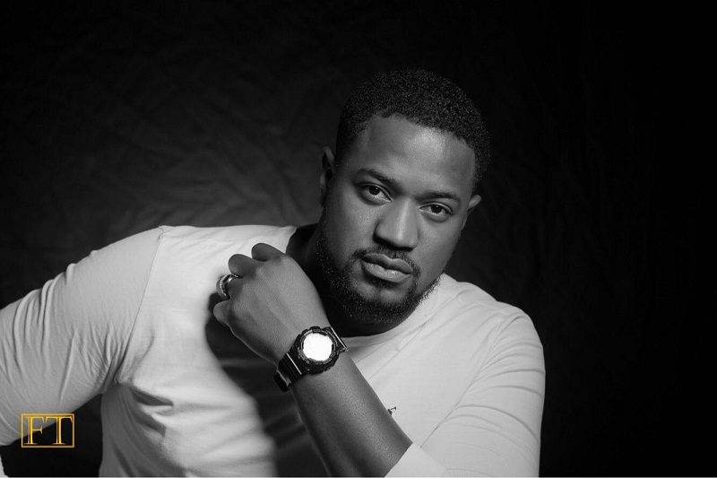
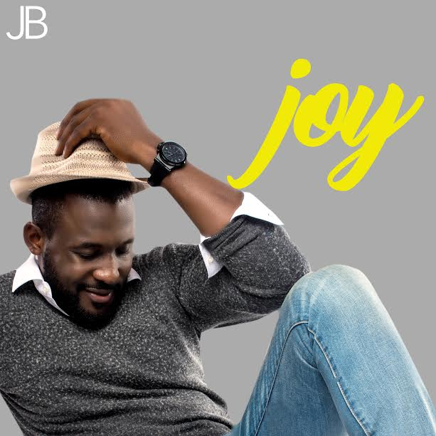
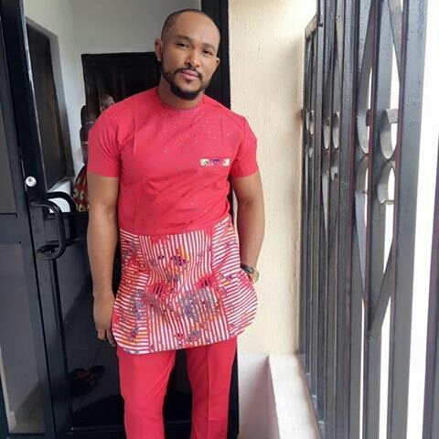
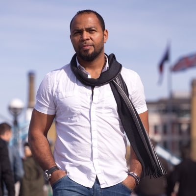
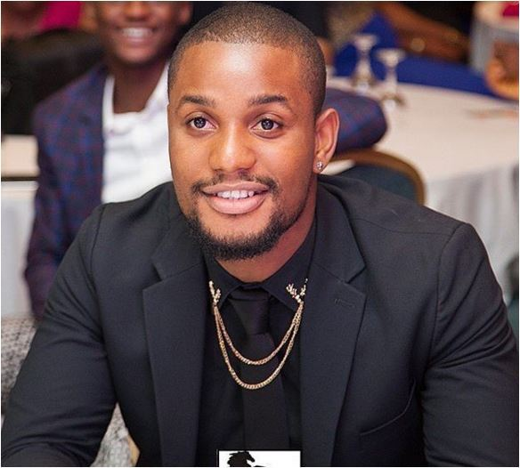
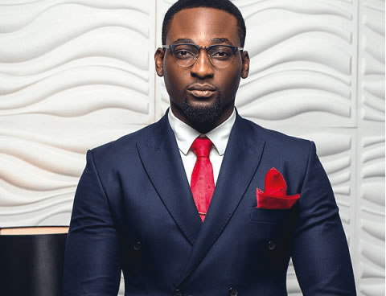
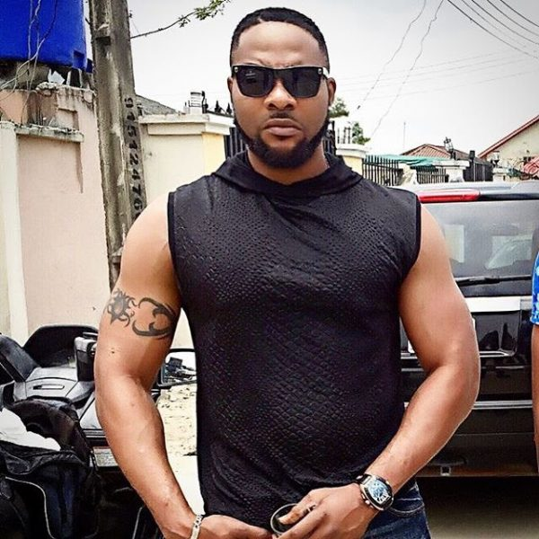
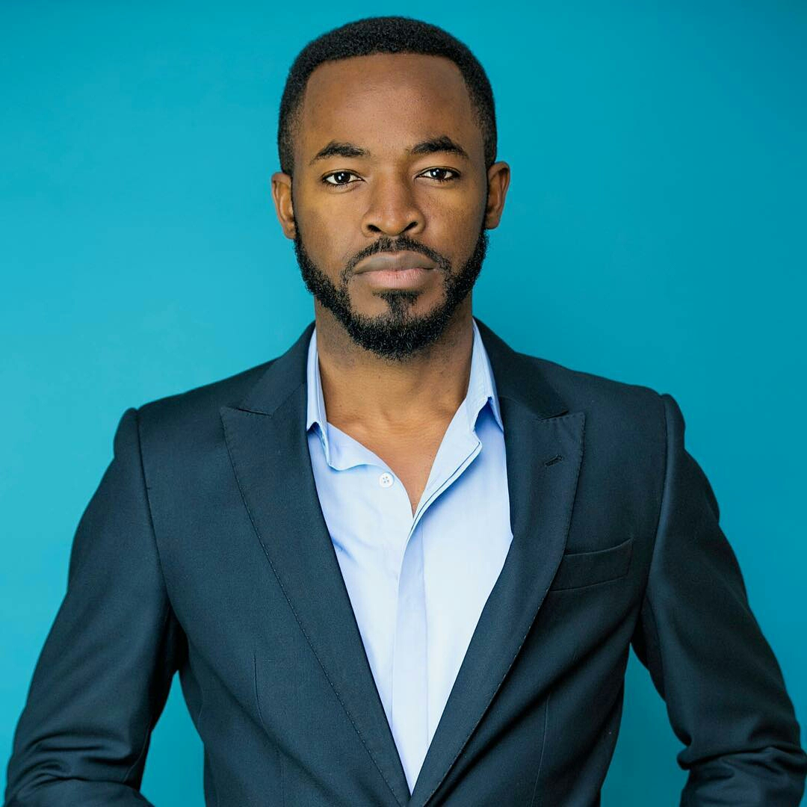
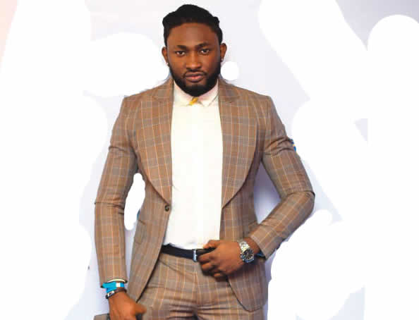
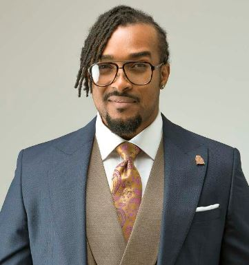

Many Nigerian actors are great-looking and talented, attracting millions of fans from all over Africa.
In this post, we take a look at the handsome Nollywood faces. This is a fairly subjective assessment because everyone has their own unique perception of beauty. However, most Nigerians agree that these men really deserve the honour of being noted. 

#### 10- Mofe Duncan
He was born on May 28th,1983. He is an actor,model,film maker and a TV host. He is tall,dark and handsome,taking the number 10 spot on today's countdown.

#### 9- Joseph Benjamin
Joseph Benjamin is a Nigerian actor, model, Voice-over Artist and television presenter mainly known for co-hosting MTN's Project Fame, a talent reality show, and starring in the movies Tango With Me, Mr. and Mrs., and Murder at Prime Suites. He won the African Actor of the Year award at the 2012 African Film Awards. For his role in Married but Living Single, he won the best lead actor at the 2012 Best of Nollywood Awards. In 2012, Benjamin won best actor in a lead role at the 2012 Nollywood Movies Awards. 

#### 8- Blossom Chukwujekwu
Blossom Chukwujekwu is a Nigerian actor, who made his professional acting debut in 2009. In 2015 he won the Best Supporting Actor Award  at the Africa Magic Viewers Choice Awards.
In 2012, he was profiled on African Magic’s Nollywood show, Jara, as one of the top 5 actors to watch out for in 2013. Blossom has something of a feminine face, combined with a heavy masculine build which makes him a worthy candidate for this list.

#### 7- Ramsey Nouah
Also known as Nollywood's lover boy,Ramsey is another handsome actor.
Nouah was born in Edo State to an Israeli father and a Yoruba mother who hails from Owo, Ondo State.
Nouah's acting career kicked off when he starred in the Nigerian TV soap opera Fortunes. Nouah has since then appeared in numerous films starring as the lead role. He has been called "Lover-Boi" for his numerous roles in romantic film. In 2010 Nouah won the African Movie Academy Award for Best Actor in a Leading Role for his performance in the Best Picture award-winning film The Figurine. Nouah is considered to be one of the most sought-after actors in Nigeria.

#### 6- Alex Ekubo
Alexx Ekubo is a Nigerian actor and model. He was first runner up at the 2010 Mr Nigeria contest. He won the Best Actor in a Supporting Role award at the 2013 Best of Nollywood Awards for his role in the Weekend Getaway.
Ekubo is a native of Arochukwu, Abia State. He attended the Federal Government College Daura, Katsina State. He studied Law at the University of Calabar and later got a diploma in Mass Communication from Calabar Polytechnic. He's pretty face has gotten so many ladies clued to their tv screen.

#### 5- Gbenro Ajibade
Gbenro Ajibade a Nigerian actor, producer, model, and presenter.
Ajibade was born in Maiduguri, Borno State on December 8. He is the fourth child born into a family six children.
He is a leading character in the popular soap opera Tinsel and has acted in Gbomo Gbomo Express and The Wages.
Ajibade won Most Outstanding Actor/Model of the Year at the 2011 Nigerian Model Achievers Awards. He's the definition of an African Prince.

#### 4- Bolanle Ninalowo
Bolanle Ninalowo studied Accounting at Devry University and Marketing at Keller Graduate School of Management, both in America.
The former banker cum actor is one of the handsome faces in Nollywood. He won the Revelation of the year at the Best of Nollywood Awards in 2010. He is a popular face in nollywood yoruba movies. The first time I saw him in a movie I was awestruck; fine face,tall and a body to die for.

#### 3- OC Ukeje
Okechukwu Ukeje, known as OC Ukeje is Nigerian actor, model and musician. He came into prominence after winning the Amstel Malta Box Office (AMBO) reality show. He has received several awards including Africa Movie Academy Awards, Africa Magic Viewers Choice Awards, Nollywood Movies Awards, Best of Nollywood Awards, Nigeria Entertainment Awards and Golden Icons Academy Movie Awards. He has featured in several award winning films including Two Brides and a Baby, Hoodrush, Alan Poza, Confusion Na Wa and Half of a Yellow Sun. He is one of the most handsome Nollywood Actors.

#### 2- Uti Nwachukwu
Uti Nwachukwu was the winner of Big Brother Africa 5. Uti began his acting career 2011. And had so far featured in several movies since then. He won the 2012 GIAMA "Best New Actor" held in the US.
He hails from Agbor in Delta state Southern Nigeria, is a graduate of Computer Science and Education from Benson Idahosa University, Benin City. Before his rise to stardom, he was once a banker. He is well known as the winner of the 5th edition of popular Tv show, Big Brother Africa.
Uti is a fine bobo and he gets the number 2 spot on our countdown.

#### 1- Bryan Okwara
Bryan Okwara is a Nigerian actor and pageant contestant who won the title of Mr. Nigeria in 2007 and reached the semi-finals in the Mister World 2007 competition. He has that kind of beauty that's got ladies drooling over him.

