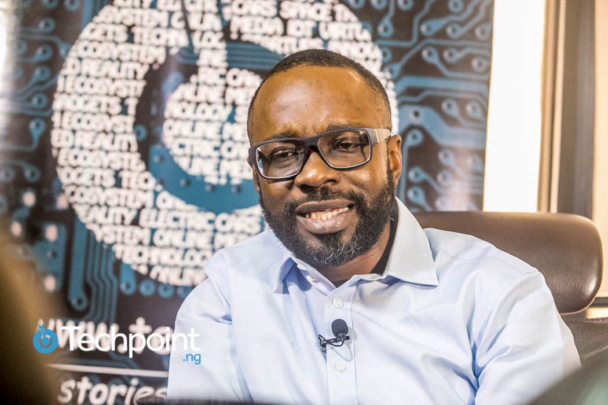

This week we'll be counting down on the top ten youngest billionaires in Nigeria. This individuals have achieved this feat. through hard work and persistence. This should serve as inspiration to us. Here's the countdown;

#### 10 - Iyinoluwa Samuel Aboyeji
 Iyinoluwa Samuel Aboyeji born March 28 1991 (27 years), is a Nigerian entrepreneur. He is a co-founder of Andela, and currently the managing director of Flutterwave.
At age 19, Aboyeji started Bookneto.com in partnership with a friend. Bookneto.com is a social learning platform for sharing and organizing resources within learning communities.The company was acquired by the Canadian Innovation Center in 2013.
In 2013 Aboyeji started Fora along with Ian Carnevale, Nadayar, and Bric. Fora is a distance learning platform for African universities. Fora enables young professionals in Africa to discover short certificate courses offered online or at universities and professional organizations in the United States.
In 2014 Iyinoluwa co-founded Andela. Andela was weaned Fora. He is listed among Forbes Africa's 30 under 30. In 2016 he co-founded Flutterwave, a payments API that makes it easier for banks and businesses to process payments across Africa.The company is a multimillion dollar company that has processed over $760 million through 7.5 million transactions for merchants in partnership with financial institutions across Africa.He is one of the youngest billionaires in Nigeria..

#### 9- Tonye Rex Idaminabo
He is the founder and CEO of Achievers Media(founded in 2011), the organisation which hosts the popular African Achievers Award,an annual event that recognises individuals and organisations that have distinguished themselves in their contribution towards the growth and development of Africa.
The event generates in excess of $1million in sponsorship revenue annually.He also founded Reputation Pool in 2016 which creates reputation polls and rankings.
He is the first West African to be appointed to the board of World Leaders Forum. He is a young Nigerian Entrepreneur recognised by Forbes Africa as one of the 30 Most Promising Entrepreneurs in Africa.

#### 8- Mark Essien
In 2015 Mark made the Forbes list of 30 youngest entrepreneurs in Africa.He is the founder and CEO of Hotels.ng, one of the first and most successful online hotel booking websites in Nigeria. Born December 18, 1980(38 years) in Ikot Ekpene, Akwa Ibom State is a Nigerian entrepreneur, software developer and startup investor.  Before founding Hotels.ng, Mark Essien had previously built a file sharing software called Gnumm (acquired by Snoopstar.com), followed by a language learning startup called Ingolingo.

#### 7- Tayo Oviosu 
Tayo Oviosu is the CEO of Paga, a mobile payments company he founded in 2009 to enable universal access to financial services for Nigerians. Over 8 years, 200 employees, 11,000 agents across Nigeria and 6 million users later, Paga is easily one of the most successful financial services companies in the country. He's one of the youngest billionaires in Nigeria.

#### 6- Abiola Olaniran
Abiola Olaniran is the founder of the Nigerian gaming company,Gamsole. He is also Nigeria's highest paid Windows Game developer. He founded Gamsole in 2012 and the company's games currently has over 10 million downloads both local and international from the Windows Phone store. He's one of Nigeria's youngest billionaires.

#### 5- Sijibomi Ogundele
Sijibomi Ogundele is one of the youngest most successful billionaire in Nigeria today. He was born in Agege,Lagos. He is the founder of the Sujimoto Construction Company Ltd,a multi-million dollar construction firm. It has offices in Lagos, Dubai, Riyadh, Accra, Paris, and Madrid. He is 34 years old.

#### 4- Jason Chukwuma Njoku
Jason Chukwuma Njoku born 11 December 1980 (38years) is a Nigerian entrepreneur, film magnate and African start-up investor. He is the co-founder and CEO of iROKOtv, one of the early video-on-demand movie platforms for Nigerian movies (also known as Nollywood). A self-proclaimed serial entrepreneur, iROKOtv is Njoku's 11th attempt at starting a business. He came up with the idea of launching a new distribution platform for Nollywood whilst living at home with his mum, aged 30, after a number of failed enterprises. In July 2012, he was cited by Forbes Africa as one of the 'Ten Young African Millionaires to Watch'. On 29 August 2013, Njoku was named as the CNBC All Africa Business Awards Young Leader of the Year for West Africa. He has also been named as one of Fast Company's Top 1000 Most Creative People in Business.

#### 3- Linda Ikeji 
 Linda Ikeji is the highest paid blogger in Nigeria with an estimated net worth of $3.2billion. She came to limelight when she announced she had just purchased a mansion worth over a million dollars in Banana Island. She is 38 years old (born 19 September 1980).She is best known for her blog. 

#### 2- Ladi Delano
Ladi Delano is a 35-year old Nigerian serial entrepreneur.
Despite not finishing college, he made his first million as a liquor entrepreneur while living in China, at the age of 24, in 2004, he founded Solidarnosc Asia, a Chinese alcoholic beverage company that made Solid XS, a premium brand of vodka. He sold Solidarnosc for $15million and used the profit from this sale to establish a real estate investment company which is based in mainland China.
He is also the CEO of Bakrie Delano Africa (BDA) which is a $1 billion joint venture with the Bakre Group of Indonesia, Bakrie Delano Africa is responsible for identifying investment opportunities in mining, agriculture and oil & gas and executing them.
He was on Forbes’ list of the youngest millionaires to watch in Africa in 2012 and is one of Nigeria’s youngest billionaire. 

#### 1- Igho Sanomi
Igho Sanomi is undoubtedly the youngest billionaire in Nigeria 2018 with an estimated net worth of $1billion.
He is a Nigerian businessman, geologist, public speaker and philanthropist with business interests in oil, telecommunications, the maritime industry, aviation and real estate. He was born in Agbor, Delta State, Nigeria. He is 43 years old (born 17 May 1975).
He is the executive director at Cosmos Oil and founder of Taleveras.

