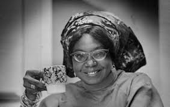
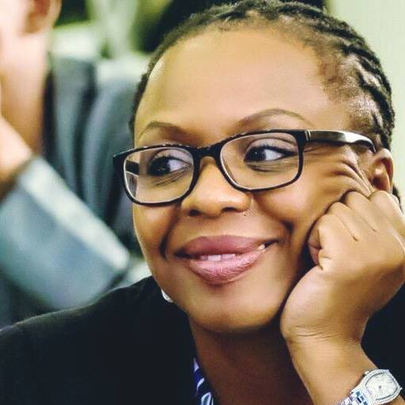
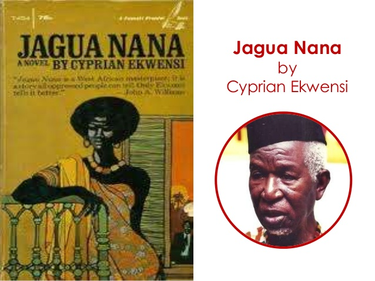
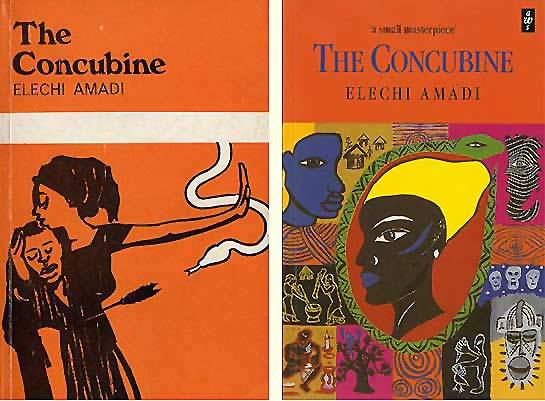
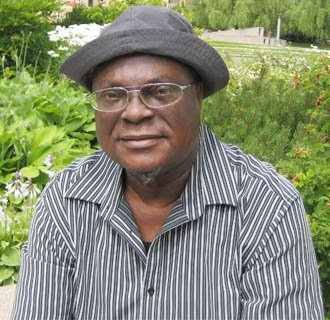
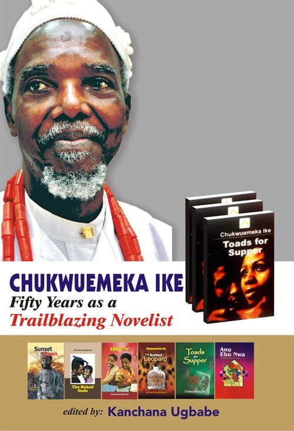
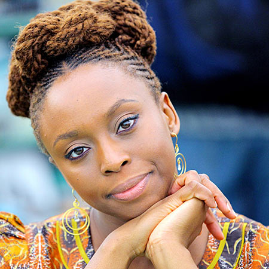
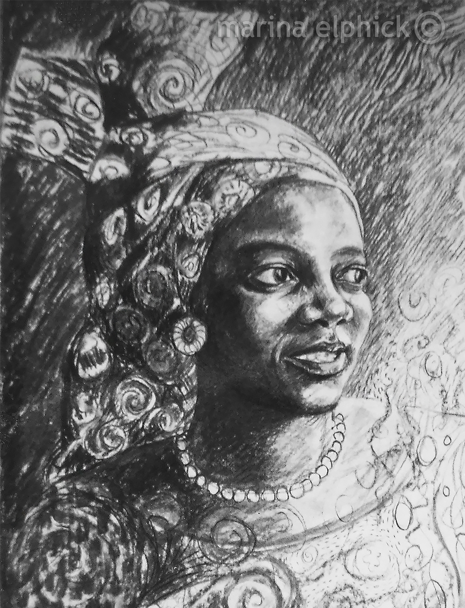
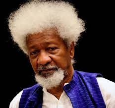
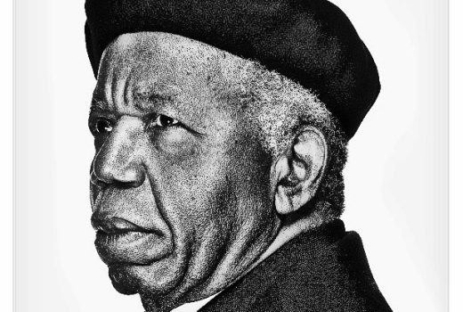

Top Ten Nigeria brings the top ten writers in Nigeria. Here's the countdown;

#### 10- Flora Nwapa
She was a Nigerian author who has been called the mother of modern African literature. She was the forerunner to a generation of African women writers, and was also acknowledged as the first African woman novelist to be published in the English language in Britain. She achieved international recognition, with her first novel Efuru published in 1966 at the age of 30 years by Heinemann Educational Books. While never considering herself a feminist, she is best known for recreating life and traditions from an Igbo woman's viewpoint.

#### 9- Lola Shoneyin
Perfect diction,perfect style,perfect story. Read the 'Secret lives of Baba Segi wives' and you will fear your wives for just a small period of your entire life. The story also talks about some wrong norms or beliefs of the society. Read it,and watch your life become transformed. She is a Nigerian poet and author.

#### 8- Cyprian Ekwensi
Oga,I duff my heart for him. His works on 'Jagua Nana ' ,' The Drummer Boy  ', 'The Passport of Mallam Ilia 'were amazing. The man deserves an accolade. He was a Nigerian author of novels, short stories, and children's books.

#### 7- Elechi Amadi
Nobody saw or expected that twist in 'The concubine'. All our ladies must read this book,so that they can begin their 3 days deliverance prayers and fasting, so that someone's spiritual husband will not just come and be killing innocent men just like that. 
He was an author of plays and novels that are generally about African village life, customs, beliefs, and religious practices prior to contact with the Western world. Amadi is best regarded for his 1966 debut novel, The Concubine, which has been called "an outstanding work of pure fiction".

#### 6- Femi Osofisan
Often praised as Nigerian greatest dramatist. He challenged those greek people that their 'Troy' story is a learner when he wrote 'Women of owu'. Come and see the dirges,the story line,the killing. Do you know that Brad pitt even begged to feature in the drama but we no gree. The Yoruba talent has written plays that was acted by the likes of 'Sam loco'.

#### 5- Chukwuemeka Ike
Among many of the younger generation, he is popular as the author of Expo '77, a critical look at academic examination abuses in West Africa. The man who coined the word 'expo' to be the new  'exam-malpractice' ,struck again when he led his readers into the world of  the 'Ogbanje'child-Obuechina. The travails of Obuechina in 'Potter's wheel' will make you fear teachers,especially the might of their canes and 'Sense installing knocks'.

#### 4- Chimamanda Adichie
I know you want to see where we placed the literary daughter of Achebe.Yes,she is the fourth on this list.the lady has mastery over words and uses this to paint a perfect description to ensure that her readers are transported into her mind and sees things from her point of view. But this  one no mean say you go follow am dey form feminism because you go get black eyes.Just read 'Purple hibiscus' and 'Half of a yellow sun' then you will definitely have half a yellow sense.

#### 3- Buchi Emecheta
The late writer will take you on the touching lives of mothers,wives,and Nigerians.I read 'Joys of motherhood' and 'Second class citizen',and i begged my mum not to invest her entire time on her children.I even swore that i would never leave this great country,Wait,Scratch that out-I cancel that one in Jesus name,i must go to Yankee.

#### 2- Wole Soyinka
The Yoruba Nobel laureate became the first African to win the Nobel literature award. His books are entertaining and educative,with intriguing twist. Just open 'Lion and the jewel' , 'the man died' and 'Ake-the years of childhood', then you will confess that Wole is Soyinka.

#### 1- Chinua Achebe
The polific writer is the author of 'Things fall apart'. If you have not read the book,you are not a Nigerian, in fact you are not a worthy African.The novel which was translated in more than four hundred languages views the story of colonialism through the life of Okonkwo, skip to the part of Ikemefuna and Okonkwo,blood will stream down your skin pores.Achebe also wrote incredible books like;'A man of the people','Chike and the river',and 'There was a country'. He also won many awards.

