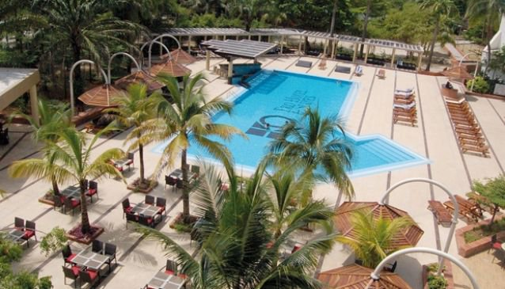
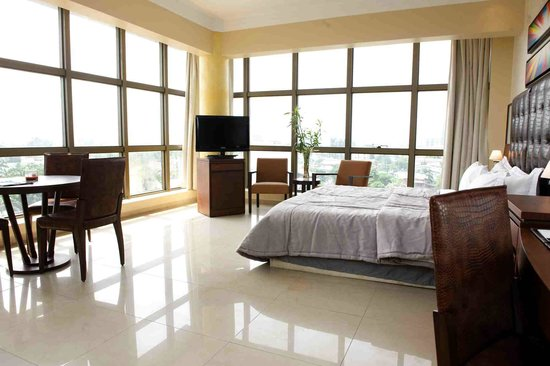
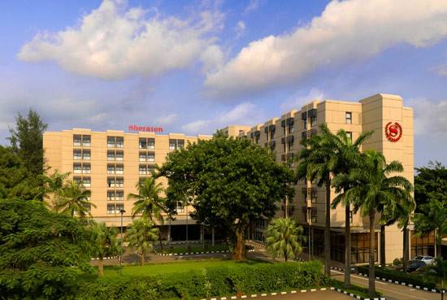
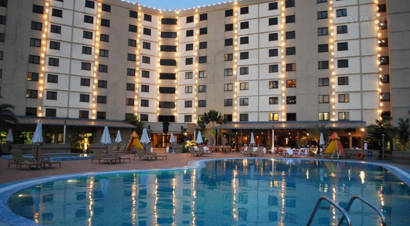
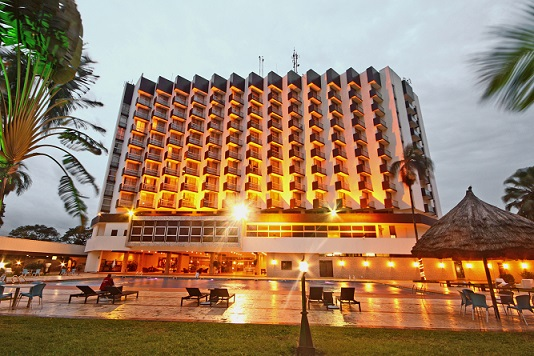
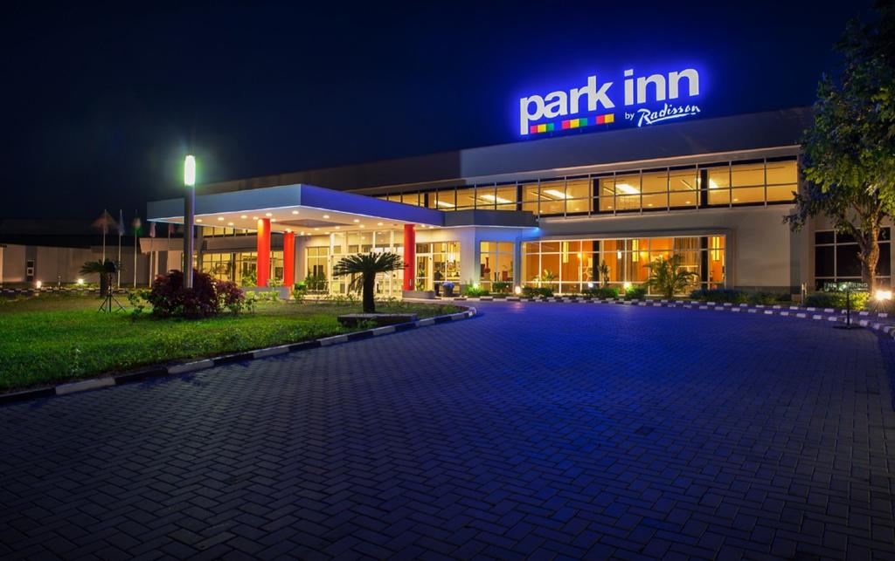
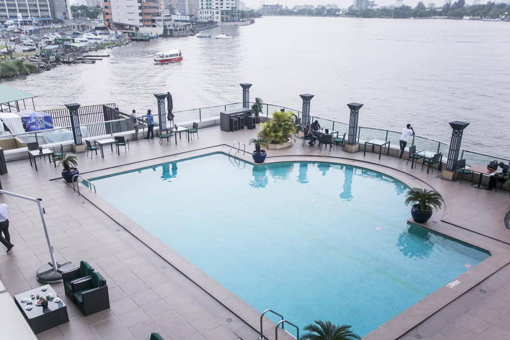
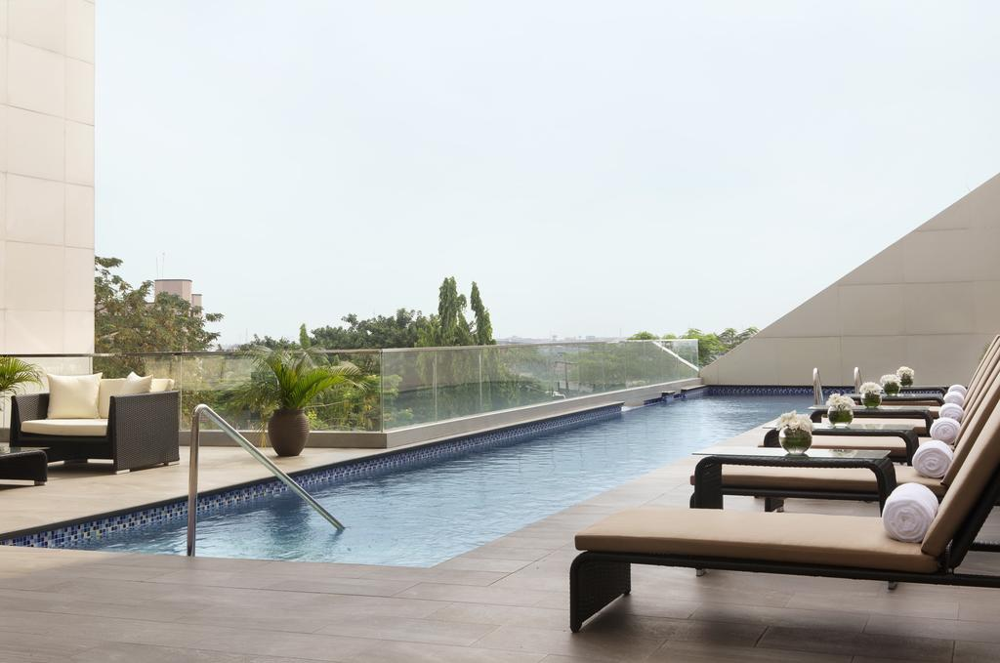
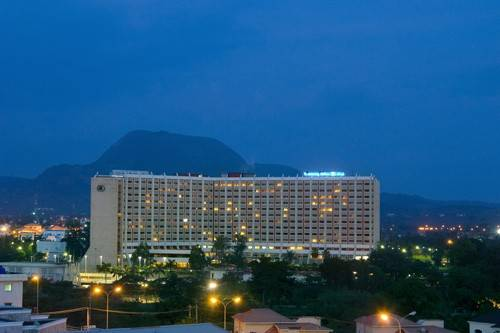
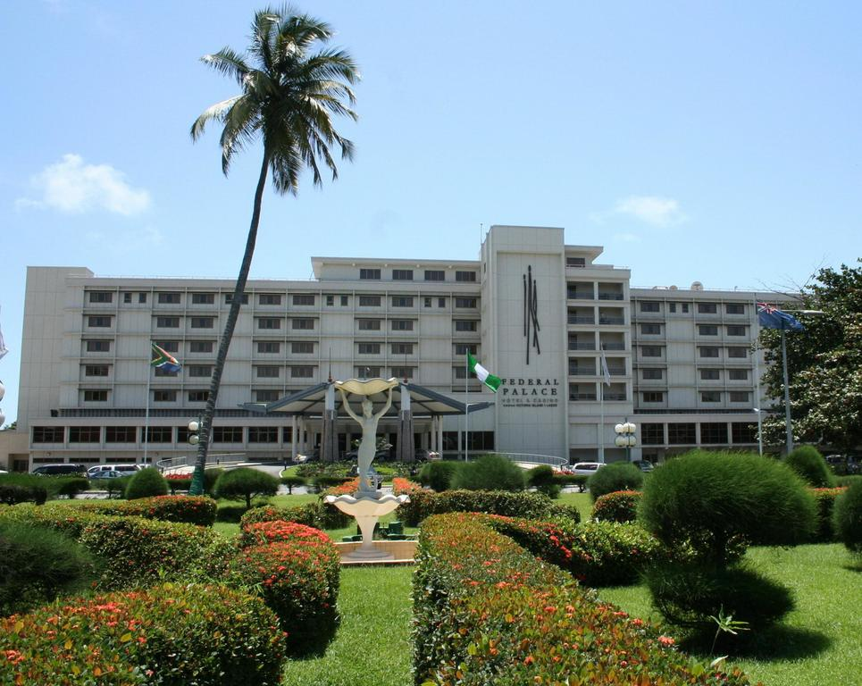

Nigeria has a diverse range of luxury hotels, which are exclusive for their indefinable beauty, unique style and impeccable service. Whether you are seeking a getaway with your friends or family, or you just want to have some time out for yourself. These hotels provide comfortable accommodation, relaxation and leisure facilities, top notch security, great shopping accessibility, trendy local and intercontinental dishes etc. Here are the top ten hotels in Nigeria;

#### 10- Eko Hotel and Suites
Eko Hotel Lagos offers world class hospitality and service. It is a renowned five star accommodation in the city of Lagos. With grand conference and banqueting facilities, Eko Hotel Lagos is the ultimate location for major events in Lagos, Nigeria. The hotel boasts of over 800 elegantly styled room & suites. There are about 8 restaurants & bar at Eko Hotel and Suites making it the ideal location for maximum comfort and relaxation.

#### 9- The Avenue Suites
The Avenue Suites is a luxury lifestyle hotel that offers top notch hospitality and service. The hotel offers a view of the Atlantic ocean and the rooms have stylish interiors. Located in the famous business district of Lagos, it is a perfect fit for corporate guests and short getaways.

#### 8- Sheraton Lagos Hotel
Sheraton Hotel Ikeja is a major 5 star hotel in Nigeria, situated in Lagos it boasts of over 300 rooms and suites. The prestigious hotel in Ikeja boasts of a restaurant that offers one of the best buffet meals in Lagos. Facilities ranging from swimming pools to lawn tennis courts are available for use by guests. Event and conferencing facilities are available for corporate and social events.

#### 7- Golden Tulip Festac
Golden Tulip Festac is a breathtakingly beautiful five star accommodation in the city of Festac, Lagos. The hotel sits on a 7 acre site with beautiful landscape. With over 400 rooms, 2 high end restaurants, a night club, conference centre and several recreational facilities, Golden Tulip Festac is great for both leisure stay and corporate events.

#### 6- Hotel Presidential
Hotel Presidential is a grand 5 star hotel situated in the city of Port Harcourt, Nigeria. The hotel lies close to the airport and boasts of grand conferencing facilities. Enjoy various intercontinental meals at the hotel’s restaurant or spend sometime at the Bamboo Bush Bar. A night club is available at the hotel for guests who would love to unwind.

#### 5- Park Inn by Radisson 
Park Inn by Radisson is an architectural delight, a luxury 5 star master piece with exquisite furnishings and luxury facilities. The hotel is an ideal location for short getaways and offers all the convenience facilities needed to enjoy a memorable and relaxing stay in Abeokuta, Nigeria.

#### 4- Lagos Oriental Hotel
Oriental Hotel Lagos is a five star hotel that combines modern architecture with spectacular interior and top notch service. The hotel offers an excellent business and leisure experience for both leisure guests and business travellers. An impressive buffet is available and all the facilities available at the hotel are perfect for an opulent stay in town.

#### 3- Renaissance Hotel Ikeja
Renaissance Hotel Ikeja now known as Radisson Blu Ikeja is one of the most stylish hotels in Lagos. It is one of the 5 star hotels in Nigeria which blends modern architecture with contemporary styling. The hotel is lavishly furnished and features a rooftop swimming pool with the view of the city as its backdrop. Enjoy tastefully made meals at the hotel’s restaurant and well stocked bar. Great facilities for events and business conferences are available. Ideally situated in the serene part of Lagos city, Radisson Blu Ikeja is perfect for business travellers who would like to stay in the best hotel in Ikeja gra.

#### 2- Transcorp Hilton Hotel Abuja
Transcorp Hilton Hotel Abuja is unarguable one of the best 5 star hotels in Nigeria. The hotel is easily accessible from Nnamdi Azikwe Airport. Transcorp Hilton hotel is the ideal haven for comfort luxury seekers, high end corporate retreats and events. It is regarded at the best hotel in Abuja. Enjoy the best in service and exquisite room offers available at the hotel. Transcorp Hilton offers a perfect blend of elegant décor, top notch service and a fine dining experience.
With exceptional conferencing and event facilities, as well fast speed internet access and 24 hours business service, Transcorp Hilton Hotel is perfect five star hotel in Abuja, Nigeria perfect for your stay. It is set on beautifully landscaped gardens and offers a wide range of leisure facilities including a swimming pool, an on-site casino, and a shopping arcade. Free WiFi is also available throughout the hotel.

#### 1- Federal Palace Hotel
Famed as one of the best and oldest five star hotels in Lagos, Federal Palace Hotel offers optimum comfort luxury to both business travellers and leisure guests alike. Regardless of its age, the hotel is modern and stylish, the rooms offer a breathtaking view of the ocean and the staffs offer excellent service. Several comfort amenities and high end facilities are in place. From an elegant casino, to a large outdoor pool, stylish restaurant with exquisite dining and multi purpose event centre. Federal Palace Hotel Lagos is perfect for relaxation and all kinds of events social and corporate events.

