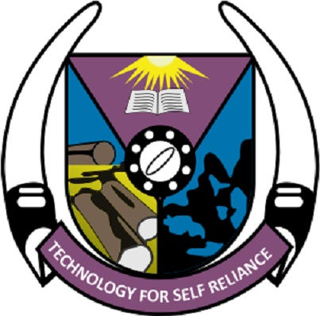
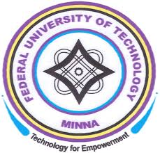
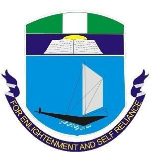
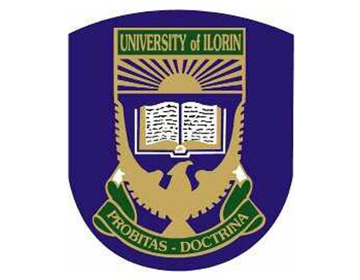
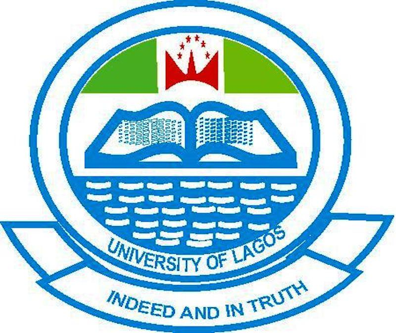
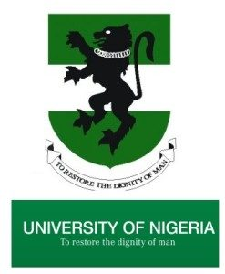
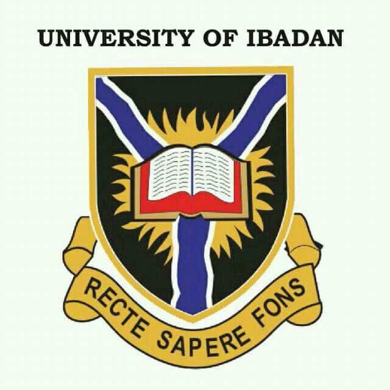

In this post,we've compiled a list of the top ten universities in the country based on the latest rankings from university ranking bodies like Times Higher Education(THE) world university ranking, webometrics etc.
Criteria for choosing include;
1. Learning Environment of the University.
2. Quality and Quantity of Lecturers of the University.
3. Learning Facilities.
The top ten universities in Nigeria are:

#### 10 - Federal University of Technology Akure (FUTA)
Federal University of Technology Akure has been ranked the 10th best university in Nigeria.
The Federal University of Technology Akure (informally FUT Akure or simply FUTA) was founded in 1981 under a drive by the government of Nigeria to create universities that specialised in producing graduates with practical as well as theoretical knowledge of technologies. It is located in Akure, the capital city of Ondo State.

#### 9 -  Federal University of Technology Minna (FUTMINNA)
Federal University of Technology Minna (FUTMINNA) is a Federal Government established post-secondary educational institution located in Minna, Nigeria.
FUTMINNA specializes in technological education. The University is a designated Centre of Excellence in Biotechnology and Genetic Engineering and has a core competence in the development of vaccines and drugs.
FUTMINNA was founded in 1983, and the first Vice-Chancellor was Professor J.O. Ndagi who served from 1983 to 1990. The governing bodies are the Council and the Senate. The institution is listed in the Guide to Higher Education in Africa, Association of African Universities and the International Association of Universities, 1999. Futminna has been ranked the 9th best university in Nigeria.

#### 8- The University of Port Harcourt(uniport)
The University of Port Harcourt is a university in the Nigerian city of Port-Harcourt. It was established in 1975 as University College, PortHarcourt and was given University status in 1977. Their motto is 'For Enlightenment and Self-Reliance' .The University of Port Harcourt was ranked the sixth in Africa and the first in Nigeria by Times Higher Education (THE) in 2015. As of 2018 it is ranked as the 8th best university in Nigeria.

#### 7- University of Ilorin
University of Ilorin, also known as Unilorin, is a University owned by the Federal Government of Nigeria, located in Ilorin, Kwara State, Nigeria. The University is specifically cited in Ilorin-South Local Government Area of the State. It was established by a Decree of the Federal Military Government in August, 1975. The establishment aimed to implement one of the educational directives of the Third National Development Plan which was aimed at providing more opportunities for Nigerians aspiring to acquire university education and to generate high-level manpower, so vital for the rapidly expanding economy. Compared to other higher institutions of learning in the country, the institution has one of the largest landmass covering approximately 5000 hectares of land and it's the 7th  best university in Nigeria according to webometrics. Their motto is Probitas Doctrina.

#### 6- The University of Lagos 
 The University of Lagos popularly known as Unilag  is a federal government research university in Lagos State, southwestern Nigeria. The university was established 1962 and their motto is In deed and in truth. It is ranked as the 6th best university in Nigeria.

#### 5- Ahmadu Bello University (ABU)
Ahmadu Bello University (ABU) is a federal government research university in Zaria, Kaduna State. ABU was founded on October 4, 1962, as the University of Northern Nigeria.
It is named after the Sardauna of Sokoto, Alhaji Sir Ahmadu Bello, the first premier of Northern Nigeria.
The university runs a wide variety of undergraduate and graduate programs (and offers associate degrees and vocational and remedial programs). It has a large medical program with its own A.B.U. Teaching Hospital, one of the largest teaching hospitals in Nigeria and Africa. It is the 5th best University in Nigeria.

#### 4- Obafemi Awolowo University (OAU) 
Obafemi Awolowo University (OAU) is a federal government owned and operated Nigerian university. The university is in the ancient city of Ile-Ife, Osun State, Nigeria. The university was founded in 1961 and classes commenced in October 1962 as the University of Ife by the regional government of Western Nigeria, led by late chief Samuel Ladoke Akintola, and was renamed Obafemi Awolowo University on 12 May 1987 in honour of Chief Obafemi Awolowo (1909–1987), first premier of the Western Region of Nigeria, whose brainchild the university was. It is the number 4 best University in Nigeria.

#### 3- University of Nigeria(UNN)
The University of Nigeria, commonly referred to as UNN, is a federal university located in Nsukka, Enugu State, Nigeria. Founded by Nnamdi Azikiwe in 1955 and formally opened on 7 October 1960, the University of Nigeria has three campuses – Nsukka, Enugu, and Ituku-Ozalla – all located in Enugu State.
The University of Nigeria was the first full-fledged indigenous and first autonomous university in Nigeria, modelled upon the American educational system. It is the first land-grant university in Africa and one of the five elite universities in Nigeria. The university has 15 Faculties and 102 academic departments. The University offers 82 undergraduate programs and 211 postgraduate programmes. It is ranked on Times Higher Education(THE) as the number 3 University in Nigeria.

#### 2- University of Ibadan (UI) 
The University of Ibadan (UI) is the oldest Nigerian university, and is located five miles (8 kilometres) from the centre of the major city of Ibadan in Western Nigeria. It is popularly known as Unibadan or UI.
Besides the College of Medicine, there are now 12 other faculties: Arts, Science, Agriculture Renewable natural resources , Social Sciences, Education, Veterinary Medicine, Pharmacy, Technology, Law, Public Health, and Dentistry and economics, environmental design and management (proposed).
The university has residential and sports facilities for staff and students on campus, as well as separate botanical and zoological gardens. In September 2016, it became the first Nigerian university to make the top 1000 in Times Higher Education rankings. Prior to that, it had always made the top African 10 in Webometrics Rankings. It is currently the 2nd best University in Nigeria.

#### 1- Covenant University (CU)
Covenant University (CU) is located in Ota, Ogun State in Nigeria. It is a private Christian university, affiliated with Living Faith Church Worldwide and a member of the Association of Commonwealth Universities, Association of African Universities and National Universities Commission. Over the years, Covenant University has grown to be one of the leading universities from Nigeria based on annual rankings from various organizations, scholarly citations from reputable journals and JAMB statistics. It is the number 1 University in Nigeria according to Times Higher Education(THE).

