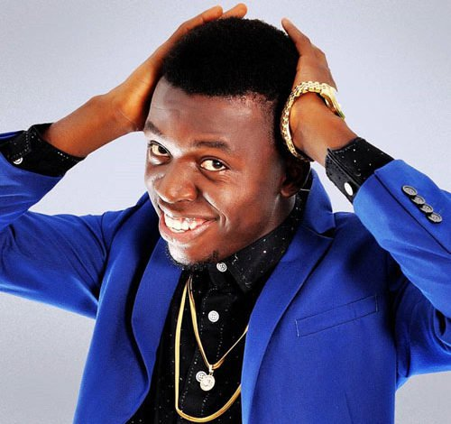
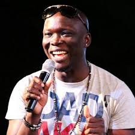
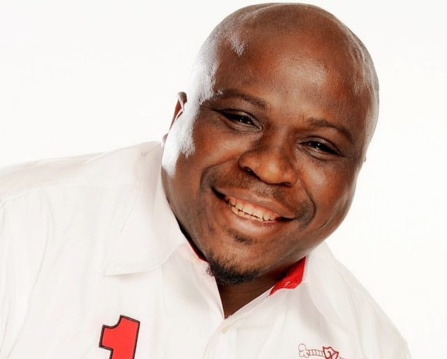
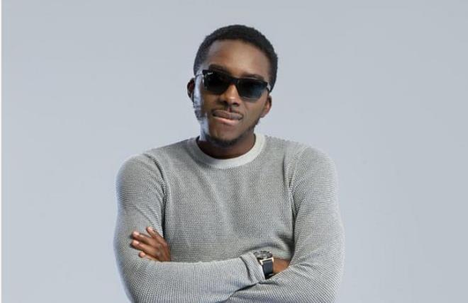
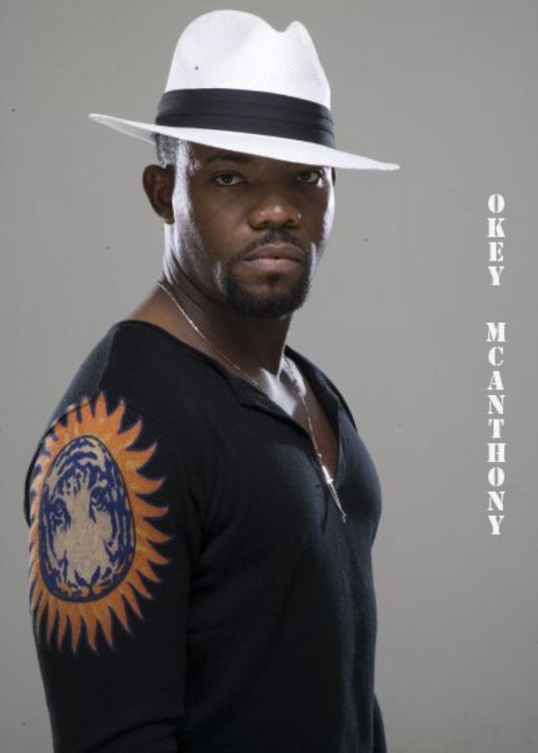
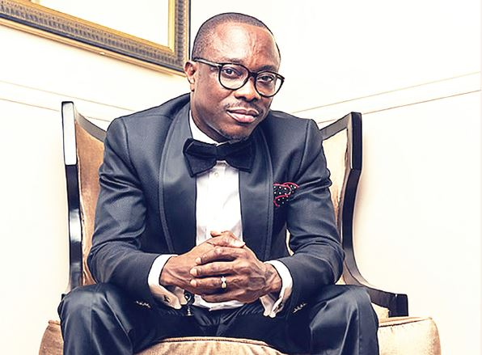
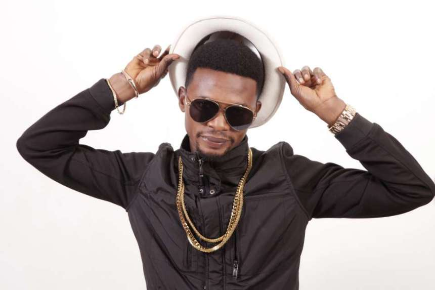
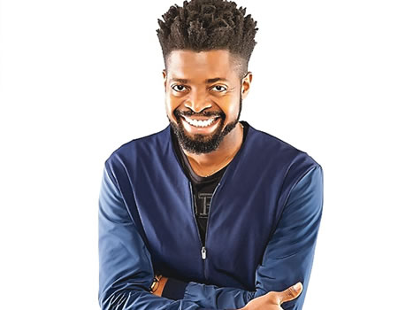
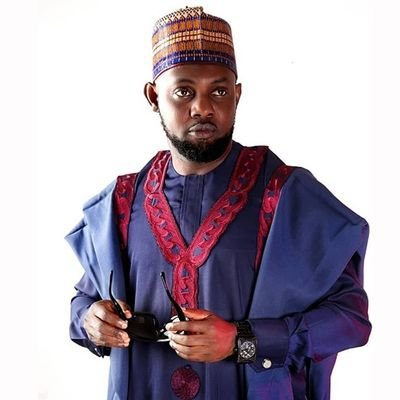
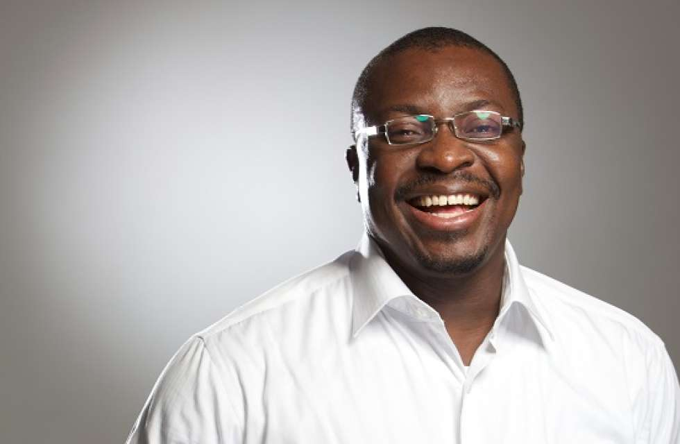

#### 10- Akpororo
Jephthah Bowoto, popularly known and referred to as Akpororo, is a Nigerian stand-up comedian, vocalist and actor. Akpororo is one of Nigeria's richest comedians and has performed in many high-profile shows and has organised his as well. Akpororo performs in many church organised events,a feat which is rarely achieved by other comedians. Akpororo net worth is estimated to be 350 million naira this 2018.

#### 9- Gordons
Gordons is one of the most talented comedians in the country. He also came into limelight via Opa William's Night of a thousand laugh. His networth is set to be 400million naira.

#### 8- Gbenga Adeyinka 
Gbenga Adeyinka is a multi-award-winning Nigerian actor, comedian, radio and TV presenter, writer, and MC. Gbenga is one of the biggest names in the Nigerian comedy industry. He is reputable for organising big shows for politicians. He is the CEO and organizer of 'laffmattaz',a popular show that rakes in lots of money for him.

#### 7- Bovi 
Bovi is a Nigerian comedian, actor, and writer from Delta State, Nigeria. He has organized popular stand-up comedy concerts like Bovi Man on Fire across the globe. He has made millions from organizing tours adverts, and events.
There is always a rush for tickets and if you are not early enough it would have sold out. Bovi also signed a multi million naira deal with Glo in 2015. He often headline most shows in Nigeria every year.

#### 6- Okey Bakasi
Okey Bakasi is a comedian, actor and politician, he started acting and doing stand up comedy while still in the university.
Okey Bakasi was the Senior Special Assistant to the former governor of Imo State, Ikedi Ohakim on entertainment. He is a household name in the entertainment industry and has organised lots of shows for top class politicians.

#### 5- Julius Agwu
With two popular events namely: Crack Your Ribs and Laugh for Christ Sake, he has bagged millions of naira yearly.
He owns properties spread across 3 states in Nigeria and is the CEO of Real Laff Entertainment. He made over 20 million Naira from a book launch and reports says he takes home tens of million naira annually.

#### 4- I go dye
"I go dye" came into limelight via Opa William's Night of a thousand laugh, a platform that exposed many of the successful comedians in the country. He is not only a funny and rib cracking comedian,but he is also the CEO of Revamp Construction Company, a real estate and road Construction Company. He is also an Ambassador to the United Nations Millennium Development Goal. His net worth according to forbes is N1.8 billion including his endorsements.

#### 3- Basketmouth
Bright Okpocha known by his stage name Basketmouth is a Nigerian comedian and actor. He is also the Brand Ambassador for companies like Globacom Ltd. and Amstel Malta. He hosts events in London, America and South Africa which are always sold out and through his Basketmouth Uncensored platform he has gained much popularity. He reportedly has an endorsement deal worth over 120 million Naira annually.

#### 2- AY
Ayodeji Richard Makun, also known by his stage name A.Y, is a Nigerian actor, comedian, radio and TV presenter. He is the host of the A.Y live shows and A.Y comedy skits. AY recently sprung up to become one of the richest comedians in Nigeria via the A.Y live shows all across the country. The release of his best seller movies "30 days in Atlanta" and "A trip to Jamaica" has also contributed to his recent rise. He charges a performance fee between 1 and 2 million Naira.

#### 1- Ali Baba
Atunyota Alleluya Akpobome stage name Ali Baba, is a Nigerian stand-up comedian and actor. He has hosted lots of events for Governors,Presidents and other top dignitaries in the past. In addition to comedy,Ali baba is also a motivational speaker. He owns streams of other businesses in Lagos. Forbes estimates his net worth as N3 billion in this 2018.

