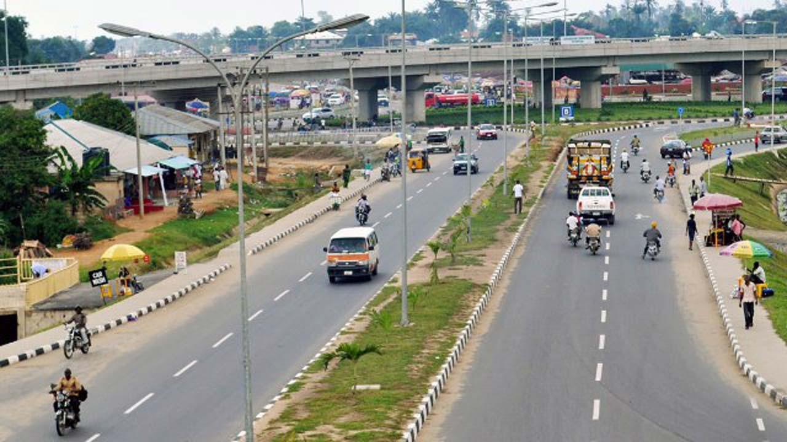

#### 10- Kaduna State 
Kaduna State is a state in Northwest Nigeria. It is the tenth richest state in Nigeria with a GDP of $10 billion. It is also a commercial hub where business thrives.

#### 9- Ogun State
Ogun State is a state in southwestern Nigeria. The state is notable for having a high concentration of industrial estates and being a major manufacturing hub in Nigeria. Major factories in Ogun include: Dangote Cement factory, Nestle,Lafarge Cement factory, Coleman Cables, Procter & Gamble amongst others. It is the ninth richest state in Nigeria and it's Gross Domestic Product(GDP) is $10 billion.

#### 8- Akwa Ibom State
Akwa Ibom is one of Nigeria's 36 states, with a population of over five million people. It is located in the coastal southern part of the country called the Niger Delta. The state is currently the highest oil- and gas-producing state in the country.It is the eighth richest state in Nigeria with a GDP of $11 billion.

#### 7- Edo state
Edo state is the seventh richest state in Nigeria,with Benin City as capital. The population of the entire state is approximately 8 million people. Edo state has a lot of tourist centers. The state also produces crude oil and other mineral resources like limestone and quarry. It boasts of a GDP of $11 billion.

#### 6- Kano State
Kano is the sixth richest state in Nigeria and is located in the North Western region of the country.Kano is the commercial nerve centre of Northern Nigeria and is the second largest city in Nigeria.Kano is a major centre for the production and export of agricultural products like hides and skins, peanuts, and cotton. The state boasts of a GDP of $12 billion.

#### 5- Imo State
Imo is one of the 36 states of Nigeria and lies in the south east of Nigeria. Owerri is its capital and largest city. Located in the south-eastern region of Nigeria, it occupies the area between the lower River Niger and the upper and middle Imo River.
The economy of the state depends primarily on agriculture and commerce.The state has several natural resources including crude oil, natural gas, lead, Calcium Cabornate and zinc.It is the fifth richest state in Nigeria with a GDP of $14 billion.

#### 4- Oyo State 
Oyo State is an inland state in south-western Nigeria, with its capital at Ibadan. Oyo State covers approximately an area of 28,454 square kilometers and is ranked 14th by size. Oyo State contain a number of natural features including the Old Oyo National Park.

The state relies mostly on agricultural proceeds to cater for its needs. Some of the agricultural crops grown at Oyo includes: maize,yam,cocoa,cassaa,cashew,millet and plantain. Most of these crops are futher exported. 

It generates a GDP of $16 billion and it is the fourth richest state in Nigeria.

#### 3- Delta State 
Delta State is the third wealthiest state in Nigeria with a GDP of $16 billion.
Delta State is an oil and agricultural producing state of Nigeria, situated in the region known as the South-South geo-political zone with a population of 4,112,445 (males: 2,069,309; females: 2,043,136).The capital city is Asaba, located at the northern end of the state, with an estimated area of 762 square kilometres (294 sq mi), while Warri is the economic nerve center of the state and also the most populated. It is located in the southern end of the state. The state has a total land area of 16,842 square kilometres (6,503 sq mi).

#### 2- Rivers State
Rivers State is one of the 36 states of Nigeria. According to census data released in 2006, the state has a population of 5,198,716, making it the sixth-most populous state in the country. Its capital and largest city, Port Harcourt, is economically significant as the centre of Nigeria's oil industry.  It boasts of a GDP of $21 billion. It is the second richest state in Nigeria.

#### 1-  Lagos State
Lagos is a state in the southwestern geopolitical zone of Nigeria. The smallest in area of Nigeria's 36 states, Lagos State is arguably the most economically important state of the country, the nation's largest urban area. It is a major financial centre and would be the fifth largest economy in Africa, if it were a country.
The actual population total is disputed between the official Nigerian Census of 2006 and a much higher figure claimed by the Lagos State Government.
Lagos is one of the few states that can stand on its own without the Federal government allocation as she can survive with her Internally Generated Revenue(IGR). Lagos has a GDP of $33 billion dollar and it is the richest state in Nigeria.

