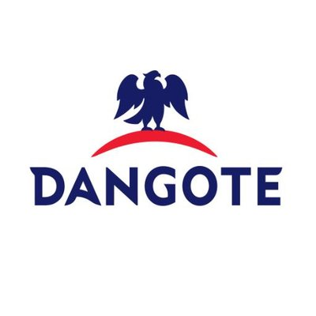
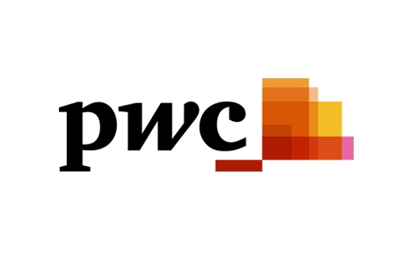
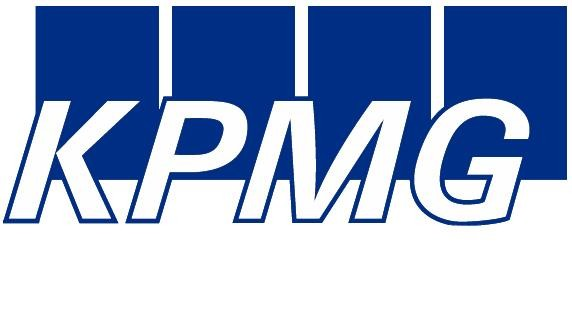
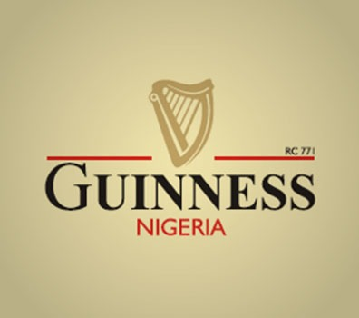
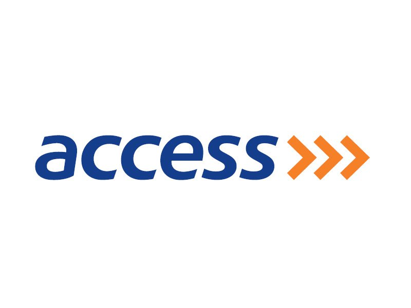
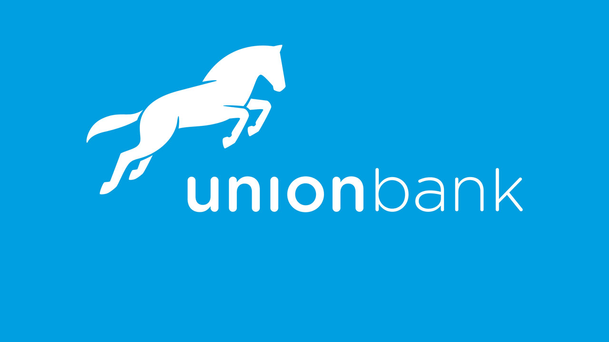
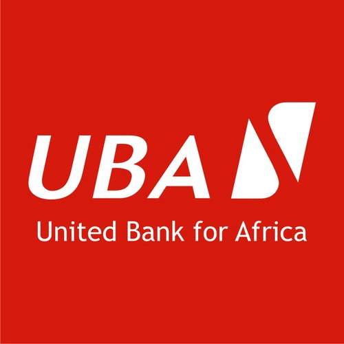
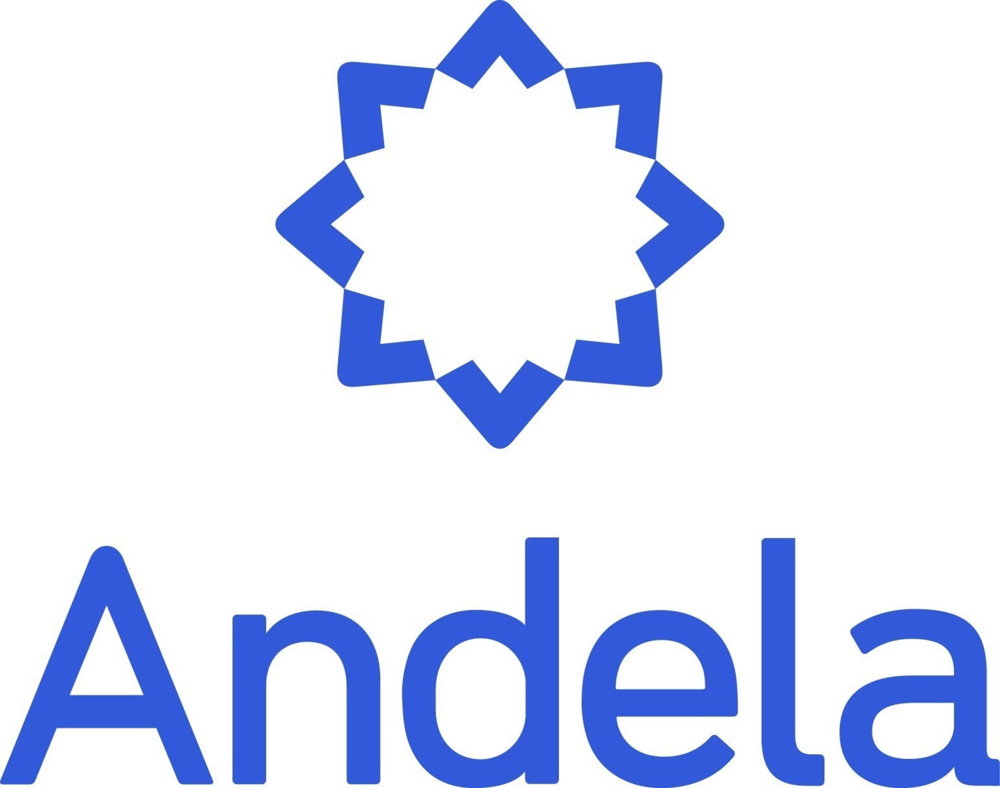

#### 10- Dangote Group
The Dangote Group is a Nigerian multinational industrial conglomerate, founded by Aliko Dangote. It is the largest conglomerate in West Africa and one of the largest on the African continent. The group employs more than 30,000 people, generating revenue in excess of US$4.1 billion in 2017.
The company was founded in 1981 as a trading enterprise, importing sugar, cement, rice, fisheries and other consumer goods for distribution in the Nigeria market. The group moved into manufacturing in the 1990s, starting with textiles, moving onto flour milling, salt processing and sugar refining by the end of the decade. The company next moved into cement production, growing rapidly and moving into other African countries.

#### 9- PricewaterhouseCoopers (PwC) 
PricewaterhouseCoopers (PwC) is a multinational professional services network headquartered in London, United Kingdom.
The PricewaterhouseCoopers name was formed by the combination of the names of Price Waterhouse and Coopers & Lybrand, following their merger in 1998. On 20 September 2010, PricewaterhouseCoopers rebranded as PwC, although the legal name of the firm remained PricewaterhouseCoopers. 
Their reputation for excellence is solid, and has been ranked as the world most prestigious accounting firm severally.

#### 8- KPMG 
KPMG is a professional service company involved in financial audit, tax, and advisory. Its tax and advisory services are further divided into various service groups.
The name 'KPMG' stands for 'Klynveld Peat Marwick Goerdeler'. They have a global reach with their headquarters in Amstelveen, Netherlands and other mega branches across the world.

#### 7- Guinness Nigeria 
Guinness Nigeria was incorporated in 1962 with the headquarters in Ikeja,Lagos. It is into Beer Brewing, Bottling and Marketing of Guinness Foreign Extra Stout, Harp Lager, Malta Guinness and other Beverages.The reputation of the company as a brand and as a public limited company is strong in Nigeria.It takes the position as the number seven best place to work in Nigeria.

#### 6- MTN
The first Telecom industry in the list and the most prodigious telecom industry in Nigeria and Africa.
Was founded in 1994, headquartered in South Africa and has it’s presence in over 20 African nations. MTN Nigeria is the sixth best company to work for in Nigeria.

#### 5- Access Bank plc
Access Bank plc is a Nigerian multinational commercial bank, owned by Access Bank Group, founded in 1989. It is licensed by the Central Bank of Nigeria.Access Bank is presently one of the five largest banks in Nigeria in terms of assets, loans, deposits and branch network. It is the fifth best company to work for in Nigeria.

#### 4- Union Bank
Union Bank of Nigeria is a large commercial bank in Nigeria, serving individuals, small and medium-sized companies, as well as large corporations and organizations. It's the fourth best company in Nigeria.

#### 3- Courteville Business Solutions(CBS)
Courteville Business Solutions plc is a foremost Nigerian e-business solutions and advisory company. 
Courteville Business Solutions Plc is West Africa’s biggest e-business Solutions Company and proudly the biggest company that renders data capture service in Sub-Sahara Africa.

#### 2- United Bank for Africa (UBA) 
United Bank for Africa (UBA) Plc, is a leading pan-African financial services group headquartered in Nigeria.It was Founded in 1949 and has a Nigerian Tony Elumelu as it’s chairman. It is the second best company to work in Nigeria.

#### 1- Andela
Andela Nigeria has been rated the number one company to work for in Nigeria,co-foundered by Nigeria's Iyinoluwa Aboyeji, Andela is an American company that specialises in training software developers. The company launched its operation in Lagos, Nigeria in June 2014.Andela focuses on software and web development.
Young people with a zest for tech driven solutions and productivity are being trained and paid.

