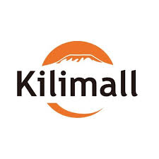
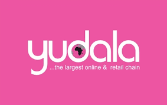
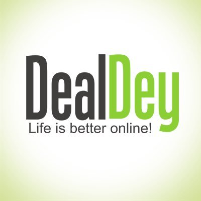
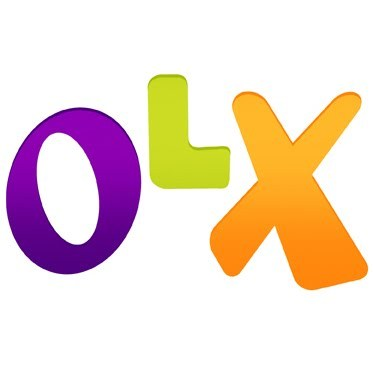
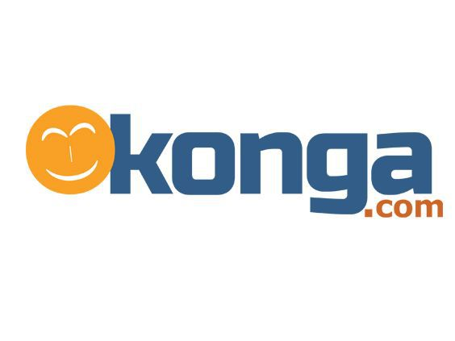
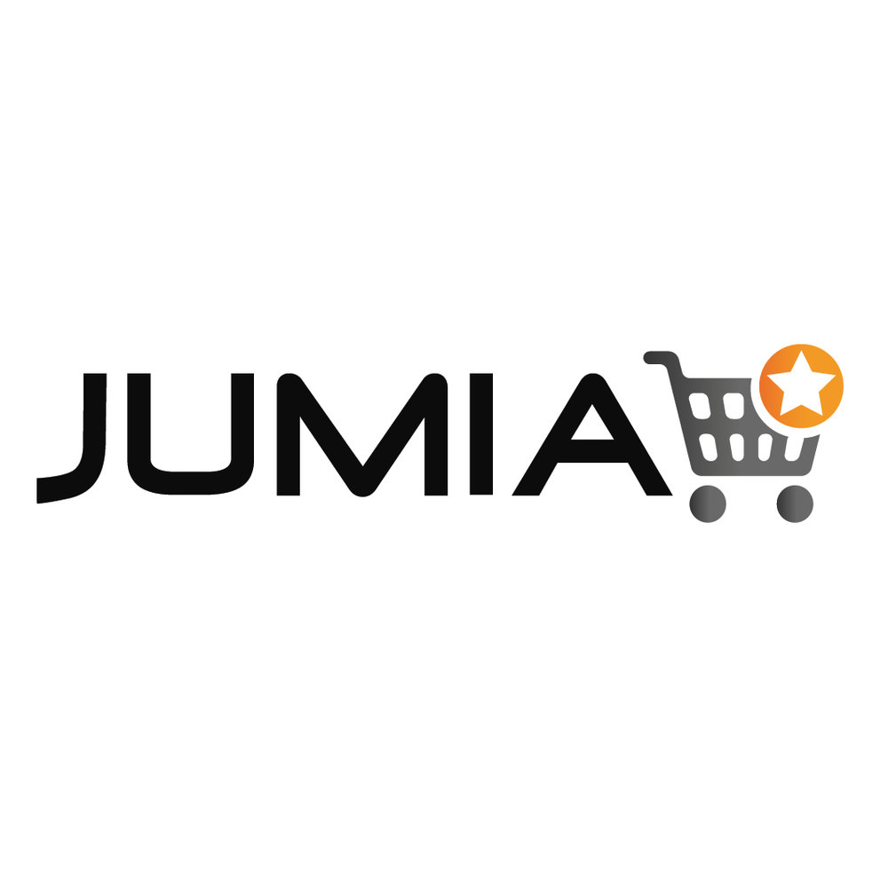

The Ecommerce business sector is making great impact in Nigeria and is influencing the economy. Looking for stores to buy goods online? This post makes a list of the top ten online stores in Nigeria.

#### 10- Kara.com.ng
This a an online store that sells a variety of products ranging from phones to computers to electronics to home appliances etc. The website is easy to navigate and there is online help,you can chat with customer service while shopping.

#### 9- Kilimall
Kilimall.ng is Nigeria’s online shopping centre that offers the best price on smartphones, electronics, dresses, shirts, shoes, home and living, and TV sets.

#### 8- Payporte
PayPorte.com has grown to become one of the biggest general merchandising eCommerce stores in Nigeria.
With headquarters in Lagos, Nigeria, PayPorte was awarded the ‘E-Commerce Company of the Year‘ at the Central Bank of Nigeria Cashless Card Expo in 2016.
With the PayPorte App, you always have access to over 50,000 products; whether it’s Fashion, Electronics, Home & Kitchen Products, Phones, Perfumes and many more.
The website is well designed in such a way that with a few taps, you can now buy these products and have them delivered on time.

#### 7- Yudala
Yudala is the first online and offline retail chain in Nigeria. The Store sells at best prices, guarantee genuine products and fast shipping to any location in Nigeria.
The category of products sold  include: Wines and Spirits, Electronics, Home and Kitchen Appliances, Fashion, Baby Products, Sport fitness, Daily Needs, Groceries, Furniture, Phones, Tablets, Computers and Accessories.

#### 6- SME MarketHub 
The SME MarketHub is the GTBank owned free online platform that allows small businesses to sell their products to audiences both near and far.
The website offers amazing discounts and variety on everyday products and services. Such that whatever you want to buy, you’ll find it all on the Hub!

#### 5- DealDey 
DealDey is Nigeria’s number one daily deals website where you can find great deals on products and services at highly discounted prices.
Dealdey usually lists deals that are available at a particular time: e.g. discounts, promos, etc.
You can find unique and amazing deals on food, travel, hotels, spas, professional courses, restaurants, fashion items for both male and female; gadgets, mobile phones, electronics and much more on their website.

#### 4- OLX
OLX Nigeria has thousand's of goods available  for sale ranging from cars, furniture, electronics, jobs and services listings.
OLX is where to buy and sell everyday in local communities and around the world.

#### 3- JiJi
Jiji is Nigeria's foremost online marketplace that provides thousands of buyers and sellers with an avenue to meet and exchange goods and services.
Jiji is a Nigerian online marketplace which represents customer to customer (C2C) and business to customer (B2C) sellers in the country.
You can get variety of products including cars, household goods, mobile phones, electronics, personal services etc
Jiji Nigeria – is one of the biggest classified websites in Nigeria and one of the best marketplaces in the country which brings buyers and sellers together with ease.

#### 2- Konga
Konga.com is a Nigerian e-commerce company founded in July 2012 with headquarters in Gbagada, Lagos State. It offers a third-party online marketplace, as well as first-party direct retail spanning various categories including consumer electronics, fashion, home appliances, books, children's items, health care and personal care products.
It’s the second most popular online shopping site for electronics, phones, computers, fashion, groceries, sport fitness, books & more at the best prices in Nigeria.

#### 1- Jumia
Jumia, formerly known as Africa Internet Group (AIG), is a system of Online Commerce, Marketplaces and classifieds websites and applications created in 2012. Started in Lagos, the company has a presence across 14 African countries.
Jumia currently covers subsidiaries such as Jovago (Jumia Travel), Lamudi (Jumia House), Hellofood (Jumia Food) and so many other entities that are now making up the Jumia Group.
They sell a wide range of products. I don't think there's anything you want to buy that you will not find on Jumia.

