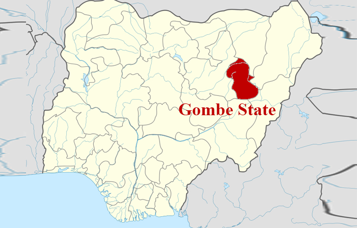

The Top Ten poorest states in Nigeria based on the reports issued by the National Bureau of Statistics are:

#### 10- Zamfara state
Zamfara state is located in the North-Western zone. Zamfara is populated with the Hausa and Fulani people.
In accordance with the National Bureau of Statistics,Zamfara suffer a 70.8% rate of poverty.

#### 9- Kebbi state
Kebbi state is situated in north-western Nigeria.
According to the reports by the National Bureau of Statistics ,it has a poverty rate of 72%. It is the ninth poorest state in Nigeria.

#### 8- Bauchi State
In Hausa, the term "Bauchi" means 'the land of freedom and tourism'. However, recent Boko Haram attacks have prevented it from been a place of tourism and freedom.
Based on the reports obtained from the National Bureau of Statistics, Bauchi has a poverty rate of 73%.

#### 7- Ebonyi State 
Ebonyi State is situated in the South Eastern region of Nigeria and considered the poorest in that region.
It has a poverty rate of 73.6% according to the National Bureau of Statistics.

#### 6- Plateau State 
Plateau state is one of the states in Nigeria endowed with tourist attractions, the state is also associated with a cold atmospheric condition.
However the state is haunted by  terrorist attacks and recurring tribal clashes particularly between its people and Fulani herdsmen. 
According to the National Bureau of Statistics,Plateau has a poverty rate of 74.1%.

#### 5- Jigawa State 
It is situated in the north-western part of the country. As contained in the reports issued by the National bureau of Statistics, it has a poverty rate of 74.1%.

#### 4- Gombe State
This state is situated within the North eastern region of Nigeria. Gombe state is one of the  Northern States extremely prone to terrorist invasions and due to this the economy is not growing.
It has a poverty rate of 74.2% according to the National Bureau of Statistics.

#### 3- Adamawa state 
 In 1991, Adamawa state was created from the now extinct Gongola state. Adamawa has recently been terrorised by the Boko Haram sect. Its economic growth and development has been thwarted due to these terrorist attacks.
It has a poverty rate estimated at 74.2% as obtained from the National  Bureau of Statistics.

#### 2- Katsina State
Located in North West zone of Nigeria. It has a poverty level of 74.5% according to the National Bureau of Statistics.

#### 1- Sokoto State
Located in the extreme northwest of Nigeria, Sokoko state is the poorest state in Nigeria with a poverty rate of 81.2%. The state is known for its hostile climatic conditions with normal day temperature as high as 45 Degrees Celsius. This harsh climate condition has prevented foreigners and foreign investors to come for investment in the state.

